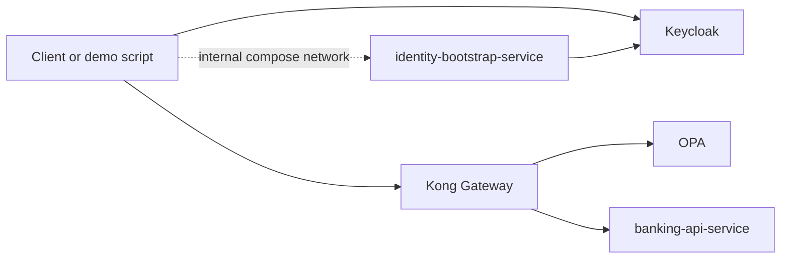

# Mobile Banking Auth PoC

Spring Boot proof of concept for mobile banking authentication and authorization using:

- `Keycloak` as IdP
- `Kong` as PEP
- `OPA` as PDP
- `Spring Boot` microservices for banking APIs and demo user bootstrap

## Architecture



## Services

- `keycloak`: issues JWTs and stores demo users
- `kong`: validates token activity through Keycloak introspection and calls OPA
- `opa`: evaluates account access policy
- `banking-api-service`: validates JWT signature, issuer, and audience, then serves account APIs
- `identity-bootstrap-service`: creates demo-managed users in Keycloak for the PoC

## Prerequisites

- Docker with Compose
- Java 21
- Maven
- `jq`

## Start The Stack

```bash
mvn -q test
docker compose up -d --build
```

## Run The Demo

```bash
bash scripts/demo.sh
```

Expected output:

```text
alice own account -> 200
alice foreign account -> 403
ops-admin account access -> 200
missing token -> 401
tampered token -> 401
```

## Endpoints And Ports

- Kong proxy: `http://localhost:8000`
- Kong admin: `http://localhost:8001`
- Keycloak: `http://localhost:9081`
- OPA: `http://localhost:8181`

`identity-bootstrap-service` is not host-published. The demo script reaches it over the internal Docker Compose network.

## Verify

```bash
mvn -q test
docker run --rm -v "$PWD/infra/opa/policies:/policies:ro" openpolicyagent/opa:0.68.0 test /policies
docker compose up -d --build
bash scripts/demo.sh
```

## Important Notes

- This is a PoC, not a production-ready banking security platform.
- The bootstrap flow is restricted to demo-managed users only.
- Kong acts as the edge PEP and OPA as the PDP, but the banking service also enforces JWT and account access checks as defense in depth.
- Docker image builds currently depend on prebuilt `target/*.jar` artifacts in this environment.

## Relevant Files

- `docker-compose.yml`
- `infra/keycloak/realm-export.json`
- `infra/kong/kong.yml`
- `infra/kong/plugins/opa-authz/handler.lua`
- `infra/opa/policies/banking_authz.rego`
- `services/banking-api-service/`
- `services/identity-bootstrap-service/`
- `scripts/demo.sh`
