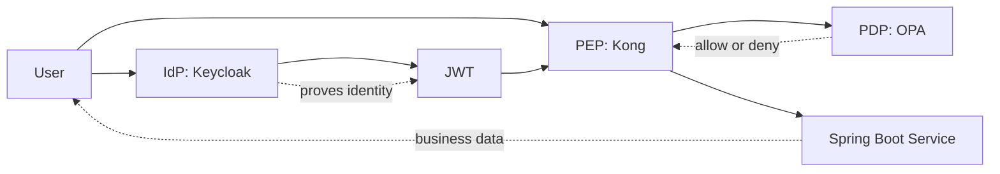

# 01 — 概念

本文讲解阅读本系列其余内容之前你需要了解的核心安全概念。

## 术语表

- **IdP（身份提供方，Identity Provider）** — 签发身份与令牌。这里是 `Keycloak`。
- **PEP（策略执行点，Policy Enforcement Point）** — 拦截请求、执行决策。这里是 `Kong`。
- **PDP（策略决策点，Policy Decision Point）** — 依据策略判定允许/拒绝。这里是 `OPA`。
- **资源服务器（Resource server）** — 拥有受保护的数据，并会再次校验令牌。这里是 `banking-api-service`。
- **JWT** — 携带身份与声明（claims）的签名令牌。

## 认证 vs 授权

认证回答的是：

- 你是谁？

授权回答的是：

- 你被允许做什么？

在本项目中：

- `Keycloak` 负责认证。
- `Kong` 与 `OPA` 负责执行授权。
- `banking-api-service` 在返回银行数据前也会校验调用方。

## IdP

IdP（身份提供方）是这样一个系统：

- 存储用户
- 校验用户名与密码
- 登录成功后签发令牌

在本项目中，`Keycloak` 就是 IdP。当 `alice` 登录时，Keycloak 对她进行认证并签发一个 JWT。

## JWT

JWT 是一个携带身份信息与声明（claims）的签名令牌，例如：

- 用户名
- 角色
- 受众（audience）
- 签发者（issuer）
- 自定义声明，如 `customer_id` 和 `account_ids`

重要：JWT 不会仅因为存在就被信任 —— 接收方必须对它进行校验。

校验项包括：

- 签名
- 签发者（issuer）
- 受众（audience）
- 过期时间（expiry）

## PEP

PEP（策略执行点）位于受保护资源之前，要么：

- 放行请求，要么
- 拦截请求。

在本项目中，`Kong` 是位于边缘的 PEP。来自 `alice` 或 `ops-admin` 的每个请求，都要先经过 Kong 才能到达 `banking-api-service`。

## PDP

PDP（策略决策点）评估策略规则并返回一个决策：

- 允许，或
- 拒绝。

在本项目中，`OPA` 是 PDP。Kong 把请求细节发送给 OPA，OPA 评估策略并返回决策。这样就把授权逻辑同 `Keycloak` 中的认证、以及 `banking-api-service` 中的业务逻辑分离开来。一个简单的理解方式：`Keycloak` 证明用户是谁，`Kong` 拦截请求，`OPA` 回答该用户是否被允许执行该操作。

## 为什么要拆分 IdP、PEP 与 PDP

把这些角色分开，是因为它们解决的是不同的问题：

- `Keycloak` 证明身份。
- `Kong` 在网关处执行访问控制。
- `OPA` 判定某个请求是否应被允许。
- `banking-api-service` 运行业务逻辑并提供纵深防御。

这种分离让系统更易于理解、也更易于修改。

## Spring Boot 微服务

本项目使用两个 Spring Boot 服务：

- `banking-api-service`
- `identity-bootstrap-service`

为什么用微服务：

- `banking-api-service` 对外暴露受保护的银行 API。
- `identity-bootstrap-service` 负责把演示用户初始化到 `Keycloak`。
- 每个服务都有单一、清晰的职责。

## 概念图

## 最重要的是什么

如果你只记住一件事，就记住这个：

1. `Keycloak` 说明用户是谁。
2. `Kong` 拦截或转发请求。
3. `OPA` 判定该操作是否被允许。
4. `banking-api-service` 再次校验，并返回银行响应。

---

Next: [02 — 本项目架构](02-this-project-architecture.md) →
