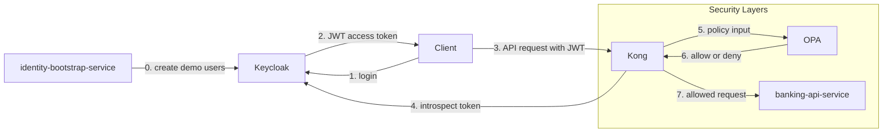

# 02 — 本项目架构

本文把 [01 — 概念](01-concepts.md) 中抽象的安全角色，映射到本 PoC 中实际运行的组件。

## 组件

| 组件 | 角色 |
|---|---|
| `Keycloak` | [IdP](01-concepts.md#idp) |
| `Kong` | [PEP](01-concepts.md#pep) |
| `OPA` | [PDP](01-concepts.md#pdp) |
| `banking-api-service` | [资源服务器](01-concepts.md#glossary) |
| `identity-bootstrap-service` | 仅用于演示初始化 |

## 各组件的职责

### Keycloak

`Keycloak` 是本项目的 [IdP](01-concepts.md#idp)。

它负责：

- 存储演示用户（`alice`、`ops-admin`）
- 校验用户名与密码
- 签发 JWT 访问令牌
- 添加诸如 `customer_id` 和 `account_ids` 之类的声明

### Kong

`Kong` 是本项目的 [PEP](01-concepts.md#pep)。

它负责：

- 在边缘接收每个客户端请求
- 检查是否存在 bearer 令牌
- 用 `Keycloak` 对令牌做内省
- 调用 `OPA` 获取授权决策
- 把被允许的请求转发给 `banking-api-service`

### OPA

`OPA` 是本项目的 [PDP](01-concepts.md#pdp)。

它负责：

- 从 `Kong` 接收请求上下文
- 评估 `infra/opa/policies/banking_authz.rego` 中的 Rego 策略
- 返回 `allow` 或 `deny`

### banking-api-service

`banking-api-service` 是本项目的 [资源服务器](01-concepts.md#glossary)。

它负责：

- 校验 JWT 的签名、签发者（issuer）与受众（audience）
- 作为纵深防御，再次检查账户归属
- 返回账户与交易数据

### identity-bootstrap-service

`identity-bootstrap-service` 存在的唯一目的，是让 PoC 可重复运行。

它负责：

- 在 `Keycloak` 中创建演示用户（`alice`、`ops-admin`）
- 设置演示用的声明与角色
- 省去手动配置 `Keycloak` 的步骤

## 架构图

## 为什么这个架构是合理的

三种角色的分离让各自的关注点保持隔离：

- `Keycloak` 拥有身份 —— 没有其他组件存储凭据。
- `OPA` 拥有策略逻辑 —— 改一条规则只需编辑一个 Rego 文件。
- `Kong` 拥有执行 —— Kong 后面的服务无需重复实现网关逻辑。

同时也演示了纵深防御：

- `Kong` 在转发前检查令牌有效性并调用 `OPA`。
- `banking-api-service` 独立地再次校验 JWT。
- `banking-api-service` 在返回数据前再次检查账户归属。

## 项目文件对照

| 路径 | 用途 |
|---|---|
| `docker-compose.yml` | 定义并串联所有运行时容器 |
| `infra/keycloak/realm-export.json` | Keycloak 的 realm、client 与角色配置 |
| `infra/kong/kong.yml` | Kong 的服务、路由与插件配置 |
| `infra/kong/plugins/opa-authz/handler.lua` | Kong 插件 —— 调用 OPA 并执行决策 |
| `infra/kong/plugins/opa-authz/schema.lua` | Kong 插件 —— 声明配置 schema |
| `infra/opa/policies/banking_authz.rego` | OPA 策略（Rego） |
| `infra/opa/policies/banking_authz_test.rego` | OPA 策略单元测试 |
| `services/banking-api-service/` | 受保护的银行 API（资源服务器） |
| `services/identity-bootstrap-service/` | 演示用户初始化服务 |
| `scripts/demo.sh` | 端到端演示脚本 |

---

← Prev: [01 — 概念](01-concepts.md) · Next: [03 — 请求流程](03-request-flows.md) →
