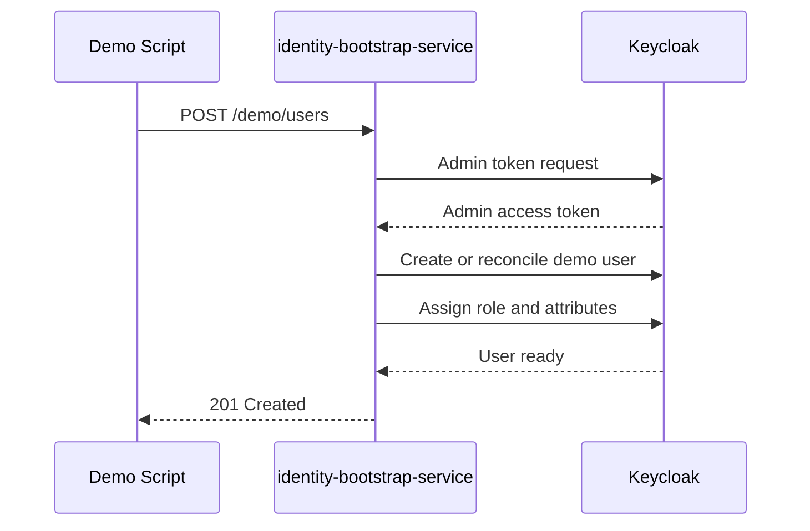
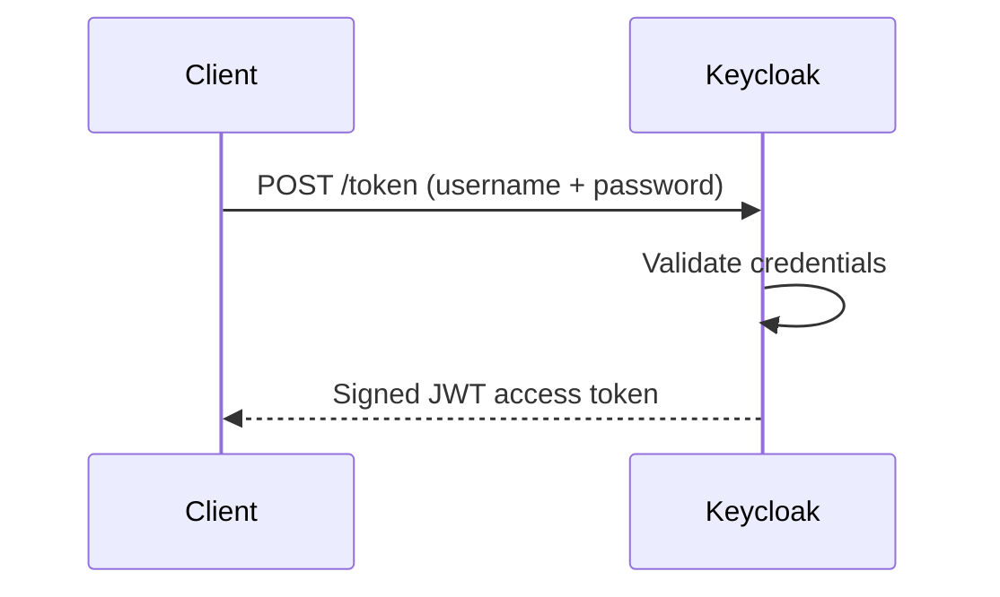
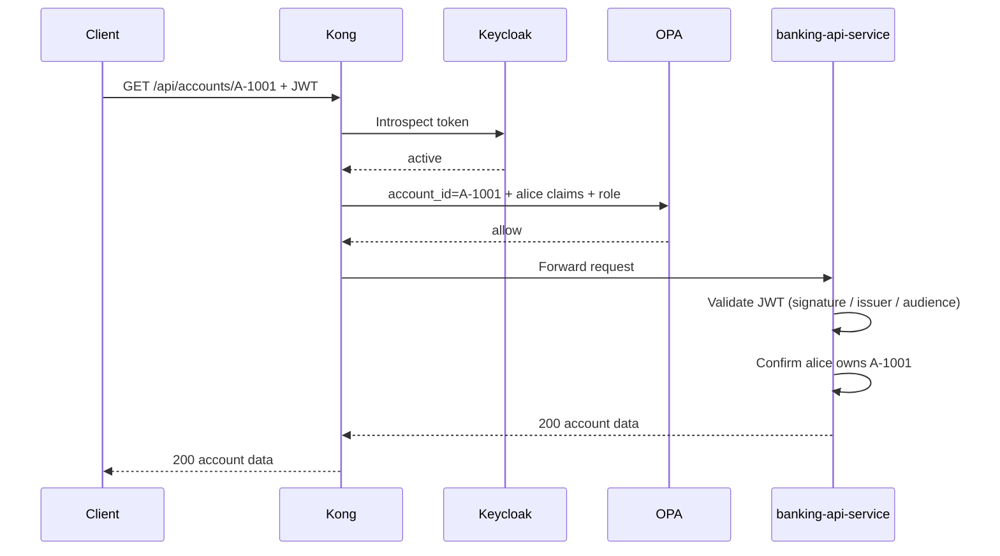
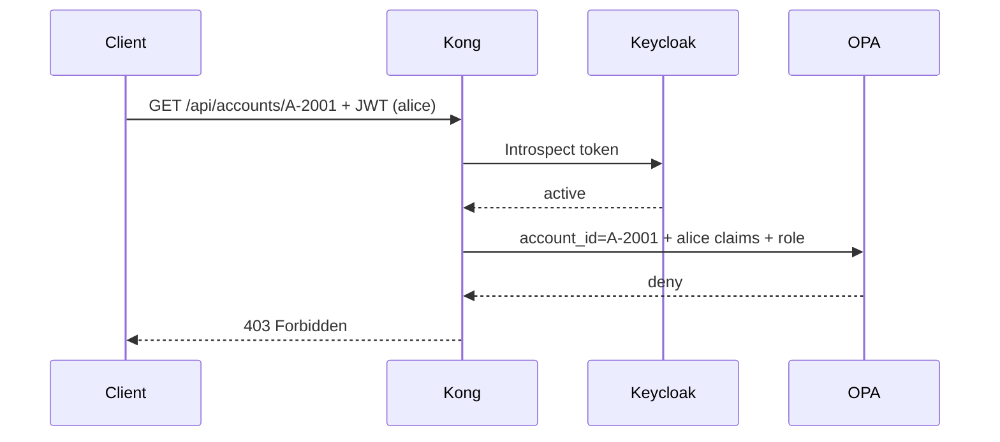
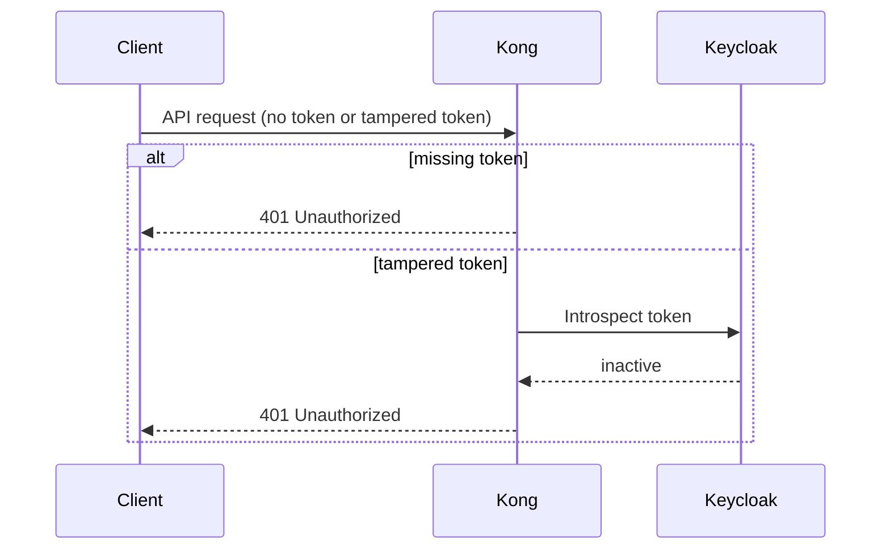

# 03 — 请求流程

对本 PoC 中五个关键交互的端到端讲解，展示 `Keycloak`、`Kong`、`OPA` 与 `banking-api-service` 在每个请求上如何协作。

---

## 流程 1：演示用户初始化

在任何登录之前，你先运行一次演示脚本。它调用 `identity-bootstrap-service`，由后者在 `Keycloak` 中创建可重复的演示用户。

步骤：

1. 演示脚本调用 `identity-bootstrap-service` 的 `POST /demo/users`。
2. `identity-bootstrap-service` 用管理员凭据向 `Keycloak` 认证。
3. `identity-bootstrap-service` 创建或对齐（reconcile）演示用户。
4. 它为用户分配角色（`customer` 或 `ops-admin`）以及自定义声明（例如 `account_ids`）。
5. `Keycloak` 确认用户就绪；`identity-bootstrap-service` 返回 `201`。

关于 `identity-bootstrap-service` 的工作原理，详见 [10 — identity-bootstrap-service](10-identity-bootstrap-service.md)。

---

## 流程 2：用户登录

你用凭据换取一个 JWT。该令牌携带身份与声明，供后续每个请求使用。

步骤：

1. 客户端把 `username` + `password` POST 到 `Keycloak` 的 token 端点。
2. `Keycloak` 校验凭据。
3. `Keycloak` 返回一个签名的 JWT 访问令牌。

关于 `Keycloak` token 端点细节与 JWT 声明结构，详见 [06 — Keycloak / IdP](06-keycloak-idp.md)。

---

## 流程 3：被允许的账户访问

`alice` 读取她自己的某个账户。`Kong`（PEP）确认令牌有效，`OPA`（PDP）确认 `alice` 拥有该账户，`banking-api-service` 在返回数据前再次校验。

示例：`alice` 请求 `GET /api/accounts/A-1001`，其中 `A-1001` 属于 `alice`。

步骤：

1. 客户端把 JWT 作为 bearer 令牌发给 `Kong`。
2. `Kong` 用 `Keycloak` 对令牌做内省 —— 确认其处于 active 状态。
3. `Kong` 把解码后的声明与请求的 `account_id` 发给 `OPA`。
4. `OPA` 评估策略并返回 `allow`（该账户在 `alice` 的 `account_ids` 声明中）。
5. `Kong` 把请求转发给 `banking-api-service`。
6. `banking-api-service` 再次校验 JWT 的签名、签发者与受众。
7. `banking-api-service` 确认 `alice` 拥有 `A-1001`。
8. `banking-api-service` 返回 `200` 及账户数据。

关于内省细节，详见 [11 — JWT 签名、校验与内省](11-jwt-signature-validation.md)。关于 OPA 策略逻辑，详见 [08 — OPA](08-opa.md)。关于线级报文，详见 [14 — 请求与响应细节](14-request-response-reference.md)。

---

## 流程 4：被拒绝的账户访问

`alice` 尝试读取一个她并不拥有的账户。`OPA` 在网关处就拒绝了它 —— 请求根本到不了 `banking-api-service`。

示例：`alice` 请求 `GET /api/accounts/A-2001`，其中 `A-2001` 属于另一个客户。

作为对比：`ops-admin` 发起同样的请求会从 `OPA` 得到 `allow`，因为 `ops-admin` 角色被授予访问任意账户的权限。

步骤：

1. 客户端把 JWT 发给 `Kong`。
2. `Kong` 对令牌做内省 —— 确认其处于 active 状态。
3. `Kong` 把解码后的声明与 `account_id=A-2001` 发给 `OPA`。
4. `OPA` 返回 `deny`（`A-2001` 不在 `alice` 的 `account_ids` 声明中，且她不具备 `ops-admin` 角色）。
5. `Kong` 返回 `403 Forbidden`。请求从未到达 `banking-api-service`。

关于 OPA 策略逻辑，详见 [08 — OPA](08-opa.md)。关于线级报文，详见 [14 — 请求与响应细节](14-request-response-reference.md)。

---

## 流程 5：缺失或被篡改的令牌

没有有效令牌的请求，会在任何策略检查之前就被 `Kong` 拒绝。

**缺失令牌：**

1. 客户端不带 bearer 令牌调用 `Kong`。
2. `Kong` 立即以 `401 Unauthorized` 拒绝。

**被篡改的令牌：**

1. 客户端发送一个被修改过的 JWT。
2. `Kong` 用 `Keycloak` 对令牌做内省。
3. `Keycloak` 报告该令牌为 inactive（签名不匹配或未知）。
4. `Kong` 返回 `401 Unauthorized`。

关于内省细节，详见 [11 — JWT 签名、校验与内省](11-jwt-signature-validation.md)。

---

## 这些流程为什么重要

每个流程都体现了组件之间清晰的职责分离（定义见 [01 — 概念](01-concepts.md)）：

- `Keycloak` 负责认证并签名令牌。
- `Kong` 在边缘执行访问控制，并驱动策略检查。
- `OPA` 仅依据策略规则判定允许或拒绝。
- `banking-api-service` 再次校验并提供业务数据。

没有任何组件越界去干别人的职责。

---

← Prev: [02 — 本项目架构](02-this-project-architecture.md) · Next: [04 — 本地演示指南](04-local-demo-guide.md) →
