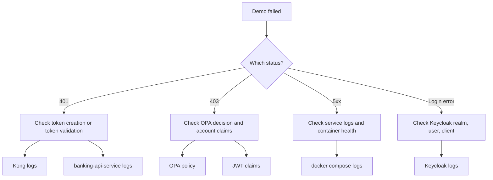

# 04 — 本地演示指南

在本地把 PoC 跑起来，实时观察每一次认证/授权决策的发生，并对任何行为异常的服务进行排查。

---

## 快速开始

在仓库根目录下：

```bash
mvn -q test
docker compose up -d --build
bash scripts/demo.sh
```

脚本在每一步之后都会暂停，要求你输入 `yes` 才继续。这样你有时间在各步骤之间检查日志或端点。

---

## 演示脚本做了什么

脚本按顺序运行以下步骤：

1. 等待 `Keycloak`、`Kong` 与 `identity-bootstrap-service` 就绪。
2. 通过 `identity-bootstrap-service` 创建 `alice` 用户。
3. 通过 `identity-bootstrap-service` 创建 `ops-admin` 用户。
4. 让 `alice` 经 `Keycloak` 登录，并捕获她的令牌。
5. 让 `ops-admin` 经 `Keycloak` 登录，并捕获其令牌。
6. 用 `alice` 的令牌调用受 Kong 保护的 API 访问她自己的账户 —— 期望 `200`。
7. 用 `alice` 的令牌调用受 Kong 保护的 API 访问他人账户 —— 期望 `403`。
8. 用 `ops-admin` 的令牌调用受 Kong 保护的 API 访问任意账户 —— 期望 `200`。
9. 不带令牌调用受 Kong 保护的 API —— 期望 `401`。
10. 用被篡改的令牌调用受 Kong 保护的 API —— 期望 `401`。

第 6–10 步演练了概念文档中描述的完整 [IdP](01-concepts.md) → [PEP](01-concepts.md) → [PDP](01-concepts.md) → [资源服务器](01-concepts.md) 链路。

---

## 常用端点

| 服务 | URL |
|---|---|
| `Keycloak`（IdP） | `http://localhost:9081` |
| Kong proxy（PEP） | `http://localhost:8000` |
| Kong admin | `http://localhost:8001` |
| `OPA`（PDP） | `http://localhost:8181` |

`identity-bootstrap-service` 与 `banking-api-service` 是 Compose 网络内部的服务，不对宿主机暴露。请用 `curl` 辅助容器来访问它们（见下文）。

---

## 用 curl 容器做内部检查

Compose 文件中包含一个位于同一内部 Docker 网络上的 `curl` 辅助服务。用它来访问那些未对宿主机暴露的服务。

在容器中打开一个 shell：

```bash
docker compose exec curl sh
```

或运行一次性命令：

```bash
# Keycloak OIDC discovery
docker compose exec curl curl http://keycloak:8080/realms/banking-poc/.well-known/openid-configuration

# List demo users (identity-bootstrap-service)
docker compose exec curl curl -i http://identity-bootstrap-service:8080/demo/users

# Query OPA policy state
docker compose exec curl curl http://opa:8181/v1/data/banking_authz/allow

# Check banking-api-service health
docker compose exec curl curl http://banking-api-service:8080/actuator/health
```

注意：Keycloak 的内部地址是 `keycloak:8080`。面向宿主机的端口 `9081` 只用于来自你本机的流量。

---

## 如果出错了

先做一次宽泛的检查：

```bash
docker compose ps
docker compose logs --no-color --tail=200
```

再按症状缩小范围：

| 症状 | 排查位置 |
|---|---|
| 登录失败 | `Keycloak` 的 realm、用户与 client 配置 |
| 合法用户却得到 `401` | Kong 的令牌校验，或 `banking-api-service` 的 JWT 配置 |
| 本应允许却得到 `403` | OPA 的策略输入与 JWT 声明 |
| 意外的 `5xx` | 服务日志与容器健康状态 |

---

## 排查流程



---

## 如何正确理解这个 PoC

本项目是一个学习与可行性验证环境，并非生产蓝图。

它证明了：

- `Keycloak` 能够签发所需的身份声明。
- `Kong` 能够在流量到达服务之前执行访问控制。
- `OPA` 能够做出外部化的授权决策。
- `banking-api-service` 能够充当受保护的资源服务器。
- 上述四个组件能够端到端地协同工作。

它并未覆盖每一项生产关注点，例如：

- 企业级密钥管理
- 高可用部署
- 生产级的用户接入（onboarding）流程
- 生产级的可观测性
- 自包含的 Docker 镜像构建

---

← Prev: [03 — 请求流程](03-request-flows.md) · Next: [05 — 组件巡览](05-component-tour.md) →
