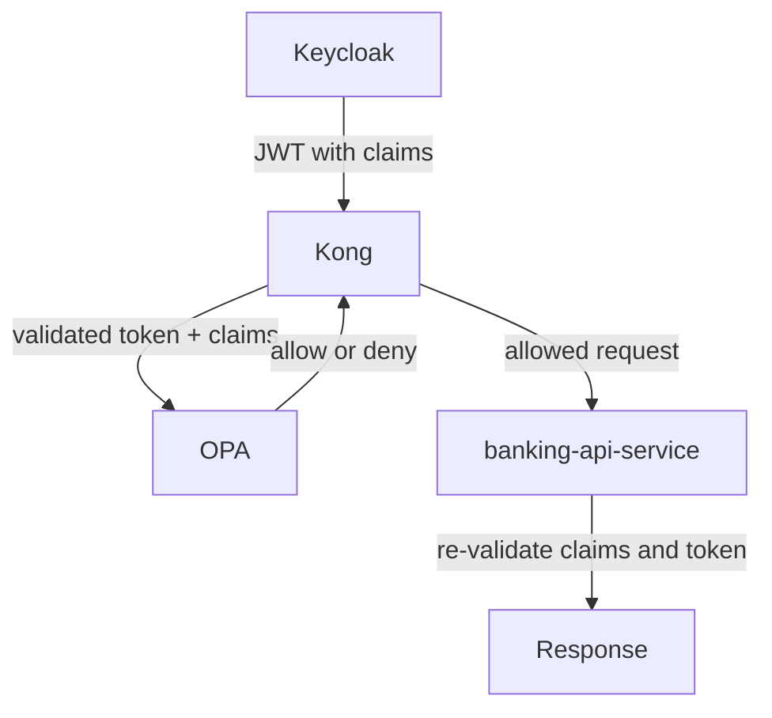

# 05 — 组件巡览

第二部分的「每个组件一段话」导览 —— 在深入每篇专题文档之前，用它来建立整体方位感。

## 声明与决策的流转

## Keycloak

`Keycloak` 是本项目的 [IdP](01-concepts.md) —— 它存储用户、校验凭据并签发 JWT。当 `alice` 或 `ops-admin` 登录时，`Keycloak` 对其进行认证，并把诸如 `customer_id` 和 `account_ids` 之类的自定义声明嵌入令牌。下游的每个其他组件都依赖 `Keycloak` 产出可信的身份数据。深入内容见 [06-keycloak-idp.md](06-keycloak-idp.md)。

## Kong

`Kong` 是 [PEP](01-concepts.md) —— 它是系统的前门，也是第一个看到每个 API 请求的组件。它用 `Keycloak` 对传入令牌做内省，确认其有效且未过期，然后把校验后的声明转发给 `OPA` 以获取策略决策。若 `OPA` 返回 `deny`，`Kong` 立即终止请求；若 `OPA` 返回 `allow`，`Kong` 把请求转发给 `banking-api-service`。深入内容见 [07-kong.md](07-kong.md)。

## OPA

`OPA` 是 [PDP](01-concepts.md) —— 它评估策略规则并返回单一的 `allow` 或 `deny` 决策。它不认证用户、不签发令牌、也不存储身份；它只回答：传入请求所描述的操作在当前策略下是否被允许。在本项目中，策略检查调用方的角色，并且对 `alice` 而言，还检查令牌声明是否与请求的 `account_id` 匹配。深入内容见 [08-opa.md](08-opa.md)。

## banking-api-service

`banking-api-service` 是 [资源服务器](01-concepts.md) —— 它拥有受保护的银行数据，并暴露账户与交易端点。即便 `Kong` 与 `OPA` 已经批准了请求，`banking-api-service` 仍会再次校验 JWT 的签名、签发者与受众，并在返回任何数据前再次检查账户级授权。这带来了纵深防御：某个以某种方式绕过网关的请求，若不通过服务端检查，依然无法取出数据。深入内容见 [09-banking-api-service.md](09-banking-api-service.md)。

## identity-bootstrap-service

`identity-bootstrap-service` 是一个内部的演示初始化服务 —— 它存在的唯一目的，是把演示用户初始化到 `Keycloak`，从而让 PoC 无需手动配置即可运行。它创建用户、设置密码、分配角色，并填充其余技术栈所依赖的 `customer_id` 与 `account_ids` 声明。它被有意地不暴露到 Compose 网络之外。深入内容见 [10-identity-bootstrap-service.md](10-identity-bootstrap-service.md)。

---

← Prev: [04 — 本地演示指南](04-local-demo-guide.md) · Next: [06 — Keycloak / IdP](06-keycloak-idp.md) →
