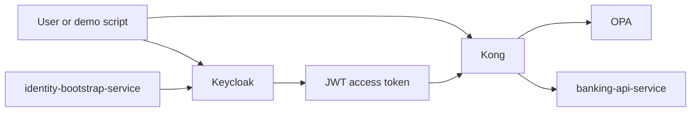
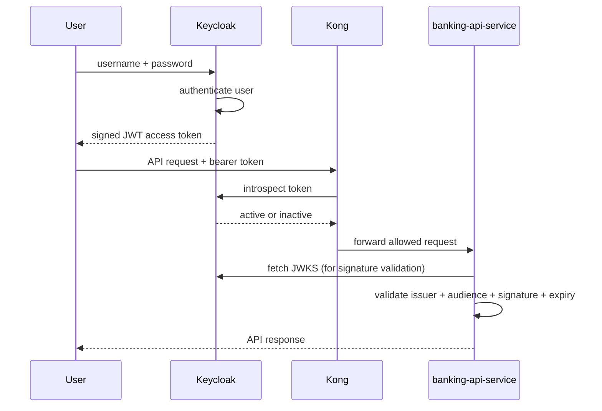
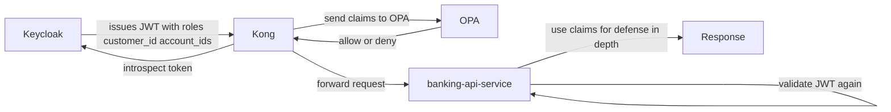

# 06 — Keycloak / IdP

`Keycloak` 是本 PoC 的身份提供方（Identity Provider）：它对用户进行认证、拥有会话状态，并签发驱动一切下游授权决策的 JWT。

## 什么是 IdP

IdP（身份提供方）是负责认证用户并签发令牌的系统。完整术语表见 [01 — 概念](01-concepts.md)。

简而言之：

- IdP 证明用户是谁
- 其他系统决定该用户能做什么

## 本项目为什么需要 IdP

如果没有 IdP，每个服务都得各自实现并维护自己的登录逻辑、令牌签发逻辑、密码处理、用户存储与声明管理。

那会造成：

- 重复的安全代码
- 各服务之间不一致的身份规则
- 更难的审计与排查
- 更难与网关、策略引擎集成

本项目使用 `Keycloak` 作为 IdP，从而把身份集中化：

- 一个统一的地方认证用户
- 一个统一的地方管理像 `customer`、`ops-admin` 这样的角色
- 一个统一的地方签发 JWT
- 一个统一的地方定义像 `customer_id`、`account_ids` 这样的声明

## Keycloak 在本 PoC 中的位置

`Keycloak` 不是网关、不是策略引擎、也不是银行 API。它是身份与令牌声明的来源。

## Keycloak 如何工作

### Realm

realm 是一个安全边界，拥有自己的用户、client、角色与令牌设置。

本项目使用 realm `banking-poc`。所有演示用户与 client 都位于该 realm 内。

### 用户

用户是用于登录的身份。本 PoC 中的演示用户是：

- `alice`
- `ops-admin`

`identity-bootstrap-service` 通过 Keycloak 管理 API 创建并管理这些用户，设置如下属性：

- `customer_id`
- `account_ids`
- `demo_managed`

### 角色

角色代表粗粒度的权限分组。本 PoC 使用两个 realm 角色：

- `customer`
- `ops-admin`

这些角色出现在 JWT 中，被 `Kong`、`OPA` 与 `banking-api-service` 使用。

### Client

client 是与 Keycloak 交互的应用或服务。本仓库定义了两个：

1. `mobile-banking-app` —— 公共 client，演示登录流程用它来获取访问令牌（`directAccessGrantsEnabled: true`、`publicClient: true`）
2. `kong-introspection` —— 机密的服务账户 client（`publicClient: false`、`serviceAccountsEnabled: true`），由 `Kong` 用来内省令牌

### 协议映射器（Protocol Mappers）

协议映射器控制哪些声明进入令牌。`mobile-banking-app` 映射了：

- `customer_id` —— 来自用户属性，写入访问令牌、ID 令牌与 userinfo
- `account_ids` —— 来自用户属性（多值），写入访问令牌、ID 令牌与 userinfo
- 受众 `mobile-banking-app` —— 仅写入访问令牌

这些声明会流向下游：`Kong` 把它们转发给 `OPA`，`OPA` 在策略中使用它们，`banking-api-service` 用它们做纵深防御检查。

### 令牌

登录成功后，Keycloak 签发一个签名的 JWT 访问令牌，包含：

- `sub`
- `preferred_username`
- `aud`
- `iss`
- `exp`
- `realm_access.roles`
- `customer_id`
- `account_ids`

该令牌由 Keycloak 签名，从而让下游系统能够以密码学方式校验它。

## 本项目中的 OAuth 2.0 与 OpenID Connect

Keycloak 讲的是标准的身份协议。

### OAuth 2.0

OAuth 2.0 是一套用于委托访问的框架。它提供了获取访问令牌、并在调用 API 时使用这些令牌的标准方式。

### OpenID Connect

OpenID Connect 是建立在 OAuth 2.0 之上的身份层。它标准化了身份声明与端点。

实践中：

- Keycloak 认证用户
- Keycloak 签发兼容 OIDC 的 JWT
- 服务用这些令牌来识别调用方

### 这里使用的流程

演示脚本使用直接的用户名/密码令牌交换（`directAccessGrantsEnabled`）来对接 Keycloak。

对本 PoC 而言重要的是：

1. 凭据发送给 Keycloak
2. Keycloak 校验凭据
3. Keycloak 返回一个签名的 JWT 访问令牌
4. 该令牌被发送到 `Kong` 以及银行 API 路径上

## Keycloak 的会话与令牌活跃性

Keycloak 拥有 JWT 背后的实时会话状态 —— 这正是为什么即便对一个结构上合法的 JWT，令牌内省也可能回答 `active: false`。完整的内省机制见 [11 — JWT 签名、校验与内省](11-jwt-signature-validation.md)。

### 逻辑会话类型

Keycloak 跟踪三层会话状态：

1. **认证会话（authentication session，短暂）** —— 登录流程期间的临时状态；登录完成或过期后移除
2. **用户会话（user session）** —— 表示某个 realm 中被认证的用户；跟踪开始时间、空闲/过期状态与登出状态
3. **客户端会话（client session，按 client 划分）** —— 为每个 client（如 `mobile-banking-app`）附着在某个用户会话上；跟踪该 client 在此次登录会话中的参与情况

### 物理存储

运行时，Keycloak 把在线会话状态存放在 Infinispan 缓存中。在集群部署里，这些缓存分布在各节点上。离线会话则持久化在数据库中。

关键的实践要点：令牌声明随 JWT 一同传输，但实时会话状态存放在 Keycloak 的服务端。这正是为什么一个令牌可以被正确解码，而内省仍可能返回 `active: false`。

关于访问令牌/刷新令牌的生命周期、以及它们与会话状态的关系，详见 [13 — 访问令牌与刷新令牌的生命周期](13-token-lifecycle.md)。

## 令牌签发与校验流程

## 为什么登录之后仍然需要校验 JWT

一个常见的误解：

> “Keycloak 已经认证过用户了，所以服务不需要再次校验令牌。”

这是错的。一旦令牌离开 Keycloak，下游系统仍必须验证：该令牌确实由 Keycloak 签发、是发给本应用的、尚未过期、且未被篡改。

这正是为什么本 PoC 在多个地方校验令牌：

- `Kong` 用 Keycloak 做内省
- `banking-api-service` 校验 JWT 的签名、签发者与受众

## Keycloak 在本仓库中如何配置

主配置文件是 `infra/keycloak/realm-export.json`。

从该文件核实的关键设置：

| 设置 | 值 |
|---|---|
| Realm | `banking-poc` |
| Realm 角色 | `customer`、`ops-admin` |
| 公共 client | `mobile-banking-app`（`directAccessGrantsEnabled: true`） |
| 机密 client | `kong-introspection`（`serviceAccountsEnabled: true`） |
| 协议映射器 | `customer_id`、`account_ids`（用户属性），`aud=mobile-banking-app` |
| 用户档案属性 | `customer_id`（单值）、`account_ids`（多值）—— 仅管理员可编辑 |

realm-export 还声明了用户档案（user-profile）schema，以便 `identity-bootstrap-service` 能安全地写入 `customer_id` 与 `account_ids` 属性。

## Keycloak 如何与其他组件协作

### Keycloak 与 identity-bootstrap-service

bootstrap 服务使用 Keycloak 管理 API 来：

- 创建演示用户
- 设置密码
- 分配 realm 角色
- 设置自定义属性（`customer_id`、`account_ids`、`demo_managed`）

这让 PoC 无需手动配置 Keycloak 即可重复运行。

### Keycloak 与 Kong

`Kong` 在转发请求或询问 `OPA` 决策之前，使用 Keycloak 令牌内省来检查令牌是否处于 active。`Kong` 使用 `kong-introspection` 机密 client 的凭据向 Keycloak 认证。

### Keycloak 与 OPA

`OPA` 不直接与 Keycloak 通信。取而代之的是：

- Keycloak 在 JWT 中签发声明
- `Kong` 在内省后读取经校验的令牌上下文
- `Kong` 把相关声明发给 `OPA`
- `OPA` 在策略中使用这些声明

所以 Keycloak 是通过令牌声明间接影响 `OPA` 的决策。

### Keycloak 与 banking-api-service

`banking-api-service` 信任 Keycloak 作为令牌签发者，但会独立校验：

- 签名（通过 JWKS）
- 签发者
- 受众

然后读取诸如 `realm_access.roles`、`customer_id`、`account_ids` 之类的声明，用于服务端的授权检查。

## 本 PoC 中的声明流转

## 本 PoC 中的实际示例

### 示例 1：alice 访问她自己的账户

Keycloak 为 `alice` 签发一个令牌，包含：

- 角色 `customer`
- `customer_id=C-1001`
- `account_ids=[A-1001]`

随后：

- `Kong` 确认令牌处于 active
- `OPA` 看到 `A-1001` 在令牌声明中
- `banking-api-service` 再次检查同一组声明
- 请求被允许

### 示例 2：alice 访问另一个账户

如果 `alice` 请求账户 `A-2001`：

- 该令牌仍然是一个有效的身份令牌
- 但声明并不授权访问 `A-2001`
- `OPA` 返回 deny
- `Kong` 返回 `403`

这体现了关键思想：有效的身份并不自动意味着有效的授权。

### 示例 3：ops-admin 的访问

如果用户具备 `ops-admin` 角色：

- `OPA` 允许更宽的访问
- `banking-api-service` 也看到该角色并在服务端允许访问

## 为什么 Keycloak 在这里很合适

Keycloak 提供了：

- 集中化的认证
- 标准的令牌签发（OIDC/OAuth 2.0）
- 通过协议映射器支持自定义声明
- 用于自动化演示初始化的管理 API
- 面向网关与服务的标准集成模式

它让项目能够专注于银行授权逻辑，而不必重新发明登录基础设施。

## 常见误解

### “Keycloak 已经处理了所有安全”

不。Keycloak 处理身份与令牌签发。它不替代网关执行（`Kong`）、策略评估（`OPA`）或业务服务检查（`banking-api-service`）。

### “OPA 可以替代 Keycloak”

不。`OPA` 是 [PDP](01-concepts.md) —— 它判定策略。它不认证用户、也不签发令牌。

### “Kong 可以替代 Keycloak”

不。`Kong` 是 [PEP](01-concepts.md) —— 网关。它不是身份提供方。

### “Spring Boot 自己全干了不就行”

技术上它能做更多，但那样会把身份、策略与业务逻辑塌缩到一个地方，使架构更难维护、更难理解。

## 小结

1. Keycloak 认证用户
2. Keycloak 签发携带身份与权益声明的 JWT
3. `Kong` 检查令牌活跃性，并向 `OPA` 请求授权决策
4. `banking-api-service` 再次校验 JWT 并执行服务端检查

这就是 Keycloak 在本项目中的意义：它是那个以标准、集中、可重复的方式让其余安全流程得以成立的系统。

---

← Prev: [05 — 组件巡览](05-component-tour.md) · Next: [07 — Kong](07-kong.md) →
