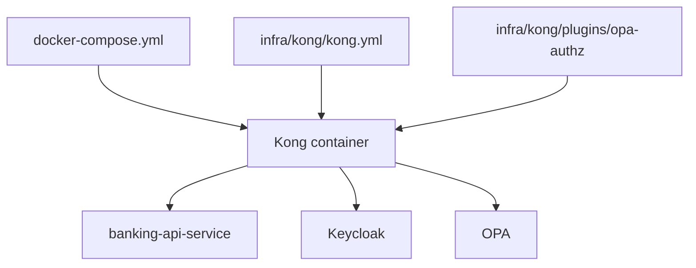
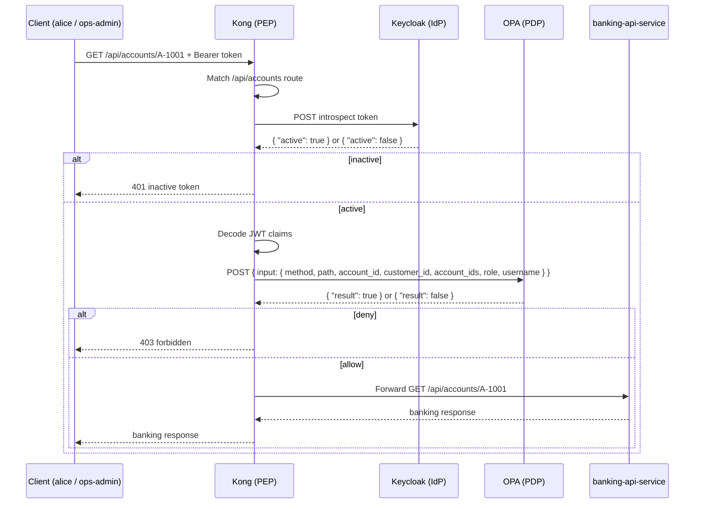

# 07 — Kong（网关 / PEP）

Kong 是 API 网关，也是[策略执行点（PEP）](01-concepts.md)：它拦截每个请求、用 `Keycloak` 校验令牌、向 `OPA` 请求授权决策，并把被允许的请求转发给 `banking-api-service`。

## 什么是 Kong

在本 PoC 所用的 [IdP / PEP / PDP](01-concepts.md) 分工中：

- `Keycloak` 是 **IdP** —— 它签发令牌。
- `Kong` 是 **PEP** —— 它在边缘执行访问控制。
- `OPA` 是 **PDP** —— 它判定某个请求是否被允许。
- `banking-api-service` 是 **资源服务器** —— 它拥有受保护的银行数据。

Kong 在本项目中的职责：

1. 接收传入的 API 请求。
2. 拒绝缺失或格式错误的 `Authorization` 头的请求。
3. 调用 `Keycloak` 内省，确认令牌当前处于 active。
4. 从令牌载荷中解码 JWT 声明。
5. 用请求路径、方法与声明构建一个 input 对象。
6. 调用 `OPA` 获取授权决策。
7. 若 `OPA` 拒绝则返回 `403`，若 `OPA` 允许则转发给 `banking-api-service`。

Kong 不是身份提供方、不是策略引擎、也不是银行业务服务。

## 两个与 Kong 相关的配置文件

本仓库中有两个文件控制 Kong：

| 文件 | 用途 |
|---|---|
| `docker-compose.yml` | 容器串联 —— 镜像、端口、环境变量、卷、依赖 |
| `infra/kong/kong.yml` | Kong 运行时行为 —— service、route、plugin、plugin 配置值 |

### 它们之间的关系



- `docker-compose.yml` 创建 Kong 容器并把配置挂载进去。
- `kong.yml` 告诉 Kong 要暴露什么路由、运行什么插件。
- `schema.lua` 定义哪些插件配置字段是合法的。
- `handler.lua` 包含每个请求都会运行的执行逻辑。

## `docker-compose.yml` 中的 Kong

相关的 Kong service 块：

```yaml
kong:
  image: kong:3.7
  environment:
    KONG_DATABASE: off
    KONG_DECLARATIVE_CONFIG: /etc/kong/kong.yml
    KONG_PLUGINS: bundled,opa-authz
    KONG_PROXY_ACCESS_LOG: /dev/stdout
    KONG_ADMIN_ACCESS_LOG: /dev/stdout
    KONG_PROXY_ERROR_LOG: /dev/stderr
    KONG_ADMIN_ERROR_LOG: /dev/stderr
    KONG_ADMIN_LISTEN: 0.0.0.0:8001
  ports:
    - "8000:8000"
    - "8001:8001"
  depends_on:
    banking-api-service:
      condition: service_started
      restart: true
    opa:
      condition: service_started
  volumes:
    - ./infra/kong/kong.yml:/etc/kong/kong.yml:ro
    - ./infra/kong/plugins/opa-authz:/usr/local/share/lua/5.1/kong/plugins/opa-authz:ro
```

关键环境变量：

- `KONG_DATABASE=off` —— Kong 以无数据库（DB-less）模式运行。所有配置来自文件，而非数据库。
- `KONG_DECLARATIVE_CONFIG=/etc/kong/kong.yml` —— 保存 Kong 声明式路由配置的文件。
- `KONG_PLUGINS=bundled,opa-authz` —— 启用 Kong 内置插件以及自定义的 `opa-authz` 插件。
- `KONG_ADMIN_LISTEN=0.0.0.0:8001` —— 在容器内暴露 Kong admin API。

关键卷：

- `kong.yml` 以只读方式挂载到容器内的 `/etc/kong/kong.yml`。
- 自定义插件目录以只读方式挂载到 `/usr/local/share/lua/5.1/kong/plugins/opa-authz` —— 这是 Kong 扫描的标准 Lua 插件路径。

`depends_on` 意味着 Kong 仅在 `banking-api-service` 与 `opa` 启动之后才启动。若 `banking-api-service` 重启，Kong 也会重启（`restart: true`）。

## `infra/kong/kong.yml` 中的 Kong

该文件使用 Kong 的声明式格式（`_format_version: "3.0"`），并定义了一个 service，内联一个 route 与一个 plugin：

```yaml
_format_version: "3.0"

services:
  - name: banking-api
    url: http://banking-api-service:8080
    routes:
      - name: banking-api-route
        paths:
          - /api/accounts
        strip_path: false
    plugins:
      - name: opa-authz
        config:
          opa_url: http://opa:8181/v1/data/banking_authz/allow
          introspection_url: http://keycloak:8080/realms/banking-poc/protocol/openid-connect/token/introspect
          introspection_client_id: kong-introspection
          introspection_client_secret: kong-introspection-secret
          timeout_ms: 2000
```

### Service

- `name: banking-api` —— Kong 对上游的内部名称。
- `url: http://banking-api-service:8080` —— Kong 把被允许的请求转发到这里。

### Route

- `paths: [/api/accounts]` —— 以 `/api/accounts` 开头的请求匹配此路由。
- `strip_path: false` —— 路径按原样转发。

因此一个 `GET /api/accounts/A-1001` 的请求（来自 `alice` 或 `ops-admin`）会按 `GET /api/accounts/A-1001` 转发到上游。

### 插件挂载与配置值

`opa-authz` 插件在每个匹配该路由的请求上运行。它的配置提供了插件在运行时使用的实际 URL 与凭据：

- `opa_url` —— Kong 把授权 input POST 过去的 OPA 端点。
- `introspection_url` —— Kong 调用来检查令牌活跃性的 `Keycloak` 端点。
- `introspection_client_id` —— 在 `Keycloak` 中注册的 `kong-introspection` client。
- `introspection_client_secret` —— 该 client 配对的密钥。
- `timeout_ms: 2000` —— Kong 在中止前等待 `Keycloak` 或 `OPA` 的时长。

## `opa-authz` 插件

自定义插件位于 `infra/kong/plugins/opa-authz/`，由两个文件组成：

### `schema.lua` —— 配置定义

`schema.lua` 声明了合法插件配置的形态。Kong 在启动时会用此 schema 校验任何 `opa-authz` 插件块：

```lua
return {
  name = "opa-authz",
  fields = {
    {
      config = {
        type = "record",
        fields = {
          { opa_url = { type = "string", required = true } },
          { introspection_url = { type = "string", required = true } },
          { introspection_client_id = { type = "string", required = true } },
          { introspection_client_secret = { type = "string", required = true } },
          { timeout_ms = { type = "number", default = 2000 } },
        },
      },
    },
  },
}
```

- 四个 URL/凭据字段都是必填字符串 —— 任一缺失，Kong 都会拒绝启动。
- `timeout_ms` 是可选的，默认 `2000`。
- `schema.lua` 定义什么是被允许的；`kong.yml` 提供实际值；`handler.lua` 在运行时使用它们。

### `handler.lua` —— 执行逻辑

`handler.lua` 在 Kong 的 `access` 阶段（优先级 `900`）对每个匹配的请求运行。逻辑按以下顺序执行：

**第 1 步 —— 读取 bearer 令牌**

```lua
local auth_header = kong.request.get_header("authorization")
if not auth_header then
  return kong.response.exit(401, { message = "missing bearer token" })
end

local token = auth_header:match("[Bb]earer%s+(.+)")
if not token then
  return kong.response.exit(401, { message = "invalid bearer token" })
end
```

若不存在 `Authorization` 头、或其中不含 bearer 令牌，则返回 `401`。

**第 2 步 —— 用 `Keycloak` 内省令牌**

```lua
local introspection, introspection_err = introspect_token(conf, token)
if not introspection then
  return kong.response.exit(503, { message = "introspection unavailable", detail = introspection_err })
end

if introspection.active ~= true then
  return kong.response.exit(401, { message = "inactive token" })
end
```

Kong 用 `introspection_client_id` 与 `introspection_client_secret` 以 HTTP Basic 认证，把令牌 POST 到 `Keycloak` 的内省端点。若 `Keycloak` 不可达，Kong 返回 `503`。若令牌不是 active，Kong 返回 `401`。

关于 Kong 为何使用内省而非基于 JWKS 的本地校验，见下文「为什么 Kong 使用内省而非 JWKS」。关于内省机制上如何工作，见 [11 — JWT 签名、校验与内省](11-jwt-signature-validation.md)。

**第 3 步 —— 解码 JWT 声明**

```lua
local claims = decode_claims(token)
if not claims then
  return kong.response.exit(401, { message = "unreadable jwt payload" })
end
```

Kong 对 JWT 载荷段做 base64 解码并 JSON 解析以读取声明。这是一次本地解码 —— 没有额外的网络调用。

**第 4 步 —— 确定有效角色**

```lua
local function effective_role(claims)
  local realm_access = claims and claims.realm_access
  local roles = realm_access and realm_access.roles or {}

  for _, role in ipairs(roles) do
    if role == "ops-admin" then return "ops-admin" end
  end

  for _, role in ipairs(roles) do
    if role == "customer" then return "customer" end
  end

  return nil
end
```

`ops-admin` 优先于 `customer`。若两个角色都不存在，`effective_role` 返回 `nil`。

**第 5 步 —— 构建 OPA input 并调用 `OPA`**

```lua
local account_id = kong.request.get_path():match("/api/accounts/([^/]+)")
local request_body = cjson.encode({
  input = {
    method = kong.request.get_method(),
    path = kong.request.get_path(),
    account_id = account_id,
    customer_id = claim_value(claims.customer_id),
    account_ids = claim_values(claims.account_ids),
    role = effective_role(claims),
    username = claims.preferred_username,
  },
})
```

对于像 `alice` 调用 `GET /api/accounts/A-1001` 这样的请求，Kong 从路径中提取 `account_id = "A-1001"`，并把它与其他字段打包成一个 JSON input 文档。

**第 6 步 —— 执行 `OPA` 决策**

```lua
if decision.result ~= true then
  return kong.response.exit(403, { message = "forbidden" })
end
```

`OPA` 返回 `{"result": true}` 或 `{"result": false}`。Kong 检查 `decision.result` —— 任何非 `true`（包括 `false` 或字段缺失）都会导致 `403`。若 `OPA` 不可达或返回非 200 状态，Kong 返回 `503`。

## Kong 的请求流程



## 与其他组件的互操作

### Kong 与 `banking-api-service`

Kong 只转发那些同时通过了 `Keycloak` 内省与 `OPA` 授权的请求。`banking-api-service` 不直接对外暴露 —— 来自 `alice` 或 `ops-admin` 的所有流量都经由 Kong 到达。

`banking-api-service` 也会用 JWKS 自行校验 JWT。这是纵深防御：银行服务不会因为 Kong 已经检查过就完全信任。

### Kong 与 `identity-bootstrap-service`

Kong 并不位于 `identity-bootstrap-service` 之前。bootstrap 是一个内部演示工具，位于同一 Compose 网络上，但 Kong 不向它路由任何流量。

### Kong 与 `Keycloak`

Kong 使用 `Keycloak` 做令牌内省，而不是把它当作自身管理访问的身份提供方。

#### 为什么 Kong 使用内省而非 JWKS

Kong 是边缘 PEP。在它用令牌声明构建 OPA input 之前，它需要从 `Keycloak` 得到一个实时确认：该令牌此刻仍然处于 active。

一个令牌可能：

- 仍然能被正确解码为 JWT，
- 仍然带有有效的密码学签名，
- 仍然处在其 `exp` 过期窗口内，

但 `Keycloak` 可能因为登出、会话过期或吊销，已经认为它 inactive。

基于 JWKS 的本地校验能确认签名、签发者、受众与过期 —— 但它无法反映 `Keycloak` 当前的会话状态。

内省让 Kong 在决定调用 OPA 之前，直接从 `Keycloak` 得到「真相之源」的答案。

因此设计是：

- **Kong 内省** —— 在 OPA 之前、在边缘做实时令牌活跃性检查。
- **`banking-api-service` JWKS 校验** —— 在资源服务器内部做快速的本地密码学校验。

关于内省如何工作的完整机制（HTTP 交互、Keycloak 的响应、`active` 的含义），见 [11 — JWT 签名、校验与内省](11-jwt-signature-validation.md)。

### Kong 与 `OPA`

Kong 仅在令牌被确认 active 之后才调用 `OPA`。`OPA` 接收到：

| 字段 | 来源 |
|---|---|
| `method` | 请求的 HTTP 方法 |
| `path` | 请求路径 |
| `account_id` | 从 `/api/accounts/{account_id}` 提取 |
| `customer_id` | JWT 声明 |
| `account_ids` | JWT 声明（列表） |
| `role` | 推导得到：`ops-admin` \| `customer` \| `nil` |
| `username` | JWT 的 `preferred_username` 声明 |

`OPA` 返回 `{"result": true}` 或 `{"result": false}`。Kong 据此执行。

把策略放在 `OPA` 里，意味着授权规则可以在不修改 Kong 或银行服务的情况下变更。

## 实用检查命令

从 Compose 网络内部发起请求时，使用辅助容器：

```bash
docker compose exec curl sh
```

检查 `Keycloak` 的 OIDC discovery：

```bash
docker compose exec curl curl http://keycloak:8080/realms/banking-poc/.well-known/openid-configuration
```

检查 `OPA` 的策略端点：

```bash
docker compose exec curl curl http://opa:8181/v1/data/banking_authz/allow
```

检查 `banking-api-service` 健康状态：

```bash
docker compose exec curl curl http://banking-api-service:8080/actuator/health
```

从宿主机检查 Kong：

```bash
# Admin API — shows loaded routes, services, plugins
curl http://localhost:8001

# Proxy — test the protected route (expect 401 without a token)
curl -i http://localhost:8000/api/accounts/A-1001
```

---

← Prev: [06 — Keycloak / IdP](06-keycloak-idp.md) · Next: [08 — OPA](08-opa.md) →
