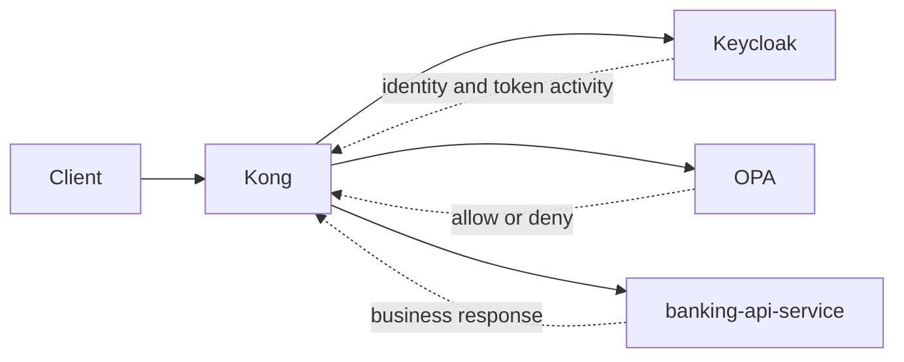
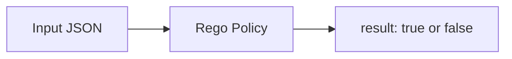
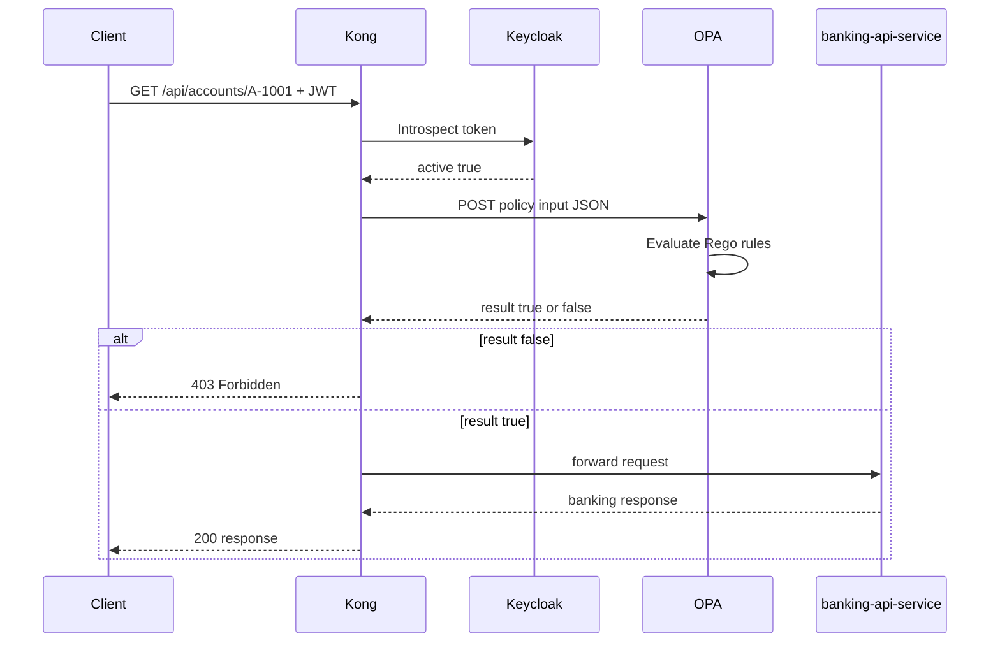

# 08 — OPA（PDP）

`OPA` 是策略决策点（Policy Decision Point）：它从 `Kong` 接收授权 input，并返回 `allow` 或 `deny`。

## 什么是 OPA

`OPA` 是 Open Policy Agent 的缩写。

在本项目中，`OPA` 是 `PDP`（策略决策点）—— 完整的 IdP / PEP / PDP 术语表见 [01 — 概念](01-concepts.md)。

`OPA` 只做一件事：

- 接收一个结构化的 input 文档
- 用 Rego 策略规则对其进行评估
- 返回一个决策：`allow` 或 `deny`

`OPA` 不认证用户。那是 `Keycloak` 的职责。
`OPA` 不在边缘执行决策。那是 `Kong` 的职责。
`OPA` 只负责判定。

## 本项目为什么需要 OPA

授权逻辑本可以直接写在：

- `Kong` 的插件代码里
- `banking-api-service` 的 Java 代码里

但那样会把策略与执行或业务逻辑耦合在一起。

把 `OPA` 用作专职的 `PDP` 带来三点具体好处：

1. 策略与网关、服务代码相互分离。
2. 策略可以用 `rego test` 独立测试。
3. 策略可以在不重写 `Kong` 插件或 `banking-api-service` 的情况下变更。

在本 PoC 中：

- `Keycloak` 证明用户是谁。
- `Kong` 在边缘执行（`PEP`）。
- `OPA` 判定操作是否被允许（`PDP`）。
- `banking-api-service` 提供纵深防御（资源服务器）。

## OPA 在架构中的位置



`OPA` 位于 `Kong` 与上游 `banking-api-service` 之间。Kong 在每个请求上同步调用 `OPA`、等待决策，然后要么转发请求、要么返回 `403`。

## Input → Policy → Result 模型

`OPA` 是一个通用引擎。它本身并不知道「银行账户」是什么。它只知道：

1. 它收到了什么 input
2. Rego 里写了什么规则



在本仓库中：

- `Kong` 构造并发送 `input`
- `banking_authz.rego` 定义规则
- `OPA` 返回 `result: true` 或 `result: false`

## Rego 基础

`OPA` 策略用 `Rego` 编写，这是一门声明式语言。

你描述的是「要授予访问，必须满足什么条件」，而不是写一步步的命令式逻辑。

实践中，本仓库的规则读起来是：

- 如果是读路由且角色是 `ops-admin`，则允许
- 如果是读路由、角色是 `customer`、且请求的账户在令牌的 `account_ids` 中，则允许
- 其余一切拒绝

## 默认拒绝（Deny By Default）

策略中最重要的一行是：

```rego
default allow := false
```

除非某条 `allow` 规则匹配，否则答案就是 `deny`。这比枚举 deny 规则更安全 —— 一条缺失的 deny 规则永远不会意外地放开访问。

## 本仓库中的实际策略

文件：`infra/opa/policies/banking_authz.rego`

```rego
package banking_authz

default allow := false

allow {
    read_only_account_request
    input.role == "ops-admin"
}

allow {
    read_only_account_request
    input.role == "customer"
    input.customer_id != ""
    account_ids := object.get(input, "account_ids", [])
    account_ids[_] == input.account_id
}

read_only_account_request {
    input.method == "GET"
    regex.match("^/api/accounts/[^/]+(?:/transactions)?$", input.path)
}
```

## 策略逐段讲解

### `package banking_authz`

把规则放进 `banking_authz` 包。`Kong` 在以下地址查询 `OPA`：

```
http://opa:8181/v1/data/banking_authz/allow
```

所以 `banking_authz` 是包，`allow` 是被查询的决策。

### `default allow := false`

除非下面某条 `allow` 规则匹配，否则一切都被拒绝。

### 第一条 `allow` 规则 —— ops-admin

```rego
allow {
    read_only_account_request
    input.role == "ops-admin"
}
```

含义：

- 请求必须是合法的读路由（通过辅助规则判定）
- 调用方必须具备角色 `ops-admin`
- 不做账户归属检查 —— `ops-admin` 可读取任意账户

### 第二条 `allow` 规则 —— customer

```rego
allow {
    read_only_account_request
    input.role == "customer"
    input.customer_id != ""
    account_ids := object.get(input, "account_ids", [])
    account_ids[_] == input.account_id
}
```

含义：

- 请求必须是合法的读路由
- 调用方必须具备角色 `customer`
- 令牌必须携带非空的 `customer_id`
- 请求的 `account_id` 必须出现在令牌的 `account_ids` 列表中

这就是核心的客户归属检查。

### 辅助规则：`read_only_account_request`

```rego
read_only_account_request {
    input.method == "GET"
    regex.match("^/api/accounts/[^/]+(?:/transactions)?$", input.path)
}
```

含义：

- 只有 `GET` 请求能通过此关卡
- 只允许两种路径形态：
  - `/api/accounts/{accountId}`
  - `/api/accounts/{accountId}/transactions`

这防止未来新增的非读路由被同样的 `allow` 规则意外放行。

## OPA 接收到什么 Input

`OPA` 不直接读取 HTTP 请求。`Kong` 构造一个结构化的 input 文档并以 JSON POST 过去。

策略中 `OPA` 实际消费的字段是：

| 字段 | 类型 | 被谁使用 |
|---|---|---|
| `method` | string | `read_only_account_request` |
| `path` | string | `read_only_account_request` |
| `role` | string | 两条 `allow` 规则 |
| `customer_id` | string | customer 的 `allow` 规则 |
| `account_ids` | 字符串数组 | customer 的 `allow` 规则 |
| `account_id` | string | customer 的 `allow` 规则 |

`username` 被包含在 input 中，但在本版本的策略规则里未被消费。

完整的声明目录见 [14 — 请求与响应细节](14-request-response-reference.md)。

`alice` 的示例 input 文档：

```json
{
  "input": {
    "method": "GET",
    "path": "/api/accounts/A-1001",
    "account_id": "A-1001",
    "customer_id": "C-1001",
    "account_ids": ["A-1001"],
    "role": "customer",
    "username": "alice"
  }
}
```

## Kong 如何把 Input 发给 OPA

`Kong` 通过 `opa-authz` 插件调用 `OPA` 的 REST API。URL 来自 `infra/kong/kong.yml`：

```yaml
plugins:
  - name: opa-authz
    config:
      opa_url: http://opa:8181/v1/data/banking_authz/allow
```

插件 handler（`infra/kong/plugins/opa-authz/handler.lua`）构造 input 体：

```lua
local request_body = cjson.encode({
  input = {
    method = kong.request.get_method(),
    path = kong.request.get_path(),
    account_id = account_id,
    customer_id = claim_value(claims.customer_id),
    account_ids = claim_values(claims.account_ids),
    role = effective_role(claims),
    username = claims.preferred_username,
  },
})
```

`OPA` 收到的是从已校验 JWT 中提取出来的、干净的授权 input，而不是原始 HTTP 请求。

## OPA 返回什么

若策略允许：

```json
{ "result": true }
```

若策略拒绝：

```json
{ "result": false }
```

`Kong` 把它映射为行为：

- `result: true` → 把请求转发给上游 `banking-api-service`
- `result: false` → 向客户端返回 `403 Forbidden`

## 本 PoC 中的 OPA 请求流程



## OPA 在 Docker Compose 中如何运行

```yaml
opa:
  image: openpolicyagent/opa:0.68.0
  command: ["run", "--server", "--addr=0.0.0.0:8181", "/policies"]
  ports:
    - "8181:8181"
  volumes:
    - ./infra/opa/policies:/policies:ro
```

- `OPA` 作为独立的 HTTP 服务器运行在端口 `8181`
- 策略以只读方式从 `infra/opa/policies` 挂载
- `OPA` 没有被编译进任何 Java 服务 —— 它是一个独立容器

这种分离意味着策略可以独立于 `Kong` 或 `banking-api-service` 进行更新、测试与重载。

## 测试

文件：`infra/opa/policies/banking_authz_test.rego`

```rego
package banking_authz_test

import data.banking_authz
```

### 允许：ops-admin 读取某账户

```rego
test_ops_admin_is_allowed {
    banking_authz.allow with input as {
        "method": "GET",
        "path": "/api/accounts/A-1001",
        "role": "ops-admin",
        "account_id": "A-1001",
        "customer_id": "C-9999",
    }
}
```

`ops-admin` 可读取任意账户端点，无论客户归属如何。

### 允许：customer 读取自己的账户

```rego
test_customer_can_access_owned_account {
    banking_authz.allow with input as {
        "method": "GET",
        "path": "/api/accounts/A-1001",
        "role": "customer",
        "account_id": "A-1001",
        "customer_id": "C-1001",
        "account_ids": ["A-1001"],
    }
}
```

当账户 `A-1001` 出现在 `alice`（客户 `C-1001`）的 `account_ids` 中时，她可读取该账户。

### 允许：customer 读取自己的交易

```rego
test_customer_can_access_owned_account_transactions {
    banking_authz.allow with input as {
        "method": "GET",
        "path": "/api/accounts/A-1001/transactions",
        "role": "customer",
        "account_id": "A-1001",
        "customer_id": "C-1001",
        "account_ids": ["A-1001"],
    }
}
```

对所拥有的账户，其交易子资源同样被允许。

### 拒绝用例

测试文件证明了以下所有情形会被拒绝：

| 测试 | 它证明了什么 |
|---|---|
| `test_customer_cannot_access_other_account` | `account_ids` 不包含请求的账户 |
| `test_customer_without_claimed_account_is_denied` | `account_ids` 为空 |
| `test_customer_without_customer_id_is_denied` | `customer_id` 字段缺失 |
| `test_ops_admin_post_account_is_denied` | `POST` 不满足 `read_only_account_request` |
| `test_customer_subresource_path_is_denied` | `/cards` 路径不被正则匹配 |
| `test_other_roles_are_denied` | 角色 `auditor` 不匹配任一 `allow` 规则 |

负向测试与正向测试同等重要：只有当你也证明了它拒绝什么时，一条策略才值得信任。

## 实际示例

### alice 读取她自己的账户

Input：

```json
{
  "input": {
    "method": "GET",
    "path": "/api/accounts/A-1001",
    "account_id": "A-1001",
    "customer_id": "C-1001",
    "account_ids": ["A-1001"],
    "role": "customer",
    "username": "alice"
  }
}
```

结果：`allow`

原因：

- `GET` + 匹配的路径 → `read_only_account_request` 通过
- `role == "customer"`
- `customer_id` 非空
- `A-1001` 在 `account_ids` 中

### alice 尝试访问另一个客户的账户

Input：

```json
{
  "input": {
    "method": "GET",
    "path": "/api/accounts/A-2001",
    "account_id": "A-2001",
    "customer_id": "C-1001",
    "account_ids": ["A-1001"],
    "role": "customer",
    "username": "alice"
  }
}
```

结果：`deny`

原因：

- `A-2001` 不在 `alice` 的 `account_ids`（`["A-1001"]`）中

### ops-admin 读取任意账户

Input：

```json
{
  "input": {
    "method": "GET",
    "path": "/api/accounts/A-2001",
    "account_id": "A-2001",
    "customer_id": "C-9999",
    "role": "ops-admin"
  }
}
```

结果：`allow`

原因：

- `ops-admin` 规则不检查账户归属

### POST 请求（对两种角色都拒绝）

Input：

```json
{
  "input": {
    "method": "POST",
    "path": "/api/accounts/A-1001",
    "role": "ops-admin",
    "account_id": "A-1001",
    "customer_id": "C-9999"
  }
}
```

结果：`deny`

原因：

- `read_only_account_request` 失败，因为 `method != "GET"`

### 不受支持的子资源路径

Input：

```json
{
  "input": {
    "method": "GET",
    "path": "/api/accounts/A-1001/cards",
    "role": "customer",
    "account_id": "A-1001",
    "customer_id": "C-1001",
    "account_ids": ["A-1001"]
  }
}
```

结果：`deny`

原因：

- 正则只匹配 `/api/accounts/{id}` 与 `/api/accounts/{id}/transactions`
- `/cards` 不匹配

## OPA 不做什么

`OPA` 很强大，但在本 PoC 中它有清晰的边界：

- 不认证用户（那是 `Keycloak`）
- 不签发 JWT（那是 `Keycloak`）
- 在本请求路径中不自己内省令牌（那是 `Kong` 插件）
- 在这里不自己校验 JWT 签名（`Kong` 插件在内省后解码载荷）
- 不提供银行数据（那是 `banking-api-service`）

`OPA` 依赖 `Kong` 提供可信、格式良好的 input。如果 input 是错的，决策就是错的。

## 思维模型

1. `Keycloak` 说明用户是谁。
2. `Kong` 验证令牌处于 active 并提取声明。
3. `Kong` 把结构化 input 发给 `OPA`。
4. `OPA` 评估 Rego 规则并返回 `result: true` 或 `result: false`。
5. `Kong` 在边缘执行该决策。
6. `banking-api-service` 在返回银行数据前再次校验 JWT。

---

← Prev: [07 — Kong](07-kong.md) · Next: [09 — banking-api-service](09-banking-api-service.md) →
