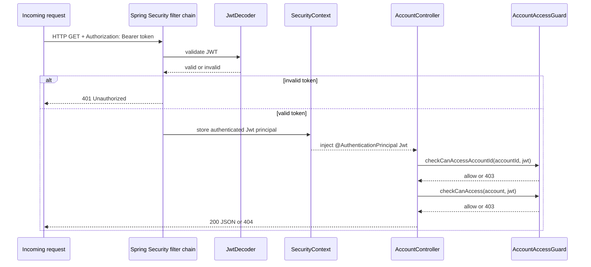
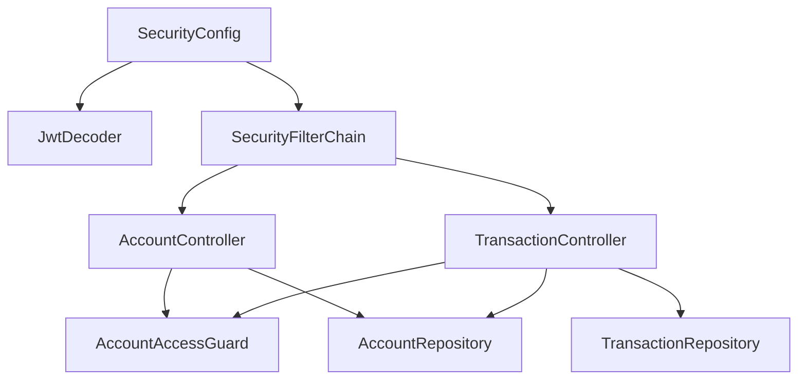

# 09 — banking-api-service（资源服务器）

这个 Spring Boot 服务拥有受保护的银行数据，并在每个请求上作为纵深防御层再次检查安全性。

---

## 该服务做什么

`banking-api-service` 暴露两个端点：

- `GET /api/accounts/{accountId}`
- `GET /api/accounts/{accountId}/transactions`

它返回简单的内存银行数据。本文关注的是它的安全行为，而非数据存储。

安全职责：

- 认证 bearer 令牌
- 校验 JWT 的签名、签发者与受众
- 依据 JWT 声明对请求的账户进行授权

---

## 为什么该服务仍要做安全检查

`Kong` 是边缘的 PEP，`OPA` 是判定 allow/deny 的 PDP。但 `banking-api-service` 仍然是一个独立的信任边界。PEP/PDP/资源服务器的定义见 [01 — 概念](01-concepts.md)。

该服务再次检查的理由：

- 服务可能在网络内部被直接调用，绕过 `Kong`
- 网关配置错误可能让没有有效令牌的请求通过
- 未来的路由可能绕过部分边缘逻辑
- 纵深防御是良好的安全实践 —— 每一层都应保护自身

因此该服务重复关键检查：签名、签发者、受众，以及账户级授权。

---

## 请求流程概览

```mermaid
flowchart LR
    R[Incoming HTTP request] --> SF[Spring Security filter chain]
    SF --> JD[JwtDecoder]
    JD --> V[Signature · issuer · audience validation]
    V --> JP[Authenticated Jwt principal]
    JP --> AG[AccountAccessGuard]
    AG --> AC[AccountController or TransactionController]
    AC --> REPO[AccountRepository / TransactionRepository]
    REPO --> RESP[JSON response]
```



---

## `SecurityConfig` 装配

`SecurityConfig` 标注了 `@Configuration`。Spring Boot 在启动时发现它，并从中创建两个 bean：

- `SecurityFilterChain`
- `JwtDecoder`

### `SecurityFilterChain`

```java
@Bean
SecurityFilterChain securityFilterChain(HttpSecurity http) throws Exception {
    return http
            .csrf(csrf -> csrf.disable())
            .authorizeHttpRequests(authorize -> authorize
                    .requestMatchers("/actuator/health").permitAll()
                    .anyRequest().authenticated())
            .oauth2ResourceServer(oauth2 -> oauth2.jwt(Customizer.withDefaults()))
            .build();
}
```

每一行的含义：

- 禁用 CSRF —— 这是一个无状态 API，不是浏览器表单应用
- `/actuator/health` 公开 —— 容器健康检查需要
- 其余一切都要求认证
- `.oauth2ResourceServer(...jwt(...))` 安装 JWT 认证过滤器

这些过滤器提取 `Authorization: Bearer` 令牌，并在控制器被调用之前请 `JwtDecoder` 校验它。

### `JwtDecoder`

```java
@Bean
JwtDecoder jwtDecoder(
        @Value("${spring.security.oauth2.resourceserver.jwt.jwk-set-uri}") String jwkSetUri,
        @Value("${banking-api.security.issuer-uri}") String issuerUri,
        @Value("${banking-api.security.audience}") String audience) {
    NimbusJwtDecoder jwtDecoder = NimbusJwtDecoder.withJwkSetUri(jwkSetUri).build();
    jwtDecoder.setJwtValidator(jwtValidator(issuerUri, audience));
    return jwtDecoder;
}
```

`NimbusJwtDecoder.withJwkSetUri(...)` 从 `Keycloak` 的 JWKS 端点获取公钥，并用它们验证令牌签名。随后一个自定义的 `jwtValidator` 检查签发者与受众。

该服务使用 JWKS（公钥验证）而非令牌内省 —— 无状态、每个请求都不需要往返 `Keycloak`。关于这一选择背后的理由，见 [11 — JWT 签名、校验与内省](11-jwt-signature-validation.md)。关于 JWKS 机制，见 [12 — JWKS 深入解析](12-jwks.md)。

---

## 配置

### `application.yml` 中的键

| 键 | 用途 |
|---|---|
| `spring.security.oauth2.resourceserver.jwt.jwk-set-uri` | 获取 `Keycloak` 公钥的 URL |
| `banking-api.security.issuer-uri` | 受信任的签发者；必须与 JWT 的 `iss` 声明匹配 |
| `banking-api.security.audience` | 必需的受众值；必须出现在 JWT 的 `aud` 声明中 |

### 环境变量（来自 `docker-compose.yml`）

| 变量 | Docker Compose 中的值 |
|---|---|
| `BANKING_API_JWK_SET_URI` | `http://keycloak:8080/realms/banking-poc/protocol/openid-connect/certs` |
| `BANKING_API_ISSUER_URI` | `http://keycloak:8080/realms/banking-poc` |
| `BANKING_API_AUDIENCE` | `mobile-banking-app` |

---

## JWT 校验

`SecurityConfig` 中的 `jwtValidator` 方法组合了两个校验器：

### 签名

`NimbusJwtDecoder` 使用从 `Keycloak` 的 JWKS 端点获取的密钥验证令牌签名。被篡改的令牌会立即失败。

### 签发者

`JwtValidators.createDefaultWithIssuer(issuerUri)` 检查 `iss` 声明是否与配置的 `Keycloak` realm 匹配。来自不同签发者的令牌会被拒绝。

### 受众

一个 `JwtClaimValidator` 检查 `aud` 声明是否包含 `mobile-banking-app`。不针对本应用的令牌会被拒绝。

若任一检查失败，Spring Security 返回 `401 Unauthorized`，控制器永不会被调用。

---

## 该服务读取哪些声明

`AccountAccessGuard` 从已校验的 `Jwt` 中读取三个声明：

| 声明 | 读取方式 |
|---|---|
| `realm_access.roles` | `jwt.getClaim("realm_access")` 转为 `Map`，再 `get("roles")` |
| `customer_id` | `jwt.getClaimAsString("customer_id")` |
| `account_ids` | `jwt.getClaimAsStringList("account_ids")` |

整个系统的完整声明目录见 [14 — 请求与响应细节](14-request-response-reference.md)。

---

## Spring Security 在运行时如何装配 `SecurityConfig`

启动时：

1. Spring 发现 `SecurityConfig`（`@Configuration`）
2. 创建 `SecurityFilterChain` bean —— 安装 JWT 过滤器链
3. 创建 `JwtDecoder` bean —— Spring Security 自动使用它

每个请求：

1. JWT 过滤器提取 bearer 令牌
2. `JwtDecoder` 校验签名、签发者、受众
3. Spring 把已认证的 `Jwt` 存入安全上下文
4. 控制器通过 `@AuthenticationPrincipal Jwt jwt` 接收它
5. 控制器调用 `AccountAccessGuard` 做授权



---

## `AccountAccessGuard`

文件：`services/banking-api-service/src/main/java/com/banking/poc/bankingapi/account/AccountAccessGuard.java`

该守卫有两个公开方法：

- `checkCanAccessAccountId(String accountId, Jwt jwt)` —— 在仓库查找之前调用
- `checkCanAccess(AccountDto account, Jwt jwt)` —— 在账户加载之后调用

### 为什么有两次检查

**第一次检查 —— 账户 ID 预检（`checkCanAccessAccountId`）：**

- 尽早拒绝明显被禁止的账户 ID
- 减少信息泄露 —— 对于将被拒绝的请求，服务不触碰仓库
- 避免为调用方明显无法访问的请求加载数据

**第二次检查 —— 对象级检查（`checkCanAccess`）：**

- 确认已加载账户的 `customerId` 确实与 JWT 的 `customer_id` 匹配
- 为「账户/客户关系与仅凭 ID 所暗示的不一致」的情形增加一层保险

### 授权规则

**规则 1 —— 无 JWT → `401`**

若 `Jwt` 对象为 `null`，守卫抛出 `401 Unauthorized`。

**规则 2 —— `ops-admin` 可访问任意账户**

若 `realm_access.roles` 包含 `ops-admin`，两次检查都无条件通过。

**规则 3 —— `customer` 必须匹配声明上下文**

对 `checkCanAccessAccountId`，以下全部必须为真：

- `realm_access.roles` 包含 `customer`
- `customer_id` 声明非 null 且非空白
- `account_ids` 声明包含请求的 `accountId`

对 `checkCanAccess`，还需额外满足：

- `account.customerId()` 等于 JWT 的 `customer_id`
- `account.accountId()` 在 JWT 的 `account_ids` 列表中

**规则 4 —— 否则 `403`**

---

## `AccountController`

文件：`services/banking-api-service/src/main/java/com/banking/poc/bankingapi/account/AccountController.java`

端点：`GET /api/accounts/{accountId}`

```java
@GetMapping("/{accountId}")
public AccountDto getAccount(@PathVariable String accountId, @AuthenticationPrincipal Jwt jwt) {
    accountAccessGuard.checkCanAccessAccountId(accountId, jwt);
    AccountDto account = accountRepository.findById(accountId)
            .orElseThrow(() -> new ResponseStatusException(HttpStatus.NOT_FOUND));
    accountAccessGuard.checkCanAccess(account, jwt);
    return account;
}
```

流程：

1. 从路径接收 `accountId`，从安全上下文接收已校验的 `Jwt`
2. `checkCanAccessAccountId` —— 若调用方无法访问该账户 ID，尽早拒绝
3. 从 `AccountRepository` 加载账户 —— 未找到则返回 `404`
4. `checkCanAccess` —— 确认已加载账户与调用方的声明上下文匹配
5. 以 JSON 返回 `AccountDto`

---

## `TransactionController`

文件：`services/banking-api-service/src/main/java/com/banking/poc/bankingapi/transaction/TransactionController.java`

端点：`GET /api/accounts/{accountId}/transactions`

```java
@GetMapping("/{accountId}/transactions")
public List<TransactionDto> getTransactions(@PathVariable String accountId, @AuthenticationPrincipal Jwt jwt) {
    accountAccessGuard.checkCanAccessAccountId(accountId, jwt);
    AccountDto account = accountRepository.findById(accountId)
            .orElseThrow(() -> new ResponseStatusException(HttpStatus.NOT_FOUND));
    accountAccessGuard.checkCanAccess(account, jwt);
    return transactionRepository.findByAccountId(accountId);
}
```

流程与 `AccountController` 相同。两次守卫检查都通过后，控制器从 `TransactionRepository` 加载交易列表并返回。

---

## 类之间的关系



---

## 互操作

### 与 `Keycloak`

`Keycloak` 签名 JWT、设置签发者，并嵌入 `customer_id`、`account_ids` 与角色声明。该服务用 `Keycloak` 的 JWKS 端点校验签名，并且不信任来自未签名或错误签发令牌的任何声明。

### 与 `Kong`

`Kong` 是把请求转发到 `banking-api-service` 的 PEP。然而，该服务并不无条件信任 `Kong` —— 它独立校验 JWT。这意味着对该服务的直接调用（绕过 `Kong`）仍会得到同样的安全执行。

### 与 `OPA`

`OPA` 是 `Kong` 在边缘咨询的 PDP。`banking-api-service` 不直接调用 `OPA`。取而代之，它从受信任的 JWT 声明出发，再次执行同样的业务访问规则（账户归属、角色）。边缘与服务会收敛到同一答案，因为二者读取的是同一组声明。

### 与 `identity-bootstrap-service`

`identity-bootstrap-service` 创建带有角色、`customer_id` 与 `account_ids` 的 `Keycloak` 用户。这些值会嵌入到 `banking-api-service` 后续接收并校验的每个 JWT 中。

---

## 实际示例

### 示例 1 —— `alice` 访问她自己的账户

`alice` 的 JWT：

- `realm_access.roles`：`["customer"]`
- `customer_id`：`C-1001`
- `account_ids`：`["A-1001"]`

请求：`GET /api/accounts/A-1001`

结果：

- JWT 校验通过（签名、签发者、受众）
- `checkCanAccessAccountId` 通过（`A-1001` 在 `account_ids` 中）
- 加载账户
- `checkCanAccess` 通过（`customerId` 匹配）
- `200 OK` 及账户 JSON

### 示例 2 —— `alice` 请求一个她不拥有的账户

JWT 同上。

请求：`GET /api/accounts/A-2001`

结果：

- JWT 校验通过
- `checkCanAccessAccountId` 失败（`A-2001` 不在 `account_ids = ["A-1001"]` 中）
- `403 Forbidden` —— 控制器永不执行

### 示例 3 —— `ops-admin` 访问任意账户

`ops-admin` 的 JWT：

- `realm_access.roles`：`["ops-admin"]`

请求：`GET /api/accounts/A-2001`

结果：

- JWT 校验通过
- `checkCanAccessAccountId` 通过（角色 `ops-admin` 短路）
- 加载账户
- `checkCanAccess` 通过（角色 `ops-admin` 短路）
- `200 OK` 及账户 JSON

### 示例 4 —— 被篡改的令牌

请求携带一个签名无效的 JWT。

结果：

- `JwtDecoder` 在签名验证时拒绝该令牌
- Spring Security 返回 `401 Unauthorized`
- 控制器永不执行

---

## 思维模型

1. `SecurityConfig` 在启动时装配两个 bean：`SecurityFilterChain` 与 `JwtDecoder`
2. 每个请求，过滤器链提取并校验 bearer 令牌（签名 → 签发者 → 受众）
3. 有效令牌成为一个受信任的 `Jwt` principal，通过 `@AuthenticationPrincipal` 注入
4. `AccountAccessGuard` 使用 `realm_access.roles`、`customer_id` 与 `account_ids` 执行账户级授权
5. 只有在认证与授权检查都通过后，控制器才返回数据

---

← Prev: [08 — OPA](08-opa.md) · Next: [10 — identity-bootstrap-service](10-identity-bootstrap-service.md) →
