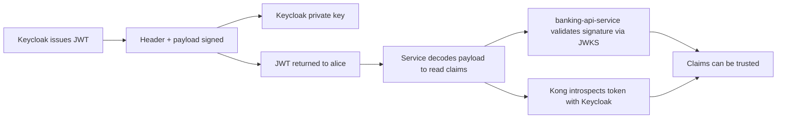
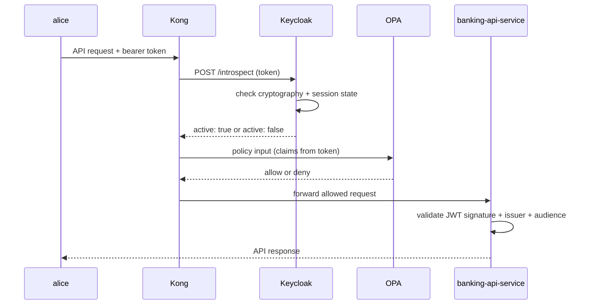
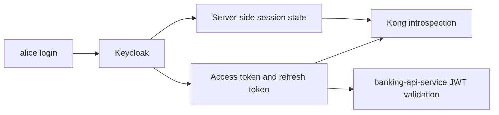

# 11 — JWT 签名、校验与内省

本 PoC 中令牌如何被签名、校验与内省 —— 以及为什么即便对一个结构合法、尚未过期的 JWT，`Keycloak` 也可能返回 `active: false`。

全文使用的固定术语见 [01 — 概念](01-concepts.md)：`Keycloak`（IdP）、`Kong`（PEP）、`OPA`（PDP）、`banking-api-service`（资源服务器）。

---

## 四个要素

### 1. 签名

签名是「`Keycloak` 创建了该令牌」的密码学证明。

它是在 `Keycloak` 签发访问令牌时，用 `Keycloak` 的私钥对令牌的 header 与 payload 签名而产生的。

为什么重要：

- 它证明令牌来自 `Keycloak`
- 它证明 payload 在签发后未被改动
- 它防止调用方仅通过 Base64URL 编码数据就伪造出一个看似有效的假令牌

### 2. 校验（Validation）

校验是指检查令牌是真实的、且对本次请求是可接受的。

典型的校验项有：

- 签名有效
- 令牌未过期（`exp`）
- 签发者（`iss`）与期望的 `Keycloak` realm 匹配
- 受众（`aud`）与该 client 或 API 匹配

在本 PoC 中：

- `banking-api-service` 使用 JWKS 在本地校验 JWT
- `Kong` 在信任令牌做策略决策之前使用 `Keycloak` 内省

### 3. 内省（Introspection）

内省是从某个服务向 `Keycloak` 内省端点发起的一次实时调用。

`Keycloak` 回复令牌是否 `active`，也可能返回令牌元数据。

为什么重要：

- 它从「真相之源」确认令牌仍然有效
- 它能捕获被吊销的或其他 inactive 的令牌
- 相比仅解码 JWT，它给出更强的信任检查

在本 PoC 中，`Kong` 在用解码后的声明为 `OPA` 构建策略 input 之前，先对令牌做内省。

关于「为什么即便对一个结构合法、未过期的 JWT，`Keycloak` 也可能返回 `active: false`」的完整机制，详见下文「内省实际检查什么」一节。

### 4. 声明（Claims）

声明是 JWT payload 内部的数据。

本 PoC 中的示例：

- `iss`
- `aud`
- `preferred_username`
- `realm_access.roles`
- `customer_id`
- `account_ids`

解码令牌让你能读取这些声明。
校验或内省告诉你这些声明是否可信。

---

## 信任链如何工作



关键观念是：解码与信任不是一回事。

- 解码回答：令牌说了什么？
- 校验回答：它真的由 `Keycloak` 签发吗？它现在可接受吗？
- 内省回答：`Keycloak` 是否仍认为该令牌处于 active？

---

## 签名验证如何工作

JWT 有三部分：

```text
header.payload.signature
```

`Keycloak` 用其私钥对 `header.payload` 部分签名。
签名作为第三段附加在后面。

当服务校验令牌时，它做相反的过程：

1. 把 JWT 拆成 header、payload 与 signature
2. 获取或加载 `Keycloak` 的公钥（通过 JWKS —— 见 [12 — JWKS 深入解析](12-jwks.md)）
3. 从 header 与 payload 重新计算期望的签名
4. 将计算出的签名与令牌中的签名比较

若二者匹配，则令牌是用配对的私钥签名的，且 payload 未被改动。
若不匹配，则令牌被拒绝。

### 私钥与公钥

`Keycloak` 把私钥保密。

服务从不需要私钥。
它们只需要公钥，而公钥是可以安全共享的。

正是这把公钥，让 `banking-api-service` 与其他服务能够验证某个令牌来自期望的 `Keycloak` realm。

### 本 PoC 中的密码学机制

本 PoC 中的访问令牌使用 `RS256`：

- `R` = RSA 公钥密码学
- `S` = 签名（signature）
- `256` = SHA-256 哈希

签名过程：

1. `Keycloak` 构建 JWT 的 header 与 payload。
2. 它对每一部分做 Base64URL 编码。
3. 它把它们拼接为 `header.payload`。
4. 它用 SHA-256 对该字符串哈希。
5. 它用 `Keycloak` 的 RSA 私钥对哈希签名。
6. 它把得到的签名作为第三段附加到 JWT 上。

当服务校验令牌时，它反过来：

1. 把 JWT 拆成 header、payload 与 signature
2. 对 header 与 payload 做 Base64URL 解码
3. 重建 `header.payload` 签名输入
4. 用 `Keycloak` 的 RSA 公钥验证签名

若签名是用配对的私钥创建的，验证成功。
若令牌被修改过，验证失败，因为哈希不再与被签名的内容匹配。

用大白话说：

- `Keycloak` 用其私钥签名
- 服务用 `Keycloak` 的公钥验证
- SHA-256 哈希让 payload 一旦被篡改即可被发现

> 服务如何在 JWKS 端点发现并缓存 `Keycloak` 的公钥，见 [12 — JWKS 深入解析](12-jwks.md)。

---

## 校验通常检查什么

校验比签名检查更宽泛。

服务通常检查：

- 签名有效
- `exp` 未过
- `iss` 与期望的 realm 匹配
- `aud` 与期望的 client 或 API 匹配
- 令牌类型符合服务的预期

若其中任一检查失败，该令牌不应被信任用于授权决策。

在本 PoC 中，`banking-api-service` 对传入请求执行 JWT 校验，因此它能拒绝过期的、格式错误的、或为错误受众签发的令牌。

---

## 内省实际检查什么

本节是本系列文档中对内省机制的唯一完整论述。

### 内省时 Keycloak 做什么

当 `Kong` 调用 `Keycloak` 的内省端点时，`Keycloak` 做的不止是解码 JWT。

在高层面上，`Keycloak` 检查：

1. 令牌能否被解析？
2. 令牌在密码学上是否可接受？
3. 令牌是否过期？
4. 用户会话是否仍处于 active？
5. 客户端会话是否仍处于 active？
6. 是否有登出、吊销或失效事件使该令牌不可用？

若这些检查通过，`Keycloak` 返回：

```json
{
  "active": true
}
```

若不通过，`Keycloak` 返回：

```json
{
  "active": false
}
```

所以内省回答的是：`Keycloak` 此刻是否仍认为该令牌可用？

### 为什么即便对结构合法、未过期的 JWT，Keycloak 也可能返回 `active: false`

这是整个技术栈中最重要的观念之一。

因为 `Keycloak` 保有服务端会话状态，所以即便满足以下条件，它也能说一个令牌是 inactive：

- 令牌看起来仍是一个有效的 JWT
- 声明仍能被解码
- 令牌尚未到达其 `exp` 时间戳

原因在于：`Keycloak` 不仅是该 JWT 的签发者 —— 它还是该 JWT 背后实时会话状态的拥有者。

`Keycloak` 可能返回 `active: false` 的例子：

- `alice` 登出了
- 用户会话过期了
- 客户端会话过期了
- `alice` 账户被禁用了
- 该 client（如 `mobile-banking-app`）被禁用了
- 发生了 realm 或 client 的失效事件

所以当 `Keycloak` 收到一个内省请求时，它不仅在问「这个 JWT 看起来格式良好吗？」—— 它还在问「依据 `Keycloak` 此刻的状态，这个令牌是否仍属于一个存活且可接受的会话？」

**JWT 携带令牌数据。`Keycloak` 保有会话真相。**

这是关于内省最重要的思维模型。

### Keycloak 如何保有会话状态

访问令牌与会话相关，但不是同一回事。

- JWT 携带身份与声明数据
- `Keycloak` 在服务端保有实时会话信息

`Keycloak` 通常维护以下会话层：

| 层 | 它代表什么 |
|---|---|
| 认证会话 | 登录流程期间的临时状态；登录完成或过期后移除 |
| 用户会话 | 某个 realm 中被认证的用户会话 —— 跟踪开始时间、空闲/过期、登出状态 |
| 客户端会话 | 该用户会话中按 client 划分的参与（例如对 `mobile-banking-app`） |

运行时，`Keycloak` 主要把在线会话状态存放在 Infinispan 缓存中。离线会话则持久化在数据库中。在集群部署里，缓存在各节点间复制。

实践要点：令牌声明随 JWT 携带，但实时会话活动维护在服务端。这正是为什么一个令牌可以被正确解码，但若其背后的会话状态已不存在，内省仍可能返回 `active: false`。

### 本 PoC 中的内省流程



### 会话与令牌的关系



---

## JWKS vs 内省 —— 该用哪个

本 PoC 两种机制都用，但用在不同的地方。

### 为什么 `banking-api-service` 用 JWKS 而非内省

`banking-api-service` 充当资源服务器。它用 JWKS 做 JWT 校验，理由如下：

**1. 本地且快速。** `banking-api-service` 从 JWKS 端点下载 `Keycloak` 的公钥后，便能在本地校验 JWT，每个请求都无需网络往返。

**2. JWT 本就为此模式而设计。** 一个自包含的 JWT 已经携带了声明、过期、签发者、受众与签名。这使得本地 JWKS 校验成为 Spring Security JWT 资源服务器自然且标准的模式。

**3. 更好的韧性。** 若 `Keycloak` 短暂变慢或不可用，只要服务已经拥有所需公钥，对已签发的令牌做本地 JWT 校验仍可工作。每个请求都内省会对 `Keycloak` 的实时可用性形成硬依赖。

**4. 更清晰的资源服务器边界。** Spring Security 的资源服务器支持，正是为「bearer JWT + 通过 JWKS 发现公钥 + 签发者与受众校验」而设计的。使用 JWKS 是标准、高效的模型 —— 而非权宜之计。

> 密钥轮换机制与 JWKS 缓存见 [12 — JWKS 深入解析](12-jwks.md)。

### 每种机制回答什么

| 机制 | 回答的问题 |
|---|---|
| JWKS 校验 | 该令牌是否由受信任的签发者签名？它是否有正确的 `iss`、`aud` 与 `exp`？ |
| 内省 | `Keycloak` 此刻是否仍认为该令牌处于 active？ |

JWKS 校验回答令牌在密码学上是否可信。
内省再补上一个实时答案：令牌背后的会话是否仍存活。

### 为什么本 PoC 两者都用

| 组件 | 机制 | 用途 |
|---|---|---|
| `Kong` | 内省 | 边缘的实时令牌活跃性检查 —— 在构建 `OPA` 策略 input 之前，向 `Keycloak` 询问令牌是否 active |
| `banking-api-service` | JWKS 校验 | 本地密码学验证 —— 服务不盲目相信网关已经检查了一切 |

纵深防御：即便 `Kong` 已经内省过，`banking-api-service` 仍把 JWT 校验作为自己的信任边界。

**简短版：**

- 内省 = 实时会话状态检查
- JWKS 校验 = 本地密码学信任检查

---

## 声明用来做什么

声明携带身份与授权上下文。

示例：

- `iss` 告诉服务令牌由谁签发
- `aud` 告诉服务令牌是发给哪个 client 或 API 的
- `preferred_username` 给出可读的用户名（`alice`、`ops-admin`）
- `realm_access.roles` 给出角色信息
- `customer_id` 与 `account_ids` 携带业务上下文

声明一经解码就很容易读取，但只有在校验或内省之后，才可以安全地据其行动。

---

## 端到端示例（alice）

1. `alice` 向 `Keycloak` 认证。
2. `Keycloak` 在服务端创建一个用户会话与一个客户端会话。
3. `Keycloak` 签发一个签名的 JWT 访问令牌，包含 `iss`、`aud`、`preferred_username`、`customer_id` 与 `account_ids`。
4. `alice` 把 bearer 令牌发给 `Kong`。
5. `Kong` 调用 `Keycloak` 的内省端点 —— `Keycloak` 检查 JWT 与实时会话状态，返回 `active: true`。
6. `Kong` 把策略 input（解码后的声明）发给 `OPA`；`OPA` 返回 allow。
7. `Kong` 把请求转发给 `banking-api-service`。
8. `banking-api-service` 用 `Keycloak` 的公钥（经 JWKS 获取）校验 JWT 签名，检查 `iss`、`aud` 与 `exp`。
9. `banking-api-service` 把 API 响应返回给 `alice`。

两层信任：

- 实时的 `Keycloak` 会话验证（经由 `Kong` 内省）
- 本地的密码学验证（经由 `banking-api-service` 的 JWKS 校验）

> 关于访问令牌如何通过刷新令牌续期，见 [13 — 访问令牌与刷新令牌的生命周期](13-token-lifecycle.md)。

---

## 小结

- **解码（decode）** = 读出令牌说了什么
- **校验（validate）** = 证明令牌是真实的、是发给本服务的、且未过期
- **内省（introspect）** = 询问 `Keycloak` 令牌的会话是否仍存活

签名让令牌一旦被篡改即可被发现。
校验让令牌在本地可被接受。
内省给出来自 `Keycloak` 的实时答案 —— 而 `Keycloak` 即便对一个结构合法、未过期的 JWT 也能返回 `active: false`，因为它拥有的是会话真相，而不仅仅是令牌字符串。

---

← Prev: [10 — identity-bootstrap-service](10-identity-bootstrap-service.md) · Next: [12 — JWKS 深入解析](12-jwks.md) →
