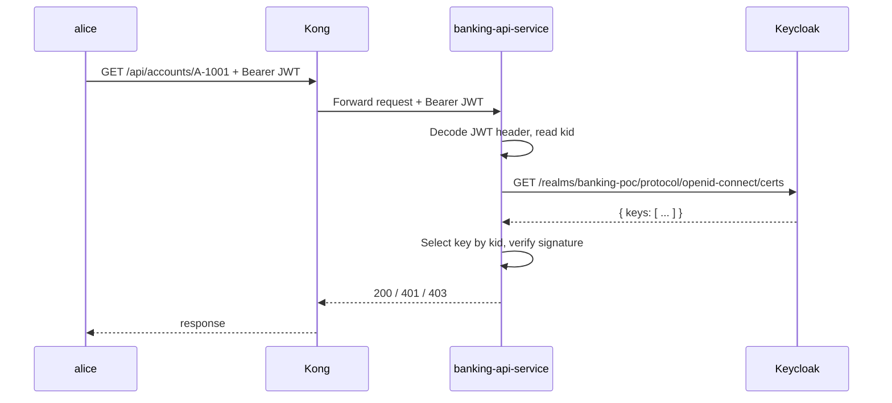

# 12 — JWKS 深入解析

JWKS 是一个实时的公钥目录，它让 `banking-api-service` 能按 `kid` 选出正确的密钥并安全地验证 JWT 签名 —— 即便 `Keycloak` 轮换了签名密钥。

全文使用的固定术语见 [01 — 概念](01-concepts.md)：`Keycloak`（IdP）、`Kong`（PEP）、`OPA`（PDP）、`banking-api-service`（资源服务器）。

---

## 快速定义

- **JWK** —— 描述一把密码学密钥的 JSON 对象。
- **JWKS** —— 一个含有 `keys` 数组的 JSON 文档，数组里有一个或多个 JWK。
- **`kid`** —— 密钥 ID，用于选出正确的密钥来做验证。
- **`jwk-set-uri`** —— 提供 JWKS 文档的端点。

---

## JWKS 为什么存在

对于像 `RS256` 这样的非对称签名：

- `Keycloak` 用私钥签名 JWT。
- 服务用配对的公钥验证 JWT。

公钥可能轮换。如果服务硬编码某一把密钥，轮换时验证就会失败。JWKS 通过在一个稳定的 URL 上发布当前的公钥来解决这个问题。服务按需从该 URL 获取并缓存结果。

---

## 它在本 PoC 中如何落位

`banking-api-service` 在 `services/banking-api-service/src/main/resources/application.yml` 中配置了：

```yaml
spring.security.oauth2.resourceserver.jwt.jwk-set-uri
```

这告诉 Spring Security 到哪里去获取用于校验 JWT 签名的公钥。

在本 PoC 中，该值由 `docker-compose.yml` 注入为：

```yaml
BANKING_API_JWK_SET_URI: http://keycloak:8080/realms/banking-poc/protocol/openid-connect/certs
```

为什么是 `http://keycloak:8080` 而不是 `http://localhost:9081`：

- `banking-api-service` 运行在 Docker Compose 网络内部。
- 在该网络内部，`keycloak` 是服务主机名。
- 容器内的 `localhost` 指向的是 `banking-api-service` 容器自身，而不是 `Keycloak`。

| 访问者 | URL |
|---|---|
| 宿主机 | `http://localhost:9081/realms/banking-poc/protocol/openid-connect/certs` |
| 容器对容器 | `http://keycloak:8080/realms/banking-poc/protocol/openid-connect/certs` |

---

## JWKS 查找流程

当一个带 bearer 令牌的请求到来时，Spring Security 按以下步骤进行：

1. 接收带 bearer 令牌的请求。
2. 解码 JWT 的 header 并读取 `kid`。
3. 从 `Keycloak` 获取 JWKS（或使用已缓存的密钥集）。
4. 选出 `kid` 与令牌 header 中 `kid` 匹配的那把 JWK。
5. 用该密钥验证 JWT 签名。
6. 若签名及所有其他校验器都通过，则认证该请求。



---

## 本 PoC 中实际的 JWKS 响应

获取 `Keycloak` 的 JWKS 端点会返回这种形态的 JSON：

```json
{
  "keys": [
    {
      "kid": "gMTvER9Ofps6D0UuEk2av7caU5GlZd4sS-c7fWkyxoA",
      "kty": "RSA",
      "alg": "RSA-OAEP",
      "use": "enc",
      "n": "...",
      "e": "AQAB",
      "x5c": ["..."],
      "x5t": "...",
      "x5t#S256": "..."
    },
    {
      "kid": "0BYek66uebuec84BqxfwJ9_qxIDr1Wka-1siBT2z0Lk",
      "kty": "RSA",
      "alg": "RS256",
      "use": "sig",
      "n": "...",
      "e": "AQAB",
      "x5c": ["..."],
      "x5t": "...",
      "x5t#S256": "..."
    }
  ]
}
```

注意：

- 该端点返回了不止一把密钥。
- 并非每把密钥用途相同 —— `use` 用来区分它们。

---

## 为什么出现了两把密钥

`Keycloak` 暴露了两把用途不同的 RSA 密钥。

### 密钥 1 —— 加密密钥

```json
{
  "alg": "RSA-OAEP",
  "use": "enc"
}
```

- `use: "enc"` 表示这把密钥用于加密场景，而非签名验证。
- `banking-api-service` 不会用这把密钥来验证 JWT 签名。

### 密钥 2 —— 签名密钥

```json
{
  "kid": "0BYek66uebuec84BqxfwJ9_qxIDr1Wka-1siBT2z0Lk",
  "kty": "RSA",
  "alg": "RS256",
  "use": "sig"
}
```

- `use: "sig"` 表示这把密钥用于签名验证。
- `alg: "RS256"` 与本 PoC 中 JWT header 的算法匹配。
- 这就是 Spring Security 用来验证 JWT 签名的密钥。

`banking-api-service` 关心的是第二把密钥，而非第一把。

---

## 一把 JWK 的解剖（RSA）

一把典型的 RSA 公钥 JWK 看起来是这样：

```json
{
  "kty": "RSA",
  "kid": "0BYek66uebuec84BqxfwJ9_qxIDr1Wka-1siBT2z0Lk",
  "use": "sig",
  "alg": "RS256",
  "n": "...",
  "e": "AQAB"
}
```

| 字段 | 含义 |
|---|---|
| `kty` | 密钥类型。这里是 `RSA`。 |
| `kid` | 密钥 ID。必须与 JWT header 中的 `kid` 匹配。 |
| `use` | 预期用途。`sig` 表示签名验证。 |
| `alg` | 预期算法。本 PoC 中是 `RS256`。 |
| `n` | RSA 模数（公开部分）。 |
| `e` | RSA 公钥指数。 |

### `x5c`、`x5t` 与 `x5t#S256` 的含义

`Keycloak` 在 RSA 密钥材料旁还附带了证书字段。

| 字段 | 含义 |
|---|---|
| `x5c` | X.509 证书链 —— 公钥材料的另一种表示。 |
| `x5t` | 证书的 SHA-1 指纹。 |
| `x5t#S256` | 证书的 SHA-256 指纹。 |

Spring Security 主要需要 `n` 与 `e` 来重建用于验证的 RSA 公钥。证书字段在 JWKS 响应中是正常的，对本 PoC 的验证过程没有影响。

---

## 通过 `kid` 把 JWT header 匹配到 JWK

本 PoC 中的一个 JWT header 形如：

```json
{
  "alg": "RS256",
  "typ": "JWT",
  "kid": "0BYek66uebuec84BqxfwJ9_qxIDr1Wka-1siBT2z0Lk"
}
```

密钥选择过程：

1. 从 JWT header 取出 `kid`。
2. 在 JWKS 的 `keys` 数组中找到 `kid` 相同的那把 JWK。
3. 用该 JWK 的公钥验证签名。

如果没有 JWK 匹配该 `kid`，验证失败，Spring Security 返回 `401 Unauthorized`。

### 本 PoC 中的具体匹配

Spring 寻找满足以下条件的 JWK：

- `kid = "0BYek66uebuec84BqxfwJ9_qxIDr1Wka-1siBT2z0Lk"`

它还确认：

- `use = "sig"`
- `alg = "RS256"`

那正是用于验证该令牌的确切公钥条目。

---

## 密钥轮换与多把密钥

JWKS 在轮换期间通常会同时持有多把密钥。

轮换期间的示例形态：

```json
{
  "keys": [
    { "kid": "old-key", "kty": "RSA", "use": "sig", "n": "...", "e": "AQAB" },
    { "kid": "new-key", "kty": "RSA", "use": "sig", "n": "...", "e": "AQAB" }
  ]
}
```

为什么这很重要：

- 旧令牌在过期前仍用旧密钥验证通过。
- 新令牌立即用新密钥验证。
- 服务不会仅因为签名密钥轮换就需要重新部署。

每个令牌 header 中的 `kid` 始终精确指向那把正确的密钥，无论此刻 JWKS 中有多少把密钥。

---

## 实践中的 Spring Security 行为

`banking-api-service` 使用 `NimbusJwtDecoder`，它由 `jwk-set-uri` 构建，并与签发者、受众校验器组合。

运行时，Spring Security 按以下顺序进行：

1. 读取 JWT header 并提取 `kid`。
2. 若尚未缓存，则从 `Keycloak` 获取 JWKS。
3. 定位 `kid` 匹配的那把 JWK。
4. 从 `n` 与 `e` 重建 RSA 公钥。
5. 验证 JWT 签名。
6. 检查令牌未过期（`exp`）。
7. 检查 `iss` 与配置的签发者匹配。
8. 检查 `aud` 包含配置的受众。

若任一检查失败，Spring Security 会在控制器逻辑运行之前就拒绝该请求。

请求被接受要求以下全部成立：

| 检查 | 描述 |
|---|---|
| 签名 | 对所选 JWK 有效 |
| 过期 | `exp` 尚未过 |
| 签发者 | `iss` 与配置的 `Keycloak` realm 匹配 |
| 受众 | `aud` 包含期望的值 |

所以 JWKS 端点实际上就是 `banking-api-service` 的一个实时公钥目录。

---

## 排障时如何检查 JWKS

从宿主机直接获取 JWKS：

```bash
curl -sS 'http://localhost:9081/realms/banking-poc/protocol/openid-connect/certs' | jq
```

解码一个令牌的 header 看它带的是哪个 `kid`：

```bash
TOKEN='<access-token>'
printf '%s' "$TOKEN" | cut -d '.' -f 1 | base64 --decode 2>/dev/null | jq
```

检查：

- 令牌 header 中的 `kid` 存在于 JWKS 的 `keys` 数组中。
- 令牌 header 中的算法与所选 JWK 的 `alg` 匹配。
- 令牌载荷中的 `iss` 与 `aud` 与 `banking-api-service` 的配置匹配。

---

## 常见失败模式

| 失败 | 症状 |
|---|---|
| 错误的 `jwk-set-uri` | `banking-api-service` 无法获取密钥；所有令牌校验都失败。 |
| 陈旧或缺失的 `kid` | 令牌由一把不在所获取 JWKS 中的密钥签名；`401 Unauthorized`。 |
| 签发者不匹配 | 令牌由另一个 `Keycloak` realm 签发。 |
| 受众不匹配 | 令牌并非发给 `banking-api-service`。 |
| 网络或路径问题 | `banking-api-service` 在启动或刷新时无法到达 `Keycloak` 的 certs 端点。 |

以上所有都会表现为 `401 Unauthorized`。

---

## 安全说明

- JWKS 端点只包含公钥 —— 绝不含私钥。
- 暴露 JWKS 是预期且正常的；它不是机密。
- 信任来自 HTTPS、签发者验证与正确的端点配置 —— 而非来自把密钥藏起来。
- 不要仅因为签名通过就关闭签发者或受众检查。四个校验器一起才构成正确的信任边界。

---

← Prev: [11 — JWT 签名、校验与内省](11-jwt-signature-validation.md) · Next: [13 — 访问令牌与刷新令牌的生命周期](13-token-lifecycle.md) →
