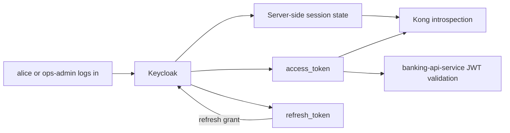
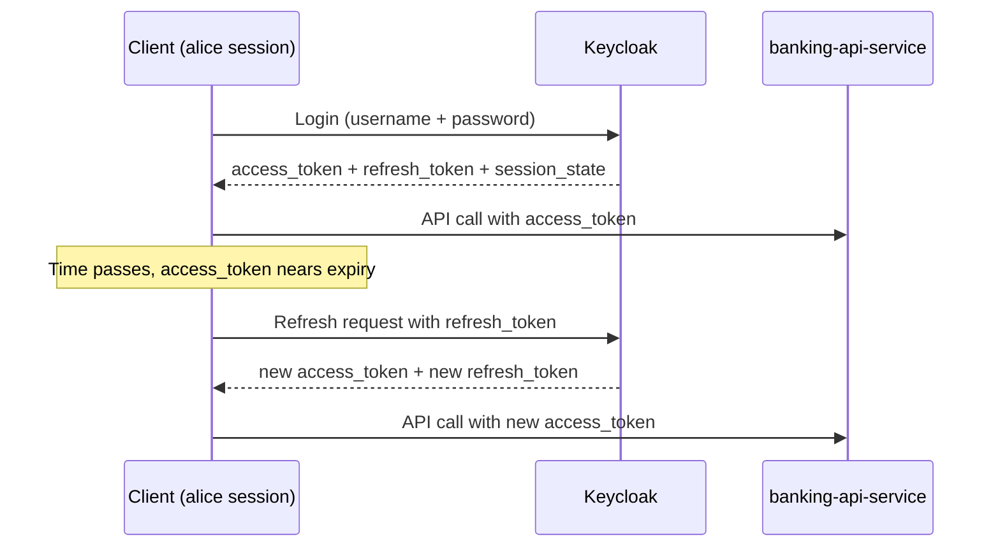

# 13 — 访问令牌与刷新令牌的生命周期

`Keycloak` 的令牌响应如何工作、每个字段为何存在，以及客户端如何在整个会话生命周期中管理访问令牌与刷新令牌。

---

## Keycloak 登录后返回什么

当客户端登录到 `Keycloak` 时，它收到的不只是一个 JWT 字符串。

它收到的是一个完整的 OAuth 2.0 / OpenID Connect 令牌响应，给了客户端做以下事情所需的一切：

- 现在就调用 API
- 知道令牌有效多久
- 之后在不立即要求用户重新登录的情况下续期会话

## 示例令牌响应

`alice` 通过 `mobile-banking-app` 登录的一个典型响应如下：

```json
{
  "access_token": "<jwt>",
  "expires_in": 300,
  "refresh_expires_in": 1800,
  "refresh_token": "<refresh-token>",
  "token_type": "Bearer",
  "scope": "email profile",
  "session_state": "<uuid>"
}
```

## 每个字段的含义

### `access_token`

这是现在用来调用受保护 API 的令牌。

在本 PoC 中：

- `alice` 或 `ops-admin` 把它发给 `Kong`
- `Kong` 用 `Keycloak` 对它做内省
- `banking-api-service` 在返回银行数据前再次校验它

可以把它理解为短期的 API 入场券。

### `expires_in`

它告诉客户端 `access_token` 还能有效多少秒。

示例：

- `300` 表示 5 分钟

目的：

- 让访问令牌保持短寿命
- 限制访问令牌泄露时的风险

### `refresh_token`

这是一个单独的令牌，用来在不立即要求用户重新登录的情况下换取新的 `access_token`。

可以把它理解为会话延续令牌。

刷新令牌不会被发送给 `banking-api-service`。
当客户端想要新的访问令牌时，它把刷新令牌发回给 `Keycloak`。

### `refresh_expires_in`

它告诉客户端 `refresh_token` 还能使用多少秒。

示例：

- `1800` 表示 30 分钟

目的：

- 限制会话能被静默延续多久
- 避免刷新令牌永久存活

### `token_type`

通常是 `Bearer`。这意味着客户端应这样发送访问令牌：

```http
Authorization: Bearer <access_token>
```

### `scope`

它告诉客户端被授予了哪些 scope。

在本 PoC 中你常看到：

- `email profile`

scope 表达被授予的能力或令牌中可用的身份信息。

### `session_state`

`Keycloak` 还返回一个 `session_state` 字段，它是 `Keycloak` 代表已认证用户在服务端维护的会话的一个不透明标识符。

这主要不是客户端要关心的事，但它对理解全貌很重要（见下文「访问令牌、刷新令牌与会话状态」）。

## 这些字段为什么存在：安全与可用性的权衡

### 如果访问令牌寿命太长

方便，但不安全。被盗的令牌能被使用很久。

### 如果访问令牌寿命太短且没有刷新

安全，但难受。用户得非常频繁地重新登录。

### 组合式设计

标准设计是：

- 短寿命的 `access_token`
- 较长寿命的 `refresh_token`

这带来：

- 对 API 调用更好的安全性
- 对会话连续性更好的用户体验

## 访问令牌 vs 刷新令牌 vs 会话状态

这三个概念相关但各不相同。

### 访问令牌

`access_token` 是：

- 一个短寿命的 bearer 令牌
- 通常作为 JWT 自包含
- 直接用于调用 API

它携带诸如 `sub`、`preferred_username`、`realm_access.roles`、`customer_id`、`account_ids` 与 `aud` 之类的声明。像 `banking-api-service` 这样的服务通常能用 JWKS 在本地校验它，而无需联系 `Keycloak`。

可以把它理解为回答：「这个令牌现在能否向某个 API 出示声明？」

### 刷新令牌

`refresh_token` 是：

- 用来获取新的 `access_token`
- 与正在进行的 `Keycloak` 会话联系得更直接
- 不会被发送给 `banking-api-service` 或任何资源 API

如果底层会话消失、过期或被作废，即便仍存在一个旧的访问令牌，刷新令牌也会停止工作。

可以把它理解为回答：「这个客户端能否延续登录会话并获取新的访问令牌？」

### 会话状态

`Keycloak` 维护着与两种令牌相关、但又彼此独立的服务端会话状态。

`Keycloak` 跟踪三层会话：

1. **认证会话（短寿命）** —— 登录流程期间的临时状态；登录完成或过期后移除
2. **用户会话** —— 表示某个 realm 中被认证的用户；跟踪开始时间、空闲/过期状态与登出状态
3. **客户端会话（按 client 划分）** —— 为每个 client（如 `mobile-banking-app`）附着在某个用户会话上；跟踪该 client 在此次登录会话中的参与情况

运行时，`Keycloak` 主要把在线会话状态存放在 Infinispan 缓存中。在集群部署里，这些缓存分布在各节点上。离线会话则持久化在数据库中。

关键洞见：

- JWT 声明随令牌内部传输
- 实时会话活动存在于 `Keycloak` 的服务端

这正是为什么一个令牌能作为有效 JWT 被解码，而内省却返回 `active: false`。完整的内省机制见 [11 — JWT 签名、校验与内省](11-jwt-signature-validation.md)。

### 小结表

| 令牌 / 概念 | 主要用途 | 发给 `banking-api-service`？ | 寿命 |
|---|---|---|---|
| `access_token` | 调用受保护的 API | 是 | 短（如 5 分钟） |
| `refresh_token` | 获取新的访问令牌 | 否，只发给 `Keycloak` | 较长（如 30 分钟） |
| 会话状态 | 服务端会话跟踪 | 不直接 | 与用户/客户端会话 TTL 绑定 |

### 关系图



## 刷新令牌解决什么问题

刷新令牌解决一个现实问题：

- 客户端如何在不持有长寿命访问令牌的情况下，让用户保持登录？

没有刷新令牌的话，客户端每次访问令牌过期时都得让 `alice` 重新登录。这对以下场景会很痛苦：

- 移动应用
- SPA
- 仪表盘
- 长寿命的用户会话

刷新令牌让客户端能悄悄地向 `Keycloak` 请求一个新的访问令牌，并延续会话，直到刷新令牌本身过期。

## 会话续期流程



## 客户端侧的自动续期如何工作

基本的客户端逻辑是：

1. 登录一次
2. 存储：
   - `access_token`
   - `refresh_token`
   - 访问令牌过期时间
   - 刷新令牌过期时间
3. 在访问令牌过期之前，用刷新令牌调用 `Keycloak`
4. 用新的响应替换已存储的令牌
5. 若刷新失败，把用户重定向回登录

## 客户端伪代码

```text
login() {
  tokenResponse = requestToken(username, password)

  store.accessToken = tokenResponse.access_token
  store.refreshToken = tokenResponse.refresh_token
  store.accessTokenExpiresAt = now() + tokenResponse.expires_in
  store.refreshTokenExpiresAt = now() + tokenResponse.refresh_expires_in
}

getValidAccessToken() {
  if now() < store.accessTokenExpiresAt - 30 seconds {
    return store.accessToken
  }

  if now() >= store.refreshTokenExpiresAt {
    redirectToLogin()
    return
  }

  refreshed = refreshSession(store.refreshToken)

  store.accessToken = refreshed.access_token
  store.refreshToken = refreshed.refresh_token
  store.accessTokenExpiresAt = now() + refreshed.expires_in
  store.refreshTokenExpiresAt = now() + refreshed.refresh_expires_in

  return store.accessToken
}

callApi() {
  token = getValidAccessToken()
  send Authorization: Bearer <token>
}
```

### 为什么要在过期之前稍早刷新

注意这一行：

- `now() < accessTokenExpiresAt - 30 seconds`

客户端常常稍早续期，而不是等到精确过期。这能避免以下问题：

- 网络延迟
- 时钟偏移
- 请求仍在途中时令牌过期

## 刷新请求示例

当客户端刷新时，它用一个不同的 grant type 调用 `Keycloak` 的 token 端点：

```http
POST /realms/banking-poc/protocol/openid-connect/token
Content-Type: application/x-www-form-urlencoded

grant_type=refresh_token
client_id=mobile-banking-app
refresh_token=<refresh_token>
```

`Keycloak` 以一个全新的令牌响应作答，包含：

- 新的 `access_token`
- 新的 `refresh_token`
- 新的 `expires_in`
- 新的 `refresh_expires_in`

## 失败情形

### 情形 1：访问令牌过期，刷新令牌仍有效

- 客户端调用刷新端点
- `Keycloak` 签发新令牌
- `alice` 透明地保持登录

### 情形 2：刷新令牌过期或无效

- `Keycloak` 拒绝刷新请求
- 客户端无法再续期会话
- `alice` 必须重新登录

### 情形 3：会话在服务端被作废

因为 `Keycloak` 维护服务端会话状态，刷新令牌可能在其 `refresh_expires_in` 时间戳到达之前就被拒绝，例如当：

- `alice` 在另一台设备上登出
- 用户在 `Keycloak` 中被禁用
- 该 client 被禁用
- 发生了 realm 或 client 的作废事件

这种情况下，`Keycloak` 会在刷新尝试时返回一个错误，客户端必须把它与刷新令牌过期同等对待。

## 这与本 PoC 的关系

在本仓库中：

- `scripts/demo.sh` 以 `alice` 或 `ops-admin` 登录，且只提取 `access_token`
- 它忽略 `refresh_token`

为什么？

- 该脚本是短命的
- 它只需要演示少量 API 调用
- 它的行为不像真正的移动或 Web 客户端会话管理器

一个真实的移动银行应用会：

- 安全地存储刷新令牌（例如放在平台的安全存储中）
- 主动监控令牌过期
- 在后台自动刷新令牌

## 安全考量

刷新令牌是敏感的。在许多方面，它们比短寿命的访问令牌更敏感，因为它们可以被反复兑换成新的访问令牌。

重要规则：

- 不要不必要地暴露刷新令牌
- 不要把刷新令牌发给 `banking-api-service` 或任何资源 API
- 只把刷新令牌发给 `Keycloak` 的 token 端点
- 根据客户端类型谨慎地存储它们

例如：

- 移动应用常把它们存放在平台的安全存储中
- 浏览器应用需要更谨慎的设计，因为浏览器存储有不同的风险特征

## 思维模型

1. `access_token` 用于现在调用 API
2. `expires_in` 告诉你该令牌能持续多久
3. `refresh_token` 用于在不重新登录的情况下获取新的访问令牌
4. `refresh_expires_in` 告诉你会话续期还能持续多久
5. `session_state` 是服务端锚点 —— `Keycloak` 能独立于令牌时间戳作废一个会话
6. 当刷新过期或会话被作废时，用户必须重新登录

这就是为什么 `Keycloak` 返回这些字段，以及它们解决了什么问题。

---

← Prev: [12 — JWKS 深入解析](12-jwks.md) · Next: [14 — 请求与响应细节](14-request-response-reference.md) →
