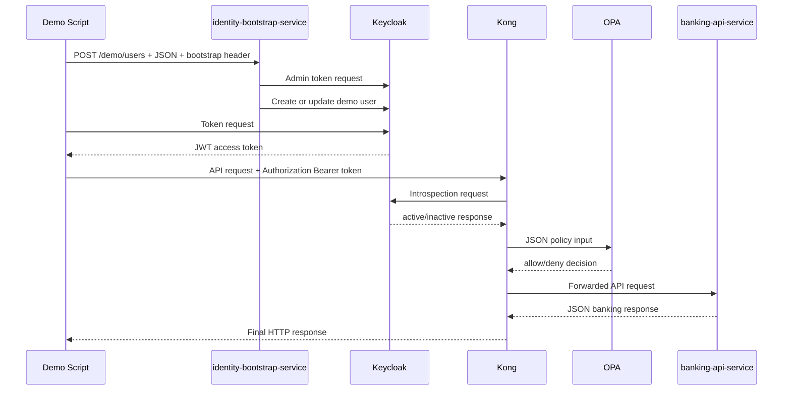
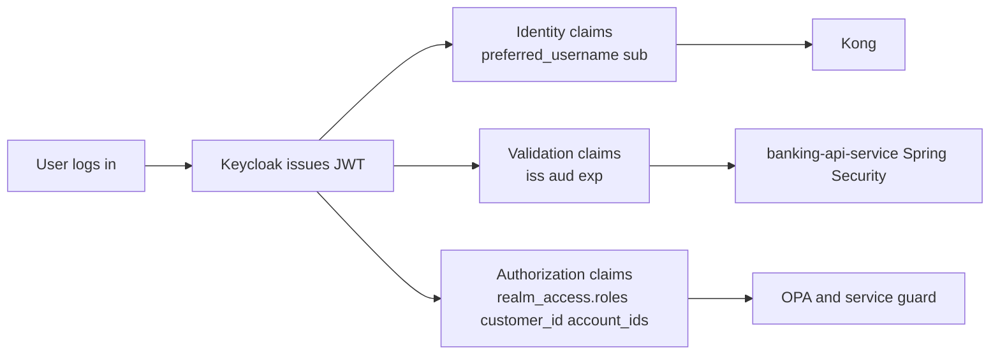
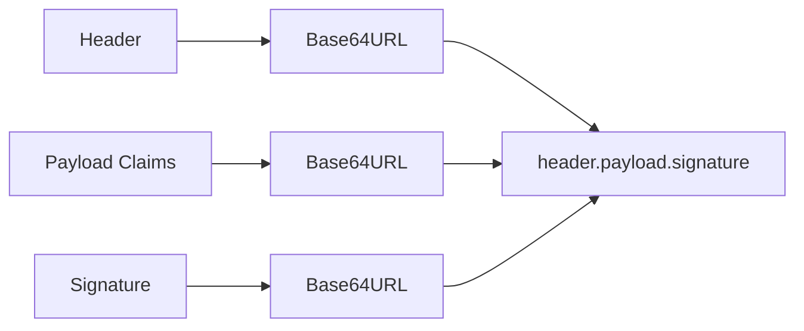
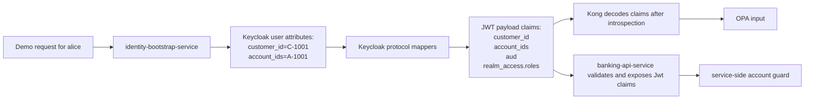
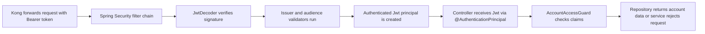

# 14 — 请求与响应细节（线级参考）

把本 PoC 中每一个跨越组件边界的请求头、请求体与声明，集中放在一处。

## 如何使用本文

这是一份**查阅型参考**，不是从头读到尾的文档。跳到你需要的流程：

| 你想知道… | 去看 |
|---|---|
| 演示脚本发什么来创建用户 | 流程 1 |
| bootstrap 服务如何向 Keycloak 认证 | 流程 2 |
| 调用了哪些 Keycloak 管理 API | 流程 3 |
| 如何获取用户 JWT | 流程 4 |
| 存在哪些 JWT 声明、为何存在 | 流程 5 — 声明目录 |
| 客户端向 Kong 发什么 | 流程 6 |
| Kong 如何内省令牌 | 流程 7 |
| Kong 向 OPA 发什么 | 流程 8 |
| Kong 如何转发给银行服务 | 流程 9 |
| 银行服务返回什么响应 | 流程 10 |
| 每一跳的请求头速查 | 流程 11 |

本文拥有**规范的 JWT 声明目录**（流程 5A–5K）。文档 [06](06-keycloak-idp.md) 与 [08](08-opa.md)–[09](09-banking-api-service.md) 链接到这里，而不重复这部分材料。

---

## 端到端数据流图



---

## 流程 1：Demo Script -> identity-bootstrap-service

演示脚本通过调用 `POST http://identity-bootstrap-service:8080/demo/users` 创建演示用户。

### 请求头

```http
X-Demo-Bootstrap-Secret: demo-bootstrap-secret
Content-Type: application/json
```

### 请求体 —— `alice`

```json
{
  "username": "alice",
  "password": "Password123!",
  "role": "customer",
  "customerId": "C-1001",
  "accountIds": ["A-1001"]
}
```

### 请求体 —— `ops-admin`

```json
{
  "username": "ops-admin",
  "password": "Password123!",
  "role": "ops-admin",
  "customerId": "C-9999",
  "accountIds": ["A-1001", "A-2001"]
}
```

### 响应

成功时，`identity-bootstrap-service` 返回 HTTP `201`：

```json
{
  "username": "alice",
  "role": "customer",
  "status": "created"
}
```

| 条件 | 状态 |
|---|---|
| 缺少 bootstrap 头 | `401` |
| 角色不在允许集合中 | `400` |
| 用户名已存在但非演示管理 | `409` |

---

## 流程 2：identity-bootstrap-service -> Keycloak Token 端点

在创建或更新用户之前，bootstrap 服务以管理员 client 的身份向 [Keycloak](01-concepts.md) 认证。

### 请求

```http
POST http://keycloak:8080/realms/master/protocol/openid-connect/token
Content-Type: application/x-www-form-urlencoded
```

表单体：

```text
grant_type=password
client_id=admin-cli
username=admin
password=admin
```

Curl 示例：

```bash
curl -sS -X POST "http://keycloak:8080/realms/master/protocol/openid-connect/token" \
  -H "Content-Type: application/x-www-form-urlencoded" \
  --data-urlencode "grant_type=password" \
  --data-urlencode "client_id=admin-cli" \
  --data-urlencode "username=admin" \
  --data-urlencode "password=admin"
```

### 响应

Keycloak 返回的 JSON 至少包含：

```json
{
  "access_token": "<admin-jwt>",
  "expires_in": 60,
  "refresh_expires_in": 1800,
  "refresh_token": "<refresh-token>",
  "token_type": "Bearer",
  "not-before-policy": 0,
  "session_state": "2f914f0e-7690-435a-bf95-d887213fca8e",
  "scope": "profile email"
}
```

bootstrap 服务提取 `access_token`，并在后续所有管理 API 调用中使用它。

---

## 流程 3：identity-bootstrap-service -> Keycloak 管理用户 API

获取管理员令牌后，bootstrap 服务调用若干 Keycloak 管理端点。

### 按用户名查找用户

```http
GET /admin/realms/banking-poc/users?username=alice&exact=true
Authorization: Bearer <admin-token>
```

未找到时的响应：

```json
[]
```

找到时的响应：

```json
[
  {
    "id": "134d2448-334d-4be5-8868-4d13085bf2cd",
    "username": "alice",
    "firstName": "alice",
    "lastName": "Demo",
    "email": "alice@example.local",
    "emailVerified": false,
    "attributes": {
      "customer_id": ["C-1001"],
      "account_ids": ["A-1001"]
    },
    "createdTimestamp": 1780652643152,
    "enabled": true,
    "totp": false,
    "disableableCredentialTypes": [],
    "requiredActions": [],
    "notBefore": 0,
    "access": {
      "manageGroupMembership": true,
      "view": true,
      "mapRoles": true,
      "impersonate": true,
      "manage": true
    }
  }
]
```

### 创建用户

```http
POST /admin/realms/banking-poc/users
Authorization: Bearer <admin-token>
Content-Type: application/json
```

请求体：

```json
{
  "username": "alice",
  "enabled": true,
  "email": "alice@example.local",
  "firstName": "alice",
  "lastName": "Demo",
  "attributes": {
    "demo_managed": ["true"],
    "customer_id": ["C-1001"],
    "account_ids": ["A-1001"]
  },
  "credentials": [
    {
      "type": "password",
      "value": "Password123!",
      "temporary": false
    }
  ]
}
```

响应：HTTP `201 Created`，带一个指向新用户资源的 `Location` 头。

### 更新已存在的演示管理用户

```http
PUT /admin/realms/banking-poc/users/<userId>
Authorization: Bearer <admin-token>
Content-Type: application/json
```

请求体：

```json
{
  "username": "alice",
  "enabled": true,
  "email": "alice@example.local",
  "firstName": "alice",
  "lastName": "Demo",
  "attributes": {
    "demo_managed": ["true"],
    "customer_id": ["C-1001"],
    "account_ids": ["A-1001"]
  }
}
```

### 重置密码

```http
PUT /admin/realms/banking-poc/users/<userId>/reset-password
Authorization: Bearer <admin-token>
Content-Type: application/json
```

请求体：

```json
{
  "type": "password",
  "value": "Password123!",
  "temporary": false
}
```

### 读取并同步 Realm 角色

当前角色查询：

```http
GET /admin/realms/banking-poc/users/<userId>/role-mappings/realm
Authorization: Bearer <admin-token>
```

请求的角色查询：

```http
GET /admin/realms/banking-poc/roles/customer
Authorization: Bearer <admin-token>
```

移除陈旧的演示管理角色：

```http
DELETE /admin/realms/banking-poc/users/<userId>/role-mappings/realm
Authorization: Bearer <admin-token>
Content-Type: application/json
```

添加期望的角色：

```http
POST /admin/realms/banking-poc/users/<userId>/role-mappings/realm
Authorization: Bearer <admin-token>
Content-Type: application/json
```

请求体：

```json
[
  {
    "id": "role-customer",
    "name": "customer",
    "composite": false,
    "clientRole": false,
    "containerId": "banking-poc"
  }
]
```

---

## 流程 4：Demo Script -> Keycloak 登录端点

脚本使用 Resource Owner Password Credentials 授权，直接从 Keycloak 获取用户令牌。

### 请求

```http
POST http://localhost:9081/realms/banking-poc/protocol/openid-connect/token
Content-Type: application/x-www-form-urlencoded
```

表单体：

```text
grant_type=password
client_id=mobile-banking-app
username=alice
password=Password123!
```

Curl 示例：

```bash
curl -sS -X POST 'http://localhost:9081/realms/banking-poc/protocol/openid-connect/token' \
  -H 'Content-Type: application/x-www-form-urlencoded' \
  --data-urlencode 'grant_type=password' \
  --data-urlencode 'client_id=mobile-banking-app' \
  --data-urlencode 'username=alice' \
  --data-urlencode 'password=Password123!'
```

### 响应

```json
{
  "access_token": "<signed-jwt>",
  "expires_in": 300,
  "refresh_expires_in": 1800,
  "refresh_token": "<refresh-token>",
  "token_type": "Bearer",
  "not-before-policy": 0,
  "session_state": "31fd1c66-4930-4538-8f6e-091e9ab9fb0c",
  "scope": "email profile"
}
```

`access_token` 就是那个签名的 JWT。它的载荷包含后续组件在校验后读取的身份与授权声明。脚本提取 `.access_token`。

### JWT 解码示例

一个 JWT 的结构是：

```text
header.payload.signature
```

`alice` 令牌的解码后 header：

```json
{
  "alg": "RS256",
  "typ": "JWT",
  "kid": "0BYek66uebuec84BqxfwJ9_qxIDr1Wka-1siBT2z0Lk"
}
```

`kid` 告诉下游系统用哪把 Keycloak 公钥来验证。

解码后的载荷：

```json
{
  "exp": 1781580804,
  "iat": 1781580504,
  "jti": "c2c1b237-1501-4602-a42f-f3b7a5a69590",
  "iss": "http://keycloak:8080/realms/banking-poc",
  "aud": "mobile-banking-app",
  "sub": "134d2448-334d-4be5-8868-4d13085bf2cd",
  "typ": "Bearer",
  "azp": "mobile-banking-app",
  "sid": "31fd1c66-4930-4538-8f6e-091e9ab9fb0c",
  "acr": "1",
  "realm_access": {
    "roles": ["customer"]
  },
  "scope": "email profile",
  "account_ids": ["A-1001"],
  "email_verified": false,
  "name": "alice Demo",
  "preferred_username": "alice",
  "given_name": "alice",
  "customer_id": "C-1001",
  "family_name": "Demo",
  "email": "alice@example.local"
}
```

完整的逐项声明拆解见流程 5E。

### 签名

JWT 的第三段是密码学签名。Keycloak 通过用其私钥对 header 与 payload 签名来生成它。下游系统用 Keycloak 的公钥（经 JWKS 获取）验证它。

- 如果 header 或 payload 在签发后改变，签名就不再匹配。
- 如果令牌不是由 Keycloak 签发的，签名就无法被验证。
- 解码让你能查看声明。签名验证或内省才让你能信任它们。

---

## 流程 5：Keycloak 产出的 JWT 声明

本节是本 PoC 的**规范声明目录**。文档 [06](06-keycloak-idp.md)、[08](08-opa.md) 与 [09](09-banking-api-service.md) 链接到这里，而不重复这部分材料。

### 流程 5A：什么是 JWT 声明

[JWT](01-concepts.md) 声明是存放在令牌载荷内部的、具名的键值事实。下面 JSON 对象中的每个字段都是一个声明：

```json
{
  "iss": "http://keycloak:8080/realms/banking-poc",
  "aud": "mobile-banking-app",
  "preferred_username": "alice",
  "customer_id": "C-1001",
  "account_ids": ["A-1001"]
}
```

**标准声明**由 JWT/OIDC 约定定义（`iss`、`aud`、`exp`、`sub`、`iat`）。它们解决常见的令牌校验问题。

**自定义声明**是应用特定的补充。在本 PoC 中是：`customer_id` 与 `account_ids`。它们解决银行领域的授权问题。

### 流程 5B：我们为什么需要 JWT 声明

用户登录后，[Kong](01-concepts.md)（PEP）、[OPA](01-concepts.md)（PDP）与 `banking-api-service` 各自需要知道：

- 谁在调用
- 令牌是否来自正确的签发者
- 用户具备什么角色
- 哪些客户/账户范围属于该用户

声明把这些上下文随请求一起携带，使每个组件无需为每次调用都去查询另一个系统。

### 流程 5C：JWT 声明解决什么问题

| 问题 | 用到的声明 |
|---|---|
| 身份传播 | `preferred_username`、`sub` |
| 令牌校验上下文 | `iss`、`aud`、`exp` |
| 授权上下文 | `realm_access.roles`、`customer_id`、`account_ids` |
| 减少重复查询 | 以上全部随令牌携带 |

### 流程 5D：JWT 声明不能解决什么

声明本身并不充分。

- 一个被解码的声明并不自动可信 —— 任何人都能造出一个假的 JWT 字符串。
- 一个有效的令牌对某个具体操作仍可能是未授权的。
- 如果真相之源发生变化，旧令牌在过期前仍带着它们签发时的声明值。

这正是为什么本 PoC 仍在 Kong 使用 Keycloak 内省、在 `banking-api-service` 做 JWT 校验、用 OPA 做策略评估，并做服务端授权检查。

### 流程 5E：本 PoC 用到哪些声明、为什么

#### `iss`

- 含义：哪个 Keycloak realm 签发了该令牌（`http://keycloak:8080/realms/banking-poc`）
- 使用者：`banking-api-service`
- 目的：拒绝非本 realm 签发的令牌

#### `aud`

- 含义：令牌面向的 client/应用（`mobile-banking-app`）
- 使用者：`banking-api-service`
- 目的：拒绝并非发给本应用的令牌

#### `preferred_username`

- 含义：人类可读的用户名（`alice` 或 `ops-admin`）
- 使用者：Kong（日志、OPA input）、诊断
- 目的：身份上下文；也作为 `input.username` 转发给 OPA

#### `realm_access.roles`

- 含义：分配给用户的 realm 角色（`["customer"]` 或 `["ops-admin"]`）
- 使用者：Kong、OPA、`banking-api-service`
- 目的：区分 `customer` 与 `ops-admin`；Kong 提取第一个角色并作为 `input.role` 发给 OPA

#### `customer_id`

- 含义：银行客户的业务标识（`alice` 为 `C-1001`，`ops-admin` 为 `C-9999`）
- 使用者：OPA（`input.customer_id`）、`banking-api-service`
- 目的：把已认证身份与银行归属关联起来；OPA 对 `customer` 角色检查 `customer_id != ""`

#### `account_ids`

- 含义：令牌携带的账户（`alice` 为 `["A-1001"]`，`ops-admin` 为 `["A-1001","A-2001"]`）
- 使用者：OPA（`input.account_ids`）、`banking-api-service`
- 目的：账户级授权；OPA 检查请求的 `account_id` 是否在 `account_ids` 中

#### `sub`

- 含义：Keycloak 内部用户 UUID
- 使用者：`banking-api-service`（Spring Security principal）
- 目的：subject 的稳定唯一标识

#### `exp` / `iat` / `jti`

- 含义：过期时间、签发时间、JWT ID
- 使用者：Kong（经内省）与 Spring Security 中的令牌校验
- 目的：防止令牌过期后被复用；提供审计线索

### 流程 5F：本 PoC 中的 JWT 声明一览



声明源自 Keycloak。Kong 与 `banking-api-service` 读取它们 —— 它们不凭空捏造声明。

### 流程 5G：声明从何而来

#### 第 1 步：用户属性被写入 Keycloak

当 `identity-bootstrap-service` 创建或更新用户时，它发送：

```json
{
  "attributes": {
    "demo_managed": ["true"],
    "customer_id": ["C-1001"],
    "account_ids": ["A-1001"]
  }
}
```

这来自 `KeycloakAdminProvisioner`：

```java
private Map<String, List<String>> attributes(DemoUserRequest request) {
    return Map.of(
            DEMO_MANAGED_ATTRIBUTE, List.of(DEMO_MANAGED_VALUE),
            "customer_id", List.of(request.customerId()),
            "account_ids", request.accountIds());
}
```

对 `alice`：`customer_id = C-1001`，`account_ids = [A-1001]`。
对 `ops-admin`：`customer_id = C-9999`，`account_ids = [A-1001, A-2001]`。

#### 第 2 步：Realm 角色存储在 Keycloak 中

bootstrap 服务分配一个 realm 角色（`customer` 或 `ops-admin`）。Keycloak 自动把 realm 角色放进令牌的 `realm_access.roles`。两个角色都在 `infra/keycloak/realm-export.json` 中声明。

#### 第 3 步：协议映射器把属性复制进令牌

`infra/keycloak/realm-export.json` 中的 `mobile-banking-app` client 有三个协议映射器。这些映射器是「已存储用户属性」与「JWT 声明」之间的桥梁。

**`customer_id` 映射器** —— 读取 `customer_id` 用户属性，并把它作为 `String` 放进访问令牌声明 `customer_id`：

```json
{
  "name": "customer_id",
  "protocolMapper": "oidc-usermodel-attribute-mapper",
  "config": {
    "access.token.claim": "true",
    "claim.name": "customer_id",
    "user.attribute": "customer_id",
    "jsonType.label": "String"
  }
}
```

**`account_ids` 映射器** —— 读取 `account_ids` 用户属性，并把它作为多值 `String` 数组放进访问令牌声明 `account_ids`：

```json
{
  "name": "account_ids",
  "protocolMapper": "oidc-usermodel-attribute-mapper",
  "config": {
    "access.token.claim": "true",
    "claim.name": "account_ids",
    "user.attribute": "account_ids",
    "jsonType.label": "String",
    "multivalued": "true"
  }
}
```

**`mobile-banking-app-audience` 映射器** —— 把 `mobile-banking-app` 加入令牌受众：

```json
{
  "name": "mobile-banking-app-audience",
  "protocolMapper": "oidc-audience-mapper",
  "config": {
    "access.token.claim": "true",
    "included.client.audience": "mobile-banking-app"
  }
}
```

这正是为什么 `banking-api-service` 能检查 `aud = mobile-banking-app`。

### 流程 5H：JWT 如何构成

```text
header.payload.signature
```

每一部分都做 Base64URL 编码。



**Header** —— 签名算法、密钥 ID、令牌类型：

```json
{
  "alg": "RS256",
  "typ": "JWT",
  "kid": "..."
}
```

**Payload** —— 声明。这是 Kong 在内省后解码、以及 Spring Security 通过 `Jwt` principal 暴露的内容：

```json
{
  "iss": "http://keycloak:8080/realms/banking-poc",
  "aud": "mobile-banking-app",
  "preferred_username": "alice",
  "realm_access": {
    "roles": ["customer"]
  },
  "customer_id": "C-1001",
  "account_ids": ["A-1001"]
}
```

**Signature** —— Keycloak 用其私钥创建的密码学证明。解码载荷很容易。信任它则需要校验。

### 流程 5I：为什么 Kong 能解码声明却仍必须校验

Kong 插件在本地解码 JWT 载荷段以读取声明：

```lua
local function decode_claims(token)
  local payload_segment = token:match("^[^.]+%.([^.]+)%.([^.]+)$")
  ...
  return cjson.decode(decoded)
end
```

但仅靠载荷解码是不安全的 —— 任何人都能造出一个看起来像 JWT 的字符串。所以 Kong 先调用 Keycloak 内省：

1. Kong 收到 bearer 令牌。
2. Kong 调用 Keycloak 内省端点。
3. Keycloak 回复 `active: true` 或 `active: false`。
4. 只有这时，Kong 才用解码后的载荷来构建 OPA input。

这就是读取声明与信任声明之间的区别。

### 流程 5J：banking-api-service 如何取得同样的声明

`banking-api-service` 不做手工 Base64 解码。取而代之：

1. Spring Security 校验 JWT 签名并检查 `iss` 与 `aud`。
2. 它创建一个已校验的 `Jwt` principal 对象。
3. 控制器与守卫代码从该对象读取声明：
   - `jwt.getClaimAsString("customer_id")`
   - `jwt.getClaimAsStringList("account_ids")`
   - `realm_access.roles`（经一个自定义转换器）

因此同样的声明值流经两条独立的执行路径：

- Kong → OPA 路径
- `banking-api-service` 服务端纵深防御路径

### 流程 5K：`alice` 的端到端声明流水线



**具体示例 —— `alice`**

存储在 Keycloak 中的用户属性：

```json
{
  "customer_id": ["C-1001"],
  "account_ids": ["A-1001"]
}
```

在 Keycloak 中分配的角色：

```json
{
  "realm_access": {
    "roles": ["customer"]
  }
}
```

由映射器加入的受众：

```json
{
  "aud": "mobile-banking-app"
}
```

系统其余部分看到的最终代表性载荷：

```json
{
  "iss": "http://keycloak:8080/realms/banking-poc",
  "aud": "mobile-banking-app",
  "preferred_username": "alice",
  "realm_access": {
    "roles": ["customer"]
  },
  "customer_id": "C-1001",
  "account_ids": ["A-1001"]
}
```

每个声明为何重要：

| 声明 | 消费者 | 目的 |
|---|---|---|
| `iss` | `banking-api-service` | 检查令牌来自本 Keycloak realm |
| `aud` | `banking-api-service` | 检查令牌面向 `mobile-banking-app` |
| `realm_access.roles` | Kong、OPA、`banking-api-service` | 区分 `customer` 与 `ops-admin` |
| `customer_id` | OPA、`banking-api-service` | 把身份关联到银行归属 |
| `account_ids` | OPA、`banking-api-service` | 账户级授权 |

---

## 流程 6：Client -> Kong

客户端调用 Kong 的 `http://localhost:8000/api/accounts/...`。Kong 通过 `infra/kong/kong.yml` 中定义的 `banking-api-route` 路由，把所有 `/api/accounts` 流量路由出去。

### 示例请求

```http
GET /api/accounts/A-1001 HTTP/1.1
Host: localhost:8000
Authorization: Bearer <jwt>
```

| 条件 | 响应 |
|---|---|
| 缺少令牌 | `401 {"message":"missing bearer token"}` |
| 令牌格式错误 | `401 {"message":"invalid bearer token"}` |

---

## 流程 7：Kong -> Keycloak 内省

在使用令牌声明作为 [OPA](01-concepts.md) input 之前，Kong 先内省令牌。`infra/kong/kong.yml` 中的 `opa-authz` 插件配置了 `introspection_url`、`introspection_client_id`（`kong-introspection`）与 `introspection_client_secret`（`kong-introspection-secret`）。

### 请求

```http
POST http://keycloak:8080/realms/banking-poc/protocol/openid-connect/token/introspect
Authorization: Basic base64(kong-introspection:kong-introspection-secret)
Content-Type: application/x-www-form-urlencoded

token=<jwt>
```

### 响应 —— 有效令牌

```json
{
  "active": true,
  "client_id": "mobile-banking-app",
  "username": "alice",
  "token_type": "Bearer",
  "exp": 1781236914,
  "iat": 1781236614,
  "sub": "134d2448-334d-4be5-8868-4d13085bf2cd",
  "aud": "mobile-banking-app",
  "iss": "http://keycloak:8080/realms/banking-poc"
}
```

### 响应 —— 被篡改或 inactive 的令牌

```json
{
  "active": false
}
```

随后 Kong 返回：

```http
HTTP/1.1 401 Unauthorized
Content-Type: application/json; charset=utf-8

{"message":"inactive token"}
```

---

## 流程 8：Kong -> OPA

若内省返回 `active: true`，Kong 在本地解码 JWT 声明并把它们发给 [OPA](01-concepts.md)。

OPA 端点是 `http://opa:8181/v1/data/banking_authz/allow`（来自 `infra/kong/kong.yml`）。策略位于 `infra/opa/policies/banking_authz.rego`。

### 请求

```http
POST http://opa:8181/v1/data/banking_authz/allow
Content-Type: application/json
```

`alice` 访问 `A-1001` 的请求体：

```json
{
  "input": {
    "method": "GET",
    "path": "/api/accounts/A-1001",
    "account_id": "A-1001",
    "customer_id": "C-1001",
    "account_ids": ["A-1001"],
    "role": "customer",
    "username": "alice"
  }
}
```

**Input 字段映射** —— 所有字段都来自 Kong 在内省后解码的 JWT 声明：

| OPA input 字段 | 来源声明 | 备注 |
|---|---|---|
| `method` | HTTP 方法 | 来自传入请求 |
| `path` | HTTP 路径 | 来自传入请求 |
| `account_id` | 路径段 | 从 `/api/accounts/{id}` 提取 |
| `customer_id` | `customer_id` | JWT 自定义声明 |
| `account_ids` | `account_ids` | JWT 自定义声明数组 |
| `role` | `realm_access.roles[0]` | 第一个 realm 角色 |
| `username` | `preferred_username` | JWT 标准声明 |

### OPA 策略逻辑（来自 `banking_authz.rego`）

```rego
allow {
    read_only_account_request
    input.role == "ops-admin"
}

allow {
    read_only_account_request
    input.role == "customer"
    input.customer_id != ""
    account_ids := object.get(input, "account_ids", [])
    account_ids[_] == input.account_id
}

read_only_account_request {
    input.method == "GET"
    regex.match("^/api/accounts/[^/]+(?:/transactions)?$", input.path)
}
```

`ops-admin` 获得对任意账户的读取权限。`customer` 必须有非空的 `customer_id`，且请求的 `account_id` 必须出现在其 `account_ids` 中。

### 响应 —— 允许

```json
{
  "result": true
}
```

### 响应 —— 拒绝

```json
{
  "result": false
}
```

Kong 返回：

```http
HTTP/1.1 403 Forbidden
Content-Type: application/json; charset=utf-8

{"message":"forbidden"}
```

---

## 流程 9：Kong -> banking-api-service

若 OPA 返回 `result: true`，Kong 把请求转发给 `http://banking-api-service:8080`（在 `infra/kong/kong.yml` 中配置为 `banking-api` 服务）。

### 转发的请求

```http
GET /api/accounts/A-1001 HTTP/1.1
Authorization: Bearer <jwt>
```

Kong 原样传递原始 bearer 令牌。`banking-api-service` 是[资源服务器](01-concepts.md)，并把这视为它自己的认证边界。

### Spring Security 校验流程



Spring Security 通过 `application.yml` 配置：

- `spring.security.oauth2.resourceserver.jwt.jwk-set-uri` —— 到哪里获取 Keycloak 的公钥
- `banking-api.security.issuer-uri` —— 令牌必须由哪个 Keycloak realm 签发
- `banking-api.security.audience` —— 令牌必须面向哪个 client（`mobile-banking-app`）

校验步骤：

1. 从 `Authorization` 头提取 bearer 令牌。
2. `NimbusJwtDecoder` 从 JWKS 端点加载 JWK。
3. 用 Keycloak 的公钥验证 JWT 签名。
4. 检查 `iss` 与配置的 realm URI 匹配。
5. 检查 `aud` 包含 `mobile-banking-app`。
6. 若任一检查失败，Spring Security 在控制器被调用之前返回 `401 Unauthorized`。

### 服务端授权守卫

令牌被接受后，`AccountAccessGuard` 在返回数据前应用它自己的规则：

| 角色 | 规则 |
|---|---|
| `ops-admin` | 访问任意账户 |
| `customer` | 必须有非空的 `customer_id`；请求的 `accountId` 必须出现在 `account_ids` 中 |

该服务从已校验的 `Jwt` principal 读取这些声明：

- `realm_access.roles`
- `customer_id`
- `account_ids`

若令牌缺失或声明不匹配，守卫相应地抛出 `401` 或 `403`。

**为什么 Kong 已经检查过还要再校验一次？**

- Kong 是一个网关控制点，而非银行服务的信任边界。
- 服务必须在被直接调用、绕过 Kong、或网关配置错误时保护自己。
- Kong 回答的是「这个请求该不该进入平台？」—— 服务回答的是「我该不该信任并据此令牌行动？」
- 服务需要那个已校验的 `Jwt` 对象，以便守卫代码能做账户级的决策。

这就是纵深防御：Kong 早早过滤掉坏流量；服务在返回银行数据前仍执行自己的规则。

---

## 流程 10：banking-api-service 的响应

### 账户详情成功

```http
GET /api/accounts/A-1001
```

```json
{
  "accountId": "A-1001",
  "customerId": "C-1001",
  "currency": "GBP"
}
```

### 交易成功

```http
GET /api/accounts/A-1001/transactions
```

```json
[
  {
    "accountId": "A-1001",
    "amount": -12.35
  }
]
```

### 错误响应

| 条件 | 状态 |
|---|---|
| 账户未找到（认证通过之后） | `404 Not Found` |
| 令牌有效但声明禁止访问（直接/内部调用） | `403 Forbidden` |
| 令牌未通过 JWT 校验 | `401 Unauthorized` |

---

## 流程 11：哪个组件发送哪个重要请求头

| 跳 | 关键请求头 |
|---|---|
| Demo Script → `identity-bootstrap-service` | `X-Demo-Bootstrap-Secret`、`Content-Type: application/json` |
| `identity-bootstrap-service` → Keycloak token 端点 | `Content-Type: application/x-www-form-urlencoded` |
| `identity-bootstrap-service` → Keycloak 管理 API | `Authorization: Bearer <admin-token>`、`Content-Type: application/json`（写操作） |
| Client → Kong | `Authorization: Bearer <jwt>` |
| Kong → Keycloak 内省 | `Authorization: Basic <base64(clientId:clientSecret)>`、`Content-Type: application/x-www-form-urlencoded` |
| Kong → OPA | `Content-Type: application/json` |
| Kong → `banking-api-service` | 转发的 `Authorization: Bearer <jwt>` |

---

## 快速对照表

| 发送方 | 接收方 | 主要用途 | 请求体风格 |
|---|---|---|---|
| Demo script | `identity-bootstrap-service` | 创建演示用户 | JSON |
| `identity-bootstrap-service` | Keycloak token 端点 | 获取管理员令牌 | 表单 URL 编码 |
| `identity-bootstrap-service` | Keycloak 管理 API | 创建/更新用户与角色 | JSON |
| Demo script | Keycloak token 端点 | 获取用户 JWT | 表单 URL 编码 |
| Client | Kong | 调用受保护的银行 API | GET 通常无请求体 |
| Kong | Keycloak 内省 | 校验令牌活跃性 | 表单 URL 编码 |
| Kong | OPA | 询问策略决策 | JSON |
| Kong | `banking-api-service` | 转发被允许的请求 | 转发原始请求 |

---

← Prev: [13 — 访问令牌与刷新令牌的生命周期](13-token-lifecycle.md)
