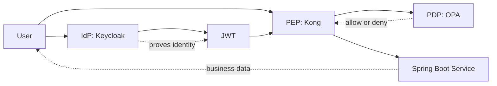

# 01 — Concepts

This doc explains the core security concepts you need before reading the rest of this series.

> **Part I · Foundations** — Start here.

## Glossary

- **IdP (Identity Provider)** — issues identity + tokens. Here: `Keycloak`.
- **PEP (Policy Enforcement Point)** — intercepts requests, enforces decisions. Here: `Kong`.
- **PDP (Policy Decision Point)** — decides allow/deny from policy. Here: `OPA`.
- **Resource server** — owns the protected data, re-checks the token. Here: `banking-api-service`.
- **JWT** — signed token carrying identity + claims.

## Authentication vs Authorization

Authentication answers:

- Who are you?

Authorization answers:

- What are you allowed to do?

In this project:

- `Keycloak` handles authentication.
- `Kong` and `OPA` enforce authorization.
- `banking-api-service` also verifies the caller before returning banking data.

## IdP

An IdP (Identity Provider) is the system that:

- stores users
- checks usernames and passwords
- issues tokens after successful login

In this project, `Keycloak` is the IdP. When `alice` logs in, Keycloak authenticates her and issues a JWT.

## JWT

A JWT is a signed token that carries identity information and claims, for example:

- username
- roles
- audience
- issuer
- custom claims like `customer_id` and `account_ids`

Important: a JWT is not trusted just because it exists — the receiver must validate it.

Validation checks:

- signature
- issuer
- audience
- expiry

## PEP

The PEP (Policy Enforcement Point) stands in front of a protected resource and either:

- allows the request through, or
- blocks the request.

In this project, `Kong` is the PEP at the edge. Every request from `alice` or `ops-admin` passes through Kong before reaching `banking-api-service`.

## PDP

The PDP (Policy Decision Point) evaluates policy rules and returns a decision:

- allow, or
- deny.

In this project, `OPA` is the PDP. Kong sends request details to OPA, and OPA evaluates the policy and returns a decision. That keeps authorization logic separate from authentication in `Keycloak` and from business logic in `banking-api-service`. A simple way to think about it: `Keycloak` proves who the user is, `Kong` intercepts the request, and `OPA` answers whether that user is allowed to perform that action.

## Why Separate IdP, PEP, and PDP

These roles are separated because they solve different problems:

- `Keycloak` proves identity.
- `Kong` enforces access at the gateway.
- `OPA` decides whether a request should be allowed.
- `banking-api-service` runs business logic and adds defense in depth.

This separation makes the system easier to reason about and easier to change.

## Spring Boot Microservices

This project uses two Spring Boot services:

- `banking-api-service`
- `identity-bootstrap-service`

Why microservices:

- `banking-api-service` exposes protected banking APIs.
- `identity-bootstrap-service` handles demo user setup into `Keycloak`.
- Each service has one clear responsibility.

## Concept Map

## What Matters Most

If you remember only one thing, remember this:

1. `Keycloak` says who the user is.
2. `Kong` blocks or forwards the request.
3. `OPA` decides whether the action is allowed.
4. `banking-api-service` validates again and serves the banking response.

---

Next: [02 — This Project Architecture](02-this-project-architecture.md) →
