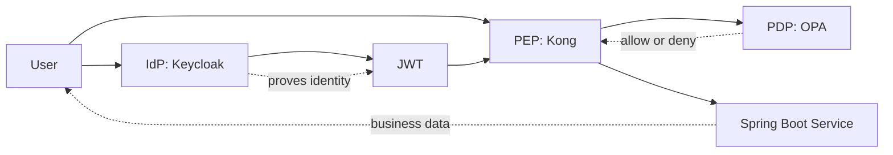

# 01 Concepts

This file explains the basic security concepts used in this PoC.

## Authentication vs Authorization

Authentication answers:

- Who are you?

Authorization answers:

- What are you allowed to do?

In this project:

- Keycloak handles authentication
- Kong and OPA help enforce authorization
- Spring Boot services also verify the caller before returning banking data

## IdP

`IdP` means `Identity Provider`.

An IdP is the system that:

- stores users
- checks usernames and passwords
- issues tokens after successful login

In this project, `Keycloak` is the IdP.

## JWT

`JWT` means `JSON Web Token`.

A JWT is a signed token that carries identity information and claims, for example:

- username
- roles
- audience
- issuer
- custom claims like `customer_id` and `account_ids`

Important idea:

- a JWT is not trusted just because it exists
- the receiver must validate it

Validation usually checks:

- signature
- issuer
- audience
- expiry

## PEP

`PEP` means `Policy Enforcement Point`.

The PEP is the component that stands in front of a protected resource and says:

- allow this request through
- block this request

In this project, `Kong` is the main PEP at the edge.

## PDP

`PDP` means `Policy Decision Point`.

The PDP is the component that evaluates policy rules and returns a decision such as:

- allow
- deny

In this project, `OPA` is the PDP.

> OPA stands for Open Policy Agent. It is a policy engine that decides whether a request should be allowed or denied based on rules you define. In this project, OPA acts as the PDP, which means Policy Decision Point. Kong sends request details to OPA, and OPA evaluates the policy and returns a decision such as allow or deny. That keeps authorization logic separate from authentication in Keycloak and from business logic in the Spring Boot services. A simple way to think about it is: Keycloak proves who the user is, Kong intercepts the request, and OPA answers whether that user is allowed to perform that action.

## Why Separate IdP, PEP, and PDP

These roles are separated because they solve different problems:

- Keycloak proves identity
- Kong enforces access at the gateway
- OPA decides whether a request should be allowed
- Spring Boot services run business logic and add defense in depth

This separation makes the system easier to reason about and easier to change.

## Spring Boot Microservices

This project uses two Spring Boot services:

- `banking-api-service`
- `identity-bootstrap-service`

Why microservices here:

- one service exposes protected banking APIs
- one service handles demo user setup into Keycloak
- each service has one clear responsibility

## Concept Map

## What Matters Most

If you remember only one thing, remember this:

1. Keycloak says who the user is
2. Kong blocks or forwards the request
3. OPA decides whether the action is allowed
4. Spring Boot validates again and serves the banking response
