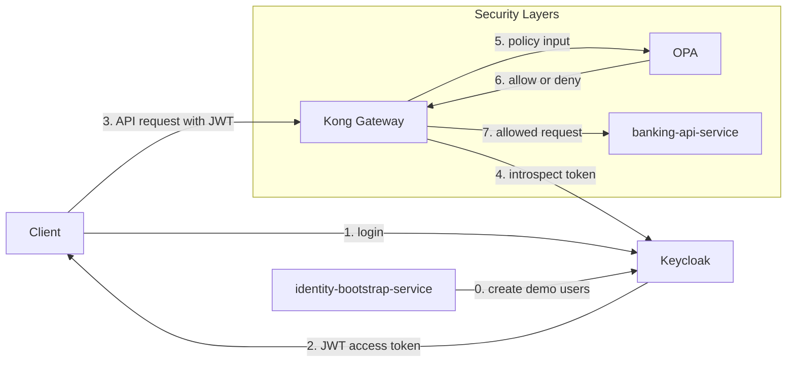

# 02 This Project Architecture

This file maps the concepts to the actual components in this PoC.

## Components In This Repo

- `Keycloak`
- `Kong`
- `OPA`
- `banking-api-service`
- `identity-bootstrap-service`

## Role Of Each Component

### Keycloak

Keycloak is the identity provider.

It is responsible for:

- storing demo users
- authenticating username and password
- issuing JWT access tokens
- adding claims such as `customer_id` and `account_ids`

### Kong

Kong is the edge gateway and the main PEP.

It is responsible for:

- receiving client requests first
- checking that a bearer token exists
- introspecting the token with Keycloak
- calling OPA for an authorization decision
- forwarding allowed requests to the banking API

### OPA

OPA is the PDP.

It is responsible for:

- reading request context from Kong
- evaluating Rego policy
- returning `allow` or `deny`

### banking-api-service

The banking API service is the protected business API.

It is responsible for:

- validating JWT signature, issuer, and audience
- checking account access again as defense in depth
- returning account and transaction data

### identity-bootstrap-service

The bootstrap service exists only for the PoC.

It is responsible for:

- creating demo-managed users in Keycloak
- setting demo claims and roles
- making the demo repeatable without manual Keycloak work

## Why This Architecture Makes Sense

This design separates concerns cleanly:

- Keycloak handles identity
- Kong protects the edge
- OPA owns policy logic
- Spring Boot services focus on application logic

It also demonstrates defense in depth:

- Kong checks token activity and calls OPA
- banking-api-service validates the JWT again
- banking-api-service also checks account ownership again

## Architecture Diagram

## Project File Mapping

- `docker-compose.yml`: runtime topology
- `infra/keycloak/realm-export.json`: Keycloak realm and client setup
- `infra/kong/kong.yml`: Kong service and plugin config
- `infra/kong/plugins/opa-authz/handler.lua`: Kong plugin logic
- `infra/opa/policies/banking_authz.rego`: OPA policy
- `services/banking-api-service/`: protected banking APIs
- `services/identity-bootstrap-service/`: demo user provisioning

## Main Security Idea In This Repo

The most important architecture idea is this:

- identity is created by Keycloak
- authorization is decided by OPA
- enforcement happens at Kong
- verification also happens inside the banking service
