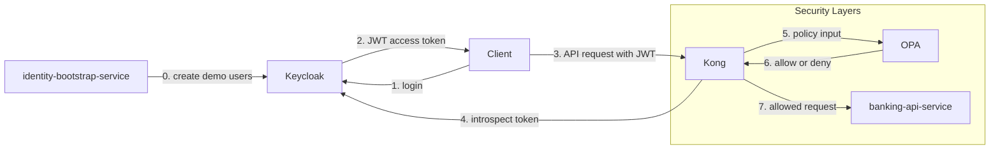

# 02 — This Project Architecture

This file maps the abstract security roles from [01 — Concepts](01-concepts.md) to the actual components running in this PoC.

> **Part I · Foundations** — Prereqs: [01](01-concepts.md)

## Components

| Component | Role |
|---|---|
| `Keycloak` | [IdP](01-concepts.md#idp) |
| `Kong` | [PEP](01-concepts.md#pep) |
| `OPA` | [PDP](01-concepts.md#pdp) |
| `banking-api-service` | [Resource server](01-concepts.md#glossary) |
| `identity-bootstrap-service` | Demo setup only |

## Role of Each Component

### Keycloak

`Keycloak` is the [IdP](01-concepts.md#idp) for this project.

It:

- stores demo users (`alice`, `ops-admin`)
- authenticates username and password
- issues JWT access tokens
- adds claims such as `customer_id` and `account_ids`

### Kong

`Kong` is the [PEP](01-concepts.md#pep) for this project.

It:

- receives every client request at the edge
- checks that a bearer token exists
- introspects the token with `Keycloak`
- calls `OPA` for an authorization decision
- forwards allowed requests to `banking-api-service`

### OPA

`OPA` is the [PDP](01-concepts.md#pdp) for this project.

It:

- receives request context from `Kong`
- evaluates the Rego policy in `infra/opa/policies/banking_authz.rego`
- returns `allow` or `deny`

### banking-api-service

`banking-api-service` is the [resource server](01-concepts.md#glossary) for this project.

It:

- validates the JWT signature, issuer, and audience
- checks account ownership again as defense in depth
- returns account and transaction data

### identity-bootstrap-service

`identity-bootstrap-service` exists only to make the PoC repeatable.

It:

- creates demo users (`alice`, `ops-admin`) in `Keycloak`
- sets demo claims and roles
- removes the need for manual `Keycloak` setup steps

## Architecture Diagram

## Why This Architecture Makes Sense

The three-role separation keeps concerns isolated:

- `Keycloak` owns identity — no other component stores credentials.
- `OPA` owns policy logic — changing a rule means editing one Rego file.
- `Kong` owns enforcement — services behind Kong do not need to re-implement gateway logic.

Defense in depth is also demonstrated:

- `Kong` checks token validity and calls `OPA` before forwarding.
- `banking-api-service` validates the JWT again independently.
- `banking-api-service` re-checks account ownership before returning data.

## Project File Mapping

| Path | Purpose |
|---|---|
| `docker-compose.yml` | Defines and wires all runtime containers |
| `infra/keycloak/realm-export.json` | Keycloak realm, client, and role configuration |
| `infra/kong/kong.yml` | Kong services, routes, and plugin config |
| `infra/kong/plugins/opa-authz/handler.lua` | Kong plugin — calls OPA and enforces the decision |
| `infra/kong/plugins/opa-authz/schema.lua` | Kong plugin — declares configuration schema |
| `infra/opa/policies/banking_authz.rego` | OPA policy (Rego) |
| `infra/opa/policies/banking_authz_test.rego` | OPA policy unit tests |
| `services/banking-api-service/` | Protected banking API (resource server) |
| `services/identity-bootstrap-service/` | Demo user provisioning service |
| `scripts/demo.sh` | End-to-end demo script |

---

← Prev: [01 — Concepts](01-concepts.md) · Next: [03 — Request Flows](03-request-flows.md) →
