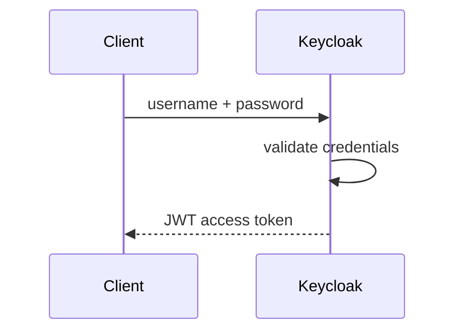
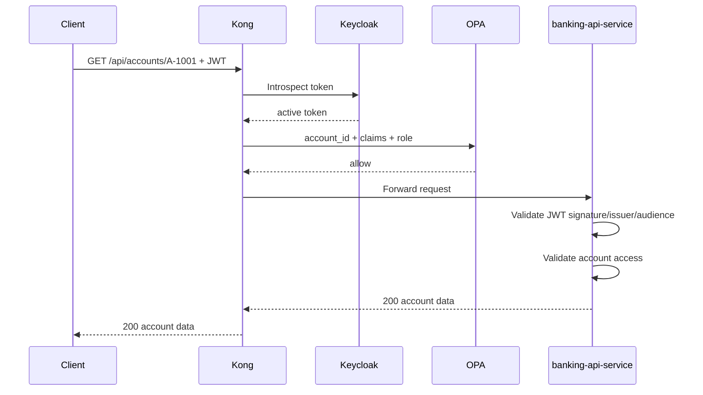
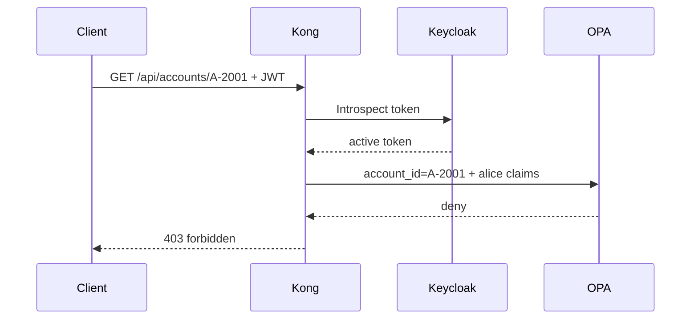
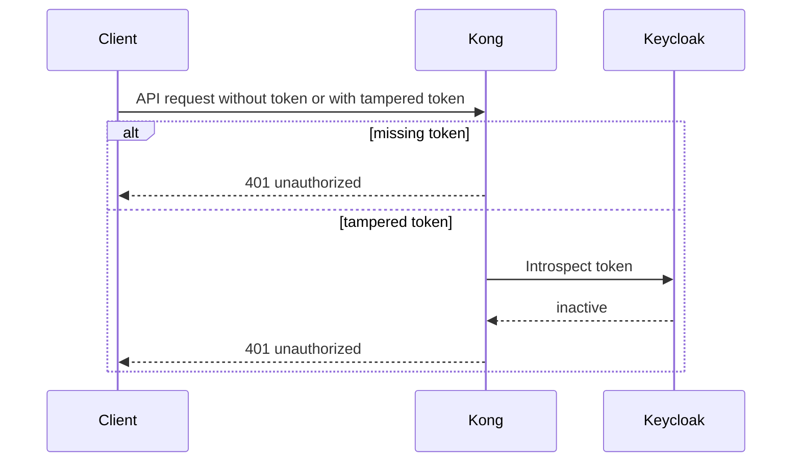

# 03 Request Flows

This file explains the main workflows in the PoC.

## Flow 1: Demo User Setup

Purpose:

- create a repeatable demo user in Keycloak

Steps:

1. The demo script calls `identity-bootstrap-service`
2. The bootstrap service authenticates as Keycloak admin
3. The bootstrap service creates or updates a demo-managed user
4. The service assigns claims and roles such as `customer` or `ops-admin`

## Flow 2: User Login

Purpose:

- exchange username and password for a JWT

Steps:

1. The client calls Keycloak token endpoint
2. Keycloak validates credentials
3. Keycloak returns a signed JWT

## Flow 3: Allowed Account Access

Example:

- `alice` accesses `A-1001`

Steps:

1. Client sends request with JWT to Kong
2. Kong introspects the token with Keycloak
3. Kong decodes claims and sends policy input to OPA
4. OPA returns `allow`
5. Kong forwards to banking service
6. Banking service validates JWT again
7. Banking service checks account access again
8. Banking service returns the account data

## Flow 4: Forbidden Account Access

Example:

- `alice` tries to access `A-2001`

Steps:

1. Kong verifies the token is active
2. Kong sends request data and claims to OPA
3. OPA returns `deny`
4. Kong stops the request and returns `403`

## Flow 5: Missing Or Tampered Token

Missing token:

1. Client calls Kong without bearer token
2. Kong returns `401`

Tampered token:

1. Client sends an altered token
2. Kong introspection sees the token as inactive
3. Kong returns `401`

## Why The Flows Matter

These flows show the separation clearly:

- Keycloak authenticates
- Kong enforces edge access
- OPA decides policy
- Spring Boot provides business behavior and extra safety checks
