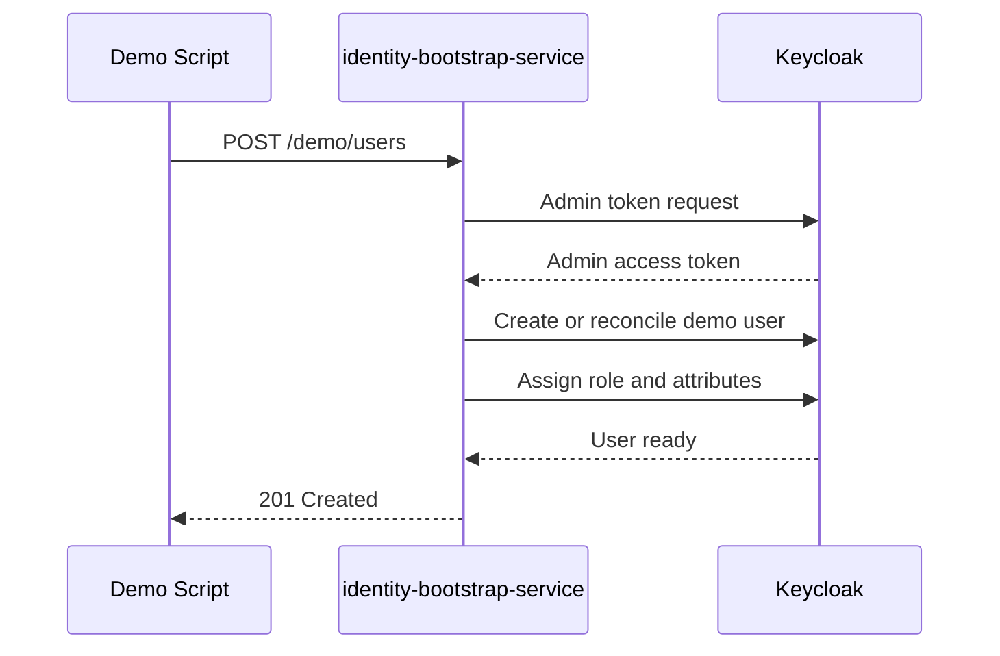
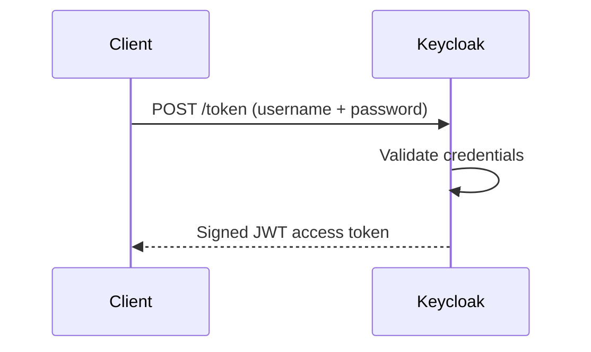
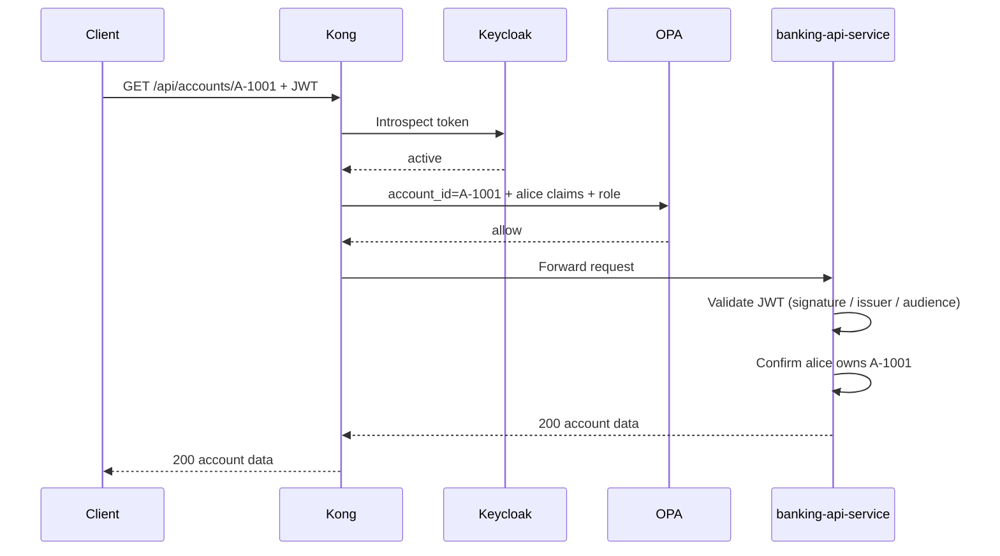
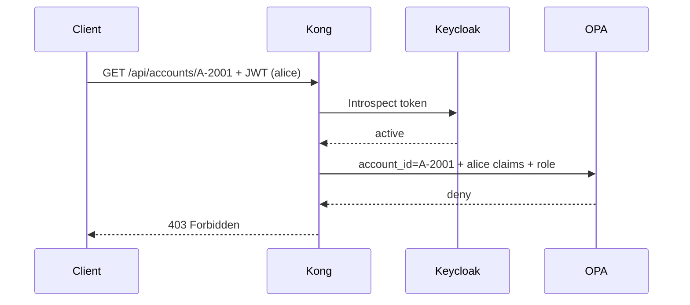
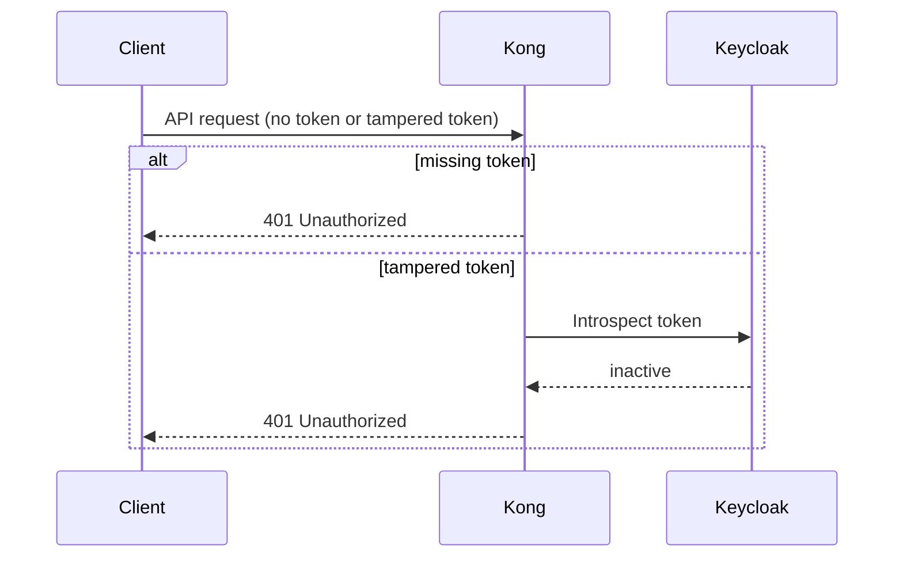

# 03 — Request Flows

End-to-end walkthroughs of the five key interactions in this PoC, showing how `Keycloak`, `Kong`, `OPA`, and `banking-api-service` collaborate on each request.

> **Part I · Foundations** — Prereqs: [01](01-concepts.md), [02](02-this-project-architecture.md)

---

## Flow 1: Demo User Setup

You run the demo script once before any login. It calls `identity-bootstrap-service`, which provisions repeatable demo users in `Keycloak`.

Steps:

1. The demo script calls `POST /demo/users` on `identity-bootstrap-service`.
2. `identity-bootstrap-service` authenticates to `Keycloak` using an admin credential.
3. `identity-bootstrap-service` creates or reconciles the demo user.
4. It assigns the user's role (`customer` or `ops-admin`) and custom claims (e.g., `account_ids`).
5. `Keycloak` confirms the user is ready; `identity-bootstrap-service` returns `201`.

For details on how `identity-bootstrap-service` works, see [10 — Identity Bootstrap Service](10-identity-bootstrap-service.md).

---

## Flow 2: User Login

You exchange credentials for a JWT. The token carries identity and claims used in every subsequent request.

Steps:

1. The client posts `username` + `password` to `Keycloak`'s token endpoint.
2. `Keycloak` validates the credentials.
3. `Keycloak` returns a signed JWT access token.

For `Keycloak` token endpoint details and JWT claim structure, see [06 — Keycloak IdP](06-keycloak-idp.md).

---

## Flow 3: Allowed Account Access

`alice` reads one of her own accounts. `Kong` (PEP) verifies the token is live, `OPA` (PDP) confirms `alice` owns that account, and `banking-api-service` re-validates before serving the data.

Example: `alice` requests `GET /api/accounts/A-1001` where `A-1001` belongs to `alice`.

Steps:

1. The client sends the JWT as a bearer token to `Kong`.
2. `Kong` introspects the token with `Keycloak` — confirms it is active.
3. `Kong` sends the decoded claims and requested `account_id` to `OPA`.
4. `OPA` evaluates the policy and returns `allow` (the account is in `alice`'s `account_ids` claim).
5. `Kong` forwards the request to `banking-api-service`.
6. `banking-api-service` re-validates the JWT signature, issuer, and audience.
7. `banking-api-service` verifies `alice` owns `A-1001`.
8. `banking-api-service` returns `200` with the account data.

For introspection details, see [11 — JWT Signature Validation](11-jwt-signature-validation.md). For OPA policy logic, see [08 — OPA](08-opa.md). For wire-level payloads, see [14 — Request-Response Reference](14-request-response-reference.md).

---

## Flow 4: Forbidden Account Access

`alice` attempts to read an account she does not own. `OPA` denies it at the gateway — `banking-api-service` is never reached.

Example: `alice` requests `GET /api/accounts/A-2001` where `A-2001` belongs to a different customer.

For contrast: `ops-admin` making the same request would receive `allow` from `OPA`, because the `ops-admin` role grants access to any account.

Steps:

1. The client sends the JWT to `Kong`.
2. `Kong` introspects the token — confirms it is active.
3. `Kong` sends the decoded claims and `account_id=A-2001` to `OPA`.
4. `OPA` returns `deny` (`A-2001` is not in `alice`'s `account_ids` claim and she lacks the `ops-admin` role).
5. `Kong` returns `403 Forbidden`. The request never reaches `banking-api-service`.

For OPA policy logic, see [08 — OPA](08-opa.md). For wire-level payloads, see [14 — Request-Response Reference](14-request-response-reference.md).

---

## Flow 5: Missing Or Tampered Token

Requests without a valid token are rejected by `Kong` before any policy check.

**Missing token:**

1. The client calls `Kong` without a bearer token.
2. `Kong` rejects immediately with `401 Unauthorized`.

**Tampered token:**

1. The client sends a modified JWT.
2. `Kong` introspects the token with `Keycloak`.
3. `Keycloak` reports the token as inactive (signature mismatch or unknown).
4. `Kong` returns `401 Unauthorized`.

For introspection details, see [11 — JWT Signature Validation](11-jwt-signature-validation.md).

---

## Why These Flows Matter

Each flow illustrates the clean separation between components (defined in [01 — Concepts](01-concepts.md)):

- `Keycloak` authenticates and signs tokens.
- `Kong` enforces edge access and drives the policy check.
- `OPA` decides allow or deny from policy rules alone.
- `banking-api-service` re-validates and provides business data.

No component over-reaches into another's responsibility.

---

← Prev: [02 — This Project Architecture](02-this-project-architecture.md) · Next: [04 — Local Demo Guide](04-local-demo-guide.md) →
