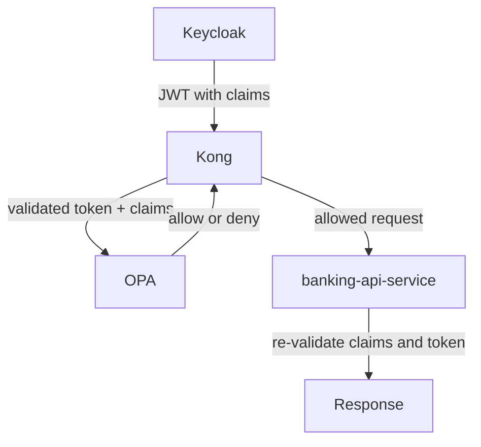

# 04 Component Deep Dives

This file explains each major component in practical terms.

## Keycloak Deep Dive

Keycloak is where identity starts.

In this project it manages:

- realm: `banking-poc`
- public client: `mobile-banking-app`
- confidential client for Kong introspection
- demo user roles
- custom claims such as `customer_id` and `account_ids`

Why it matters:

- the rest of the system depends on Keycloak to produce trustworthy identity data

## Kong Deep Dive

Kong is the front door of the banking API.

In this project Kong does three main things:

1. receives the API request first
2. introspects the token with Keycloak
3. sends a policy request to OPA

If OPA says `deny`, Kong stops the request.

If OPA says `allow`, Kong forwards the request to the banking API.

## OPA Deep Dive

OPA is not an API gateway and not an identity store.

OPA only evaluates policy.

In this project the policy checks:

- is the caller `ops-admin`
- if the caller is `customer`, does the token claim the requested `account_id`
- is the route one of the allowed read routes

OPA does not log in the user.
OPA does not issue the token.
OPA only answers whether the request should be allowed.

## banking-api-service Deep Dive

This service returns banking data.

It exposes:

- account details
- transactions

It also performs security work:

- JWT signature validation
- issuer validation
- audience validation
- service-side account authorization checks

Why that matters:

- even if a request somehow reaches the service directly, it still cannot bypass security easily

## identity-bootstrap-service Deep Dive

This service exists for demo setup, not for real customer onboarding.

It:

- creates demo-managed users in Keycloak
- sets their password
- sets their `customer_id`
- sets their `account_ids`
- assigns demo-managed roles

It is intentionally internal to the Compose network in the current PoC.

## Claim And Decision Relationship

## Simple Mental Model

Use this model when you think about the stack:

1. Keycloak creates identity data
2. Kong checks whether the token is alive
3. OPA checks whether the action is allowed
4. banking-api-service verifies again before returning data
