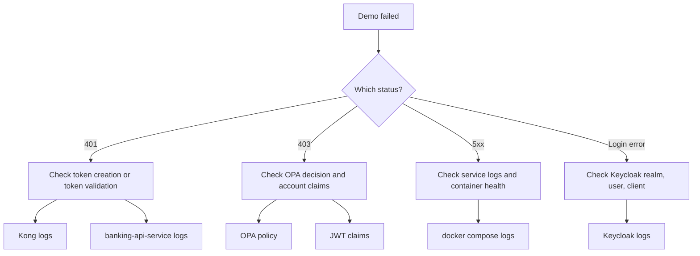

# 04 — Local Demo Guide

Run the PoC locally, watch each auth decision happen in real time, and inspect any service that misbehaves.

> **Part I · Foundations** — Prereqs: [02](02-this-project-architecture.md), [03](03-request-flows.md)

---

## Quick Start

From the repo root:

```bash
mvn -q test
docker compose up -d --build
bash scripts/demo.sh
```

The script pauses after each step and asks you to type `yes` to continue. This gives you time to inspect logs or endpoints between steps.

---

## What The Demo Script Does

The script runs nine steps in order:

1. Waits for `Keycloak`, `Kong`, and `identity-bootstrap-service` to be ready.
2. Creates the `alice` user via `identity-bootstrap-service`.
3. Creates the `ops-admin` user via `identity-bootstrap-service`.
4. Logs `alice` in through `Keycloak` and captures her token.
5. Logs `ops-admin` in through `Keycloak` and captures their token.
6. Calls the Kong-protected API with `alice`'s token for her own account — expects `200`.
7. Calls the Kong-protected API with `alice`'s token for a foreign account — expects `403`.
8. Calls the Kong-protected API with `ops-admin`'s token for any account — expects `200`.
9. Calls the Kong-protected API with no token — expects `401`.
10. Calls the Kong-protected API with a tampered token — expects `401`.

Steps 6–10 exercise the full [IdP](01-concepts.md) → [PEP](01-concepts.md) → [PDP](01-concepts.md) → [resource server](01-concepts.md) chain described in the concepts doc.

---

## Useful Endpoints

| Service | URL |
|---|---|
| `Keycloak` (IdP) | `http://localhost:9081` |
| Kong proxy (PEP) | `http://localhost:8000` |
| Kong admin | `http://localhost:8001` |
| `OPA` (PDP) | `http://localhost:8181` |

`identity-bootstrap-service` and `banking-api-service` are internal to the Compose network and are not exposed on the host. Use the `curl` helper container to reach them (see below).

---

## Internal Inspection With The curl Container

The Compose file includes a `curl` helper service on the same internal Docker network. Use it to reach services that are not exposed on the host.

Open a shell in the container:

```bash
docker compose exec curl sh
```

Or run one-off commands:

```bash
# Keycloak OIDC discovery
docker compose exec curl curl http://keycloak:8080/realms/banking-poc/.well-known/openid-configuration

# List demo users (identity-bootstrap-service)
docker compose exec curl curl -i http://identity-bootstrap-service:8080/demo/users

# Query OPA policy state
docker compose exec curl curl http://opa:8181/v1/data/banking_authz/allow

# Check banking-api-service health
docker compose exec curl curl http://banking-api-service:8080/actuator/health
```

Note: the internal Keycloak address is `keycloak:8080`. The host-facing port `9081` is only for traffic from your machine.

---

## If Something Fails

Start with a broad check:

```bash
docker compose ps
docker compose logs --no-color --tail=200
```

Then narrow down by symptom:

| Symptom | Where to look |
|---|---|
| Login fails | `Keycloak` realm, user, and client config |
| `401` for a valid user | Kong token validation or `banking-api-service` JWT config |
| `403` for expected access | OPA policy input and JWT claims |
| Unexpected `5xx` | Service logs and container health |

---

## Troubleshooting Flow



---

## How To Read The PoC Correctly

This project is a learning and feasibility environment, not a production blueprint.

It proves:

- `Keycloak` can issue the required identity claims.
- `Kong` can enforce access before traffic reaches the service.
- `OPA` can make external authorization decisions.
- `banking-api-service` can act as the protected resource server.
- All four components can work together end to end.

It does not address every production concern, such as:

- enterprise secrets management
- high-availability deployment
- production-grade onboarding flows
- production-grade observability
- self-contained Docker image builds

---

← Prev: [03 — Request Flows](03-request-flows.md) · Next: [05 — Component Tour](05-component-tour.md) →
