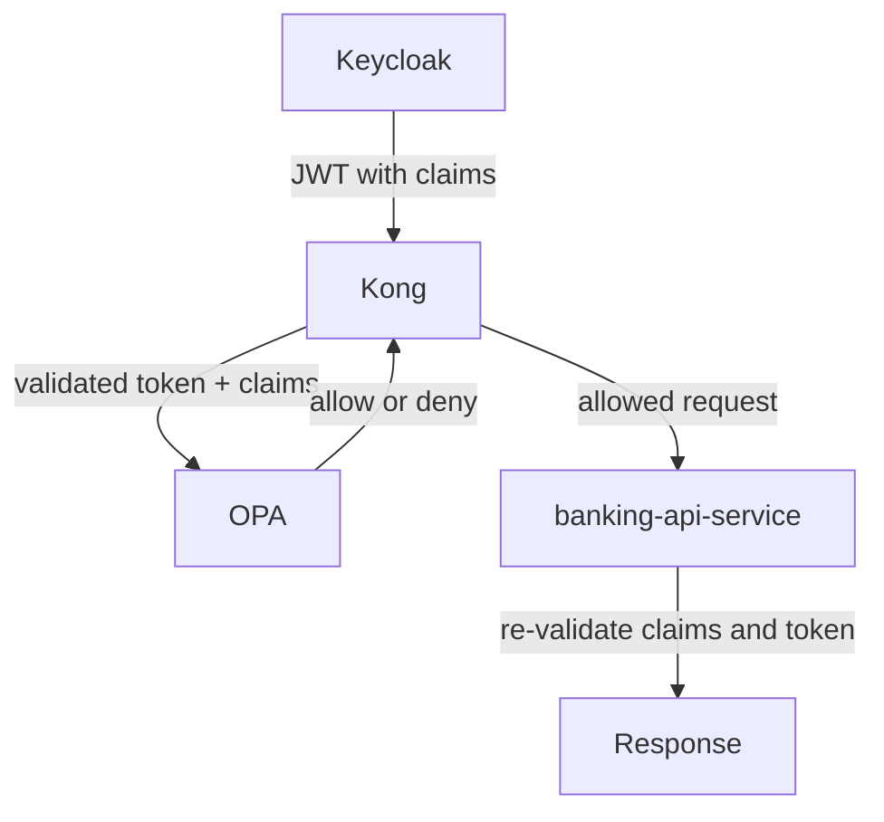

# 05 — Component Tour

A one-paragraph-per-component map of Part II — use this as your orientation before diving into each deep-dive doc.

> **Part II · Component Deep Dives** — Prereqs: [02](02-this-project-architecture.md)

## Claim and Decision Flow

## Keycloak

`Keycloak` is the [IdP](01-concepts.md) for this project — it stores users, checks credentials, and issues JWTs. When `alice` or `ops-admin` logs in, `Keycloak` authenticates them and embeds custom claims such as `customer_id` and `account_ids` into the token. Every other component downstream depends on `Keycloak` to produce trustworthy identity data. See [06-keycloak-idp.md](06-keycloak-idp.md) for the deep dive.

## Kong

`Kong` is the [PEP](01-concepts.md) — it is the front door of the system and the first component that sees every API request. It introspects the incoming token with `Keycloak` to confirm it is valid and not expired, then forwards the validated claims to `OPA` for a policy decision. If `OPA` returns `deny`, `Kong` stops the request immediately; if `OPA` returns `allow`, `Kong` forwards the request to `banking-api-service`. See [07-kong.md](07-kong.md) for the deep dive.

## OPA

`OPA` is the [PDP](01-concepts.md) — it evaluates policy rules and returns a single `allow` or `deny` decision. It does not authenticate users, issue tokens, or store identity; it only answers whether the action described in the incoming request is permitted under the current policy. In this project the policy checks the caller's role and, for `alice`, whether the token claims match the requested `account_id`. See [08-opa.md](08-opa.md) for the deep dive.

## banking-api-service

`banking-api-service` is the [resource server](01-concepts.md) — it owns the protected banking data and exposes account and transaction endpoints. Even after `Kong` and `OPA` have already approved the request, `banking-api-service` re-validates the JWT signature, issuer, and audience, and re-checks account-level authorization before returning any data. This adds defense in depth: a request that somehow bypasses the gateway still cannot extract data without passing service-side checks. See [09-banking-api-service.md](09-banking-api-service.md) for the deep dive.

## identity-bootstrap-service

`identity-bootstrap-service` is an internal demo-setup service — it exists solely to provision demo users into `Keycloak` so the PoC is runnable without manual configuration. It creates users, sets passwords, assigns roles, and populates the `customer_id` and `account_ids` claims that the rest of the stack depends on. It is intentionally not exposed outside the Compose network. See [10-identity-bootstrap-service.md](10-identity-bootstrap-service.md) for the deep dive.

---

← Prev: [04 — Local Demo Guide](04-local-demo-guide.md) · Next: [06 — Keycloak / IdP](06-keycloak-idp.md) →
