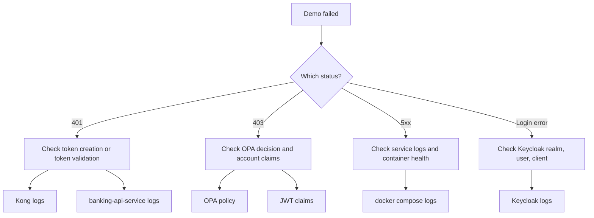

# 05 Local Demo Guide

This file explains how to run and inspect the PoC locally.

## Quick Start

```bash
mvn -q test
docker compose up -d --build
bash scripts/demo.sh
```

## What The Demo Script Does

The demo script performs these actions:

1. waits for Keycloak, Kong, and the internal bootstrap service
2. creates `alice`
3. creates `ops-admin`
4. logs both users in through Keycloak
5. calls the Kong protected API for allowed access
6. calls the Kong protected API for forbidden access
7. calls the Kong protected API without a token
8. calls the Kong protected API with a tampered token

## Useful Endpoints

- Keycloak: `http://localhost:9081`
- Kong proxy: `http://localhost:8000`
- Kong admin: `http://localhost:8001`
- OPA: `http://localhost:8181`

The bootstrap service is internal only in the current Compose setup.

## If Something Fails

Start with these checks:

```bash
docker compose ps
docker compose logs --no-color --tail=200
```

Then narrow it down:

- login failures: inspect Keycloak
- `401` for valid users: inspect Kong token introspection or Spring JWT validation
- `403` for expected access: inspect OPA policy input and claims
- banking data mismatch: inspect Spring Boot service logic

## Troubleshooting Flow



## How To Read The PoC Correctly

This project is best understood as a learning and feasibility environment.

It proves:

- Spring Boot can act as the protected banking API layer
- Keycloak can issue the required identity claims
- Kong can enforce access before traffic reaches the service
- OPA can make external authorization decisions
- the components can work together end to end

It does not try to prove every production concern such as:

- enterprise secrets management
- HA deployment
- production-grade onboarding
- production-grade observability
- self-contained Docker image builds in this environment
