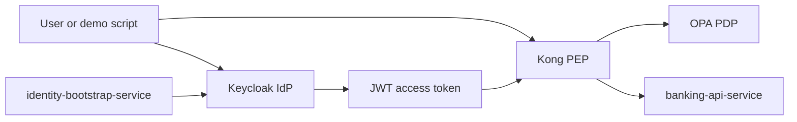
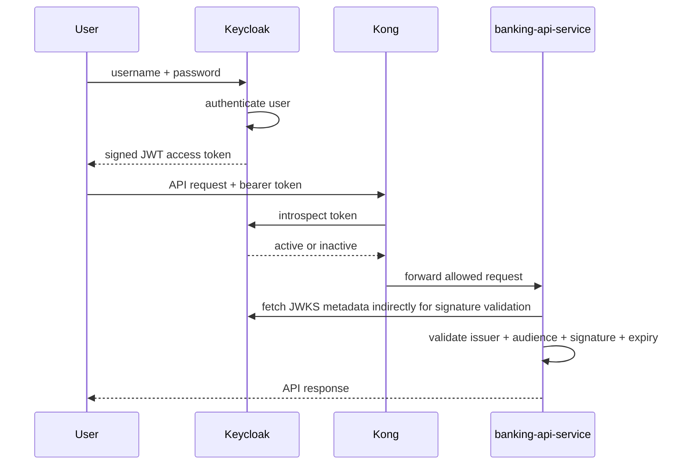
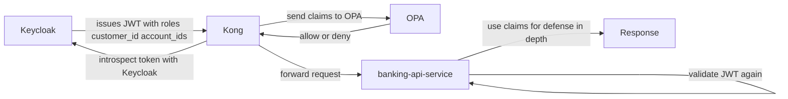

# 06 IdP And Keycloak Deep Dive

This file explains what an `IdP` is, why this project needs one, how `Keycloak` works, and how it interoperates with `Kong`, `OPA`, and the Spring Boot services in this repo.

## What An IdP Is

`IdP` means `Identity Provider`.

An Identity Provider is the system responsible for identity and login. It usually does these jobs:

- stores users
- checks credentials such as username and password
- manages roles and attributes
- issues tokens after successful authentication
- provides identity information to other systems

In simple terms:

- the IdP proves who the user is
- other systems decide what that user can do

That distinction matters.

- authentication: who are you?
- authorization: what are you allowed to do?

An IdP mainly solves authentication.

## Why This Project Needs An IdP

Without an IdP, every service would need to implement and maintain its own login logic, token issuing logic, password handling, user storage, and claim management.

That would create several problems:

- duplicated security code
- inconsistent identity rules across services
- harder auditing and troubleshooting
- harder integration with gateways and policy engines

This project uses `Keycloak` as the IdP so identity is centralized.

That gives the project:

- one place to authenticate users
- one place to manage roles like `customer` and `ops-admin`
- one place to issue JWTs
- one place to define claims like `customer_id` and `account_ids`

## Where Keycloak Sits In This PoC

Keycloak is not:

- the gateway
- the policy engine
- the banking API

Keycloak is the source of identity and token claims.

## How Keycloak Works

Keycloak is an IAM platform. In this repo, the important Keycloak concepts are:

### Realm

A realm is a security boundary.

You can think of it as an isolated identity domain with its own:

- users
- clients
- roles
- token settings

This project uses the realm:

- `banking-poc`

That means all demo users and clients for this PoC live inside that realm.

### Users

Users are the identities that log in.

In this PoC, example users are:

- `alice`
- `ops-admin`

The bootstrap service creates demo-managed users in Keycloak and sets attributes such as:

- `customer_id`
- `account_ids`
- `demo_managed`

### Roles

Roles represent coarse-grained permissions or responsibility groups.

This PoC uses realm roles:

- `customer`
- `ops-admin`

These roles appear in the token and are used later by Kong, OPA, and the banking service.

### Clients

A client is an application or service that interacts with Keycloak.

This repo defines two important clients:

1. `mobile-banking-app`
2. `kong-introspection`

`mobile-banking-app` is the client used by the demo login flow to obtain access tokens.

`kong-introspection` is a confidential client used by Kong to ask Keycloak whether a token is active.

### Protocol Mappers

Protocol mappers control what claims go into the token.

In this project, Keycloak maps:

- `customer_id`
- `account_ids`
- audience `mobile-banking-app`

Those claims are important because later:

- Kong forwards them to OPA
- OPA uses them in policy
- Spring Boot uses them for defense-in-depth checks

### Tokens

After a successful login, Keycloak issues a signed JWT access token.

That token includes claims such as:

- `sub`
- `preferred_username`
- `aud`
- `iss`
- `exp`
- `realm_access.roles`
- `customer_id`
- `account_ids`

The token is signed by Keycloak, which allows downstream systems to validate it.

## OAuth 2.0 And OpenID Connect In This Project

Keycloak speaks standard identity protocols.

The two most relevant ones here are:

- `OAuth 2.0`
- `OpenID Connect`

### OAuth 2.0

OAuth 2.0 is a framework for delegated access.

For this PoC, the important part is that it gives us a standard way to obtain access tokens and use them when calling APIs.

### OpenID Connect

OpenID Connect is an identity layer on top of OAuth 2.0.

It standardizes identity claims and endpoints around login and user identity.

In practice for this PoC:

- Keycloak authenticates users
- Keycloak issues OIDC-compatible JWTs
- services use those tokens to identify the caller

### Flow Used Here

The demo script uses direct username/password token exchange against Keycloak.

That is acceptable for a controlled PoC, but it is not the whole story of modern OIDC browser or mobile flows.

For this repo, what matters is:

1. credentials go to Keycloak
2. Keycloak validates them
3. Keycloak returns a JWT access token
4. that token is sent to Kong and the banking API path

## Token Issuance And Validation Flow

## Why JWT Validation Still Matters After Login

A common misunderstanding is:

- "Keycloak already authenticated the user, so the service does not need to validate the token again."

That is wrong.

Once the token leaves Keycloak, downstream systems must still verify that:

- the token was really issued by Keycloak
- it is meant for this application
- it has not expired
- it has not been tampered with

That is why this PoC validates tokens in more than one place:

- Kong introspects with Keycloak
- `banking-api-service` validates JWT signature, issuer, and audience

## How Keycloak Is Configured In This Repo

The main Keycloak configuration file is:

- `infra/keycloak/realm-export.json`

Important parts of that file:

- realm name: `banking-poc`
- roles: `customer`, `ops-admin`
- client: `mobile-banking-app`
- confidential client: `kong-introspection`
- protocol mappers for:
  - `customer_id`
  - `account_ids`
  - `aud=mobile-banking-app`

The file also defines user-profile support for custom attributes so the bootstrap service can write those attributes safely.

## How Keycloak Interoperates With The Other Components

### Keycloak And identity-bootstrap-service

The bootstrap service uses Keycloak admin APIs to:

- create demo users
- update demo-managed users
- set password
- assign realm roles
- set custom attributes

This makes the PoC repeatable.

### Keycloak And Kong

Kong uses Keycloak introspection to check whether the token is active before trusting the request enough to ask OPA for an authorization decision.

That is important because Kong should not make policy decisions from completely unverified token data.

### Keycloak And OPA

OPA does not talk directly to Keycloak in this PoC.

Instead:

- Keycloak issues claims in the JWT
- Kong reads validated token context
- Kong sends the relevant claims to OPA
- OPA uses those claims in policy

So Keycloak influences OPA decisions indirectly through token claims.

### Keycloak And banking-api-service

The banking service trusts Keycloak as the token issuer, but it does not blindly trust any token string.

It validates:

- signature
- issuer
- audience

Then it reads claims such as:

- roles
- `customer_id`
- `account_ids`

and uses them in service-side authorization checks.

## Claim Flow In This PoC

## Practical Examples In This PoC

### Example 1: Alice Accessing Her Own Account

Keycloak issues a token for `alice` containing claims such as:

- role `customer`
- `customer_id=C-1001`
- `account_ids=[A-1001]`

Then:

- Kong confirms the token is active
- OPA sees that `A-1001` is in the token claims
- banking-api-service checks the same claim set again
- the request is allowed

### Example 2: Alice Accessing Another Account

If `alice` requests `A-2001`:

- the token is still valid as an identity token
- but the claims do not authorize access to `A-2001`
- OPA returns `deny`
- Kong returns `403`

This shows a key idea:

- valid identity does not automatically mean valid authorization

### Example 3: ops-admin Access

If the user has the `ops-admin` role:

- OPA allows broader access
- banking-api-service also sees the role and allows service-side access

## Why Keycloak Is A Good Fit Here

Keycloak is useful in this project because it gives us:

- centralized authentication
- standard token issuance
- support for custom claims
- admin APIs for automated demo setup
- standard integration patterns for gateways and services

It lets the project focus on banking authorization logic rather than reinventing login infrastructure.

## Common Misunderstandings

### "Keycloak already handles all security"

No.

Keycloak handles identity and token issuance.
It does not replace gateway enforcement, policy evaluation, or business-service checks.

### "OPA could replace Keycloak"

No.

OPA decides policy.
OPA does not authenticate users or issue tokens.

### "Kong could replace Keycloak"

No.

Kong is the gateway.
It is not the identity provider.

### "Spring Boot could just do everything itself"

Technically it could do much more, but that would collapse identity, policy, and business logic into one place and make the architecture harder to maintain and reason about.

## Summary

If you want the shortest correct mental model:

1. Keycloak authenticates the user
2. Keycloak issues a JWT with identity and entitlement claims
3. Kong checks token activity and asks OPA for an authorization decision
4. Spring Boot validates the JWT again and enforces service-side checks

That is why Keycloak matters in this project: it is the system that makes the rest of the security flow possible in a standard, centralized, and repeatable way.
