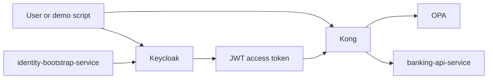
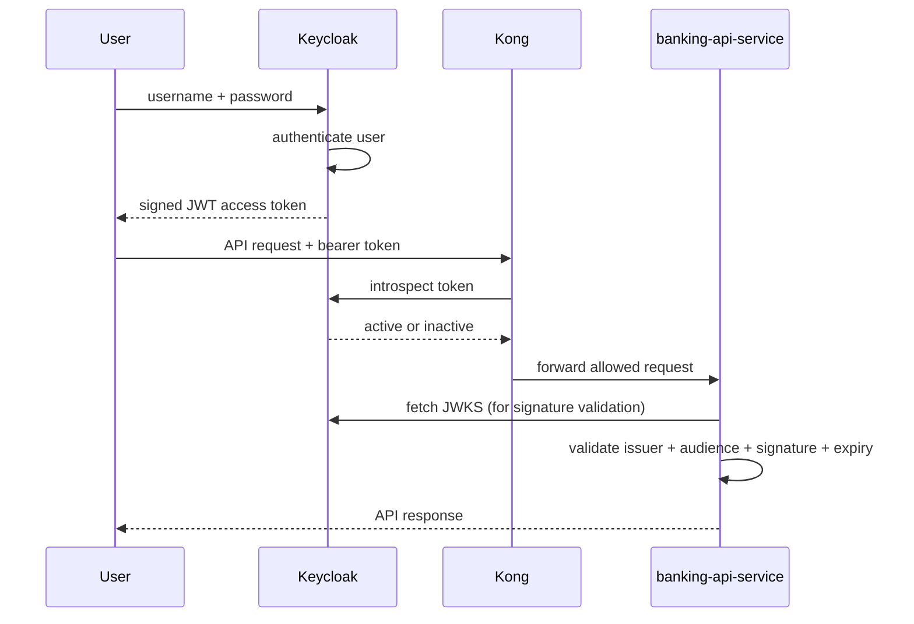
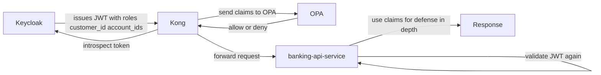

# 06 — Keycloak / IdP

`Keycloak` is the Identity Provider for this PoC: it authenticates users, owns session state, and issues the JWTs that drive every downstream authorization decision.

> **Part II · Component Deep Dives** — Prereqs: [01](01-concepts.md), [05](05-component-tour.md)

## What An IdP Is

An IdP (Identity Provider) is the system responsible for authenticating users and issuing tokens. See [01 — Concepts](01-concepts.md) for the full glossary.

In short:

- the IdP proves who the user is
- other systems decide what that user can do

## Why This Project Needs An IdP

Without an IdP, every service would need to implement and maintain its own login logic, token issuing logic, password handling, user storage, and claim management.

That would create:

- duplicated security code
- inconsistent identity rules across services
- harder auditing and troubleshooting
- harder integration with gateways and policy engines

This project uses `Keycloak` as the IdP so identity is centralized:

- one place to authenticate users
- one place to manage roles like `customer` and `ops-admin`
- one place to issue JWTs
- one place to define claims like `customer_id` and `account_ids`

## Where Keycloak Sits In This PoC

`Keycloak` is not the gateway, not the policy engine, and not the banking API. It is the source of identity and token claims.

## How Keycloak Works

### Realm

A realm is a security boundary with its own users, clients, roles, and token settings.

This project uses the realm `banking-poc`. All demo users and clients live inside that realm.

### Users

Users are the identities that log in. The demo users in this PoC are:

- `alice`
- `ops-admin`

The `identity-bootstrap-service` creates and manages these users via Keycloak admin APIs, setting attributes such as:

- `customer_id`
- `account_ids`
- `demo_managed`

### Roles

Roles represent coarse-grained permission groups. This PoC uses two realm roles:

- `customer`
- `ops-admin`

These roles appear in the JWT and are used by `Kong`, `OPA`, and `banking-api-service`.

### Clients

A client is an application or service that interacts with Keycloak. This repo defines two:

1. `mobile-banking-app` — the public client used by the demo login flow to obtain access tokens (`directAccessGrantsEnabled: true`, `publicClient: true`)
2. `kong-introspection` — a confidential service-account client (`publicClient: false`, `serviceAccountsEnabled: true`) used by `Kong` to introspect tokens

### Protocol Mappers

Protocol mappers control what claims go into the token. `mobile-banking-app` maps:

- `customer_id` — from user attribute, written to access token, ID token, and userinfo
- `account_ids` — from user attribute (multivalued), written to access token, ID token, and userinfo
- audience `mobile-banking-app` — written to access token only

Those claims flow downstream: `Kong` forwards them to `OPA`, `OPA` uses them in policy, and `banking-api-service` uses them for defense-in-depth checks.

### Tokens

After a successful login, Keycloak issues a signed JWT access token containing:

- `sub`
- `preferred_username`
- `aud`
- `iss`
- `exp`
- `realm_access.roles`
- `customer_id`
- `account_ids`

The token is signed by Keycloak, which allows downstream systems to validate it cryptographically.

## OAuth 2.0 And OpenID Connect In This Project

Keycloak speaks standard identity protocols.

### OAuth 2.0

OAuth 2.0 is a framework for delegated access. It provides a standard way to obtain access tokens and use them when calling APIs.

### OpenID Connect

OpenID Connect is an identity layer on top of OAuth 2.0. It standardizes identity claims and endpoints.

In practice:

- Keycloak authenticates users
- Keycloak issues OIDC-compatible JWTs
- services use those tokens to identify the caller

### Flow Used Here

The demo script uses direct username/password token exchange (`directAccessGrantsEnabled`) against Keycloak.

What matters for this PoC:

1. credentials go to Keycloak
2. Keycloak validates them
3. Keycloak returns a signed JWT access token
4. that token is sent to `Kong` and the banking API path

## Keycloak Sessions And Token Activity

Keycloak owns the live session state behind the JWT, which is why token introspection can answer `active: false` even for a structurally valid JWT. See [11 — JWT Signature, Validation & Introspection](11-jwt-signature-validation.md) for full introspection mechanics.

### Logical Session Types

Keycloak tracks three layers of session state:

1. **Authentication session** (short-lived) — temporary state during the login flow; removed after login completes or expires
2. **User session** — represents the authenticated user in a realm; tracks start time, idle/expiry state, and logout status
3. **Client session** (per client app) — attached to a user session for each client such as `mobile-banking-app`; tracks client-specific participation in that login session

### Physical Storage

At runtime, Keycloak stores online session state in Infinispan caches. In clustered deployments these caches are distributed across nodes. Offline sessions are persisted in the database.

The key practical point: token claims travel in the JWT, but live session state lives server-side in Keycloak. That is why a token can decode correctly while introspection still returns `active: false`.

For the access token / refresh token lifecycle and how each relates to session state, see [13 — Access & Refresh Token Lifecycle](13-token-lifecycle.md).

## Token Issuance And Validation Flow

## Why JWT Validation Still Matters After Login

A common misunderstanding:

> "Keycloak already authenticated the user, so the service does not need to validate the token again."

That is wrong. Once the token leaves Keycloak, downstream systems must still verify that the token was really issued by Keycloak, is meant for this application, has not expired, and has not been tampered with.

That is why this PoC validates tokens in more than one place:

- `Kong` introspects with Keycloak
- `banking-api-service` validates JWT signature, issuer, and audience

## How Keycloak Is Configured In This Repo

The main configuration file is `infra/keycloak/realm-export.json`.

Key settings verified from that file:

| Setting | Value |
|---|---|
| Realm | `banking-poc` |
| Realm roles | `customer`, `ops-admin` |
| Public client | `mobile-banking-app` (`directAccessGrantsEnabled: true`) |
| Confidential client | `kong-introspection` (`serviceAccountsEnabled: true`) |
| Protocol mappers | `customer_id`, `account_ids` (user attributes), `aud=mobile-banking-app` |
| User profile attributes | `customer_id` (single-value), `account_ids` (multivalued) — admin-edit only |

The realm-export also declares the user-profile schema so the `identity-bootstrap-service` can write `customer_id` and `account_ids` attributes safely.

## How Keycloak Interoperates With The Other Components

### Keycloak And identity-bootstrap-service

The bootstrap service uses Keycloak admin APIs to:

- create demo users
- set passwords
- assign realm roles
- set custom attributes (`customer_id`, `account_ids`, `demo_managed`)

This makes the PoC repeatable without manual Keycloak configuration.

### Keycloak And Kong

`Kong` uses Keycloak token introspection to check whether a token is active before forwarding the request or asking `OPA` for a decision. `Kong` authenticates to Keycloak using the `kong-introspection` confidential client credentials.

### Keycloak And OPA

`OPA` does not talk directly to Keycloak. Instead:

- Keycloak issues claims in the JWT
- `Kong` reads validated token context after introspection
- `Kong` sends the relevant claims to `OPA`
- `OPA` uses those claims in policy

So Keycloak influences `OPA` decisions indirectly through token claims.

### Keycloak And banking-api-service

`banking-api-service` trusts Keycloak as the token issuer but validates independently:

- signature (via JWKS)
- issuer
- audience

Then reads claims such as `realm_access.roles`, `customer_id`, and `account_ids` for service-side authorization checks.

## Claim Flow In This PoC

## Practical Examples In This PoC

### Example 1: alice Accessing Her Own Account

Keycloak issues a token for `alice` containing:

- role `customer`
- `customer_id=C-1001`
- `account_ids=[A-1001]`

Then:

- `Kong` confirms the token is active
- `OPA` sees `A-1001` is in the token claims
- `banking-api-service` checks the same claim set again
- the request is allowed

### Example 2: alice Accessing Another Account

If `alice` requests account `A-2001`:

- the token is still a valid identity token
- but the claims do not authorize access to `A-2001`
- `OPA` returns deny
- `Kong` returns `403`

This shows the key idea: valid identity does not automatically mean valid authorization.

### Example 3: ops-admin Access

If the user has the `ops-admin` role:

- `OPA` allows broader access
- `banking-api-service` also sees the role and allows service-side access

## Why Keycloak Is A Good Fit Here

Keycloak provides:

- centralized authentication
- standard token issuance (OIDC/OAuth 2.0)
- support for custom claims via protocol mappers
- admin APIs for automated demo setup
- standard integration patterns for gateways and services

It lets the project focus on banking authorization logic rather than reinventing login infrastructure.

## Common Misunderstandings

### "Keycloak already handles all security"

No. Keycloak handles identity and token issuance. It does not replace gateway enforcement (`Kong`), policy evaluation (`OPA`), or business-service checks (`banking-api-service`).

### "OPA could replace Keycloak"

No. `OPA` is the [PDP](01-concepts.md) — it decides policy. It does not authenticate users or issue tokens.

### "Kong could replace Keycloak"

No. `Kong` is the [PEP](01-concepts.md) — the gateway. It is not the identity provider.

### "Spring Boot could just do everything itself"

Technically it could do more, but that would collapse identity, policy, and business logic into one place and make the architecture harder to maintain and reason about.

## Summary

1. Keycloak authenticates the user
2. Keycloak issues a JWT with identity and entitlement claims
3. `Kong` checks token activity and asks `OPA` for an authorization decision
4. `banking-api-service` validates the JWT again and enforces service-side checks

That is why Keycloak matters in this project: it is the system that makes the rest of the security flow possible in a standard, centralized, and repeatable way.

---

← Prev: [05 — Component Tour](05-component-tour.md) · Next: [07 — Kong](07-kong.md) →
