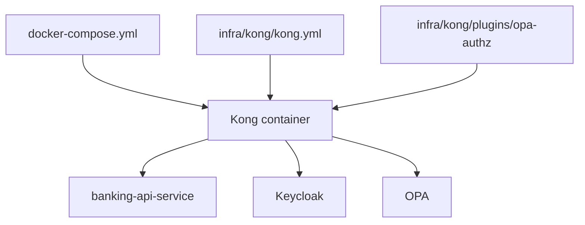
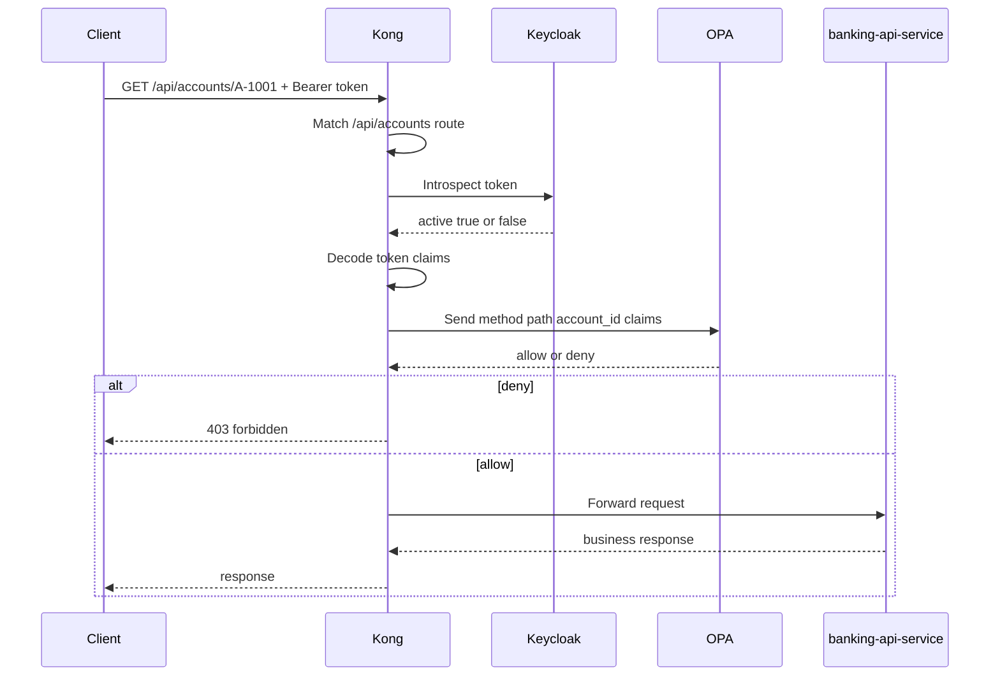

# 07 Kong Integration

This file explains how `Kong` works in this project, how `docker-compose.yml` and `infra/kong/kong.yml` fit together, and how Kong interoperates with `banking-api-service`, `identity-bootstrap-service`, `Keycloak`, and `OPA`.

## What Kong Is

Kong is an API gateway.

In this project, Kong is the main `PEP`, which means `Policy Enforcement Point`.

That means Kong is the first security layer in front of the banking API.

Its job is to:

- receive the incoming API request
- inspect the bearer token
- validate token activity with Keycloak
- ask OPA whether the request should be allowed
- forward allowed requests to `banking-api-service`
- block denied or invalid requests before they reach the banking service

Kong is not:

- the identity provider
- the policy engine
- the banking business service

In this PoC:

- `Keycloak` is the IdP
- `OPA` is the PDP
- `Kong` is the PEP

## Two Kong-Related Config Files

There are two main Kong configuration files in this repo:

1. `docker-compose.yml`
2. `infra/kong/kong.yml`

They solve different problems.

### `docker-compose.yml`

This file tells Docker:

- which Kong image to run
- which ports to expose
- which environment variables to pass into Kong
- which files to mount into the Kong container
- which other services Kong depends on

This is container wiring.

### `infra/kong/kong.yml`

This file tells Kong itself:

- what upstream service exists
- what route should match
- what plugin should run for that route
- what plugin config values should be used

This is Kong runtime behavior.

## How To Read Them Together



Simple reading model:

- `docker-compose.yml` creates the Kong container
- `kong.yml` tells Kong how to route and what plugin to run
- `schema.lua` tells Kong what plugin config is valid
- `handler.lua` contains the plugin runtime logic

## Kong In `docker-compose.yml`

Relevant section:

- image: `kong:3.7`
- host ports:
  - `8000:8000` for proxy traffic
  - `8001:8001` for Kong admin API
- environment:
  - `KONG_DATABASE=off`
  - `KONG_DECLARATIVE_CONFIG=/etc/kong/kong.yml`
  - `KONG_PLUGINS=bundled,opa-authz`
- volumes:
  - mount `infra/kong/kong.yml` into the container
  - mount the custom plugin directory into the Lua plugin path

Important meaning:

- `KONG_DATABASE=off`
  - Kong runs in DB-less mode
  - config comes from files, not a separate database

- `KONG_DECLARATIVE_CONFIG=/etc/kong/kong.yml`
  - tells Kong which file contains its declarative routing config

- `KONG_PLUGINS=bundled,opa-authz`
  - enables default Kong plugins plus this custom plugin

- `depends_on`
  - Kong waits for `banking-api-service` and `opa` to start

## Kong In `infra/kong/kong.yml`

This file defines one upstream service and one route.

### Service

```yaml
services:
  - name: banking-api
    url: http://banking-api-service:8080
```

Meaning:

- Kong can forward requests to the internal service named `banking-api-service`
- it will do so on port `8080`

### Route

```yaml
routes:
  - name: banking-api-route
    paths:
      - /api/accounts
    strip_path: false
```

Meaning:

- requests starting with `/api/accounts` match this route
- the path is forwarded as-is because `strip_path` is `false`

So this request:

- `GET /api/accounts/A-1001`

is sent upstream as:

- `GET /api/accounts/A-1001`

### Plugin Attachment

```yaml
plugins:
  - name: opa-authz
```

Meaning:

- every request matching this route runs through the custom `opa-authz` plugin first

## What `schema.lua` Does

File:

- `infra/kong/plugins/opa-authz/schema.lua`

This file defines the allowed configuration for the custom plugin.

It says the plugin config must include:

- `opa_url`
- `introspection_url`
- `introspection_client_id`
- `introspection_client_secret`
- optional `timeout_ms`

Why that matters:

- Kong validates plugin config against this schema
- missing required fields cause configuration errors early
- it separates plugin configuration definition from plugin runtime behavior

### `schema.lua` Explained Line By Line

```lua
return {
  name = "opa-authz",
  fields = {
    {
      config = {
        type = "record",
        fields = {
          { opa_url = { type = "string", required = true } },
          { introspection_url = { type = "string", required = true } },
          { introspection_client_id = { type = "string", required = true } },
          { introspection_client_secret = { type = "string", required = true } },
          { timeout_ms = { type = "number", default = 2000 } },
        },
      },
    },
  },
}
```

Explanation:

- `name = "opa-authz"`
  - this is the plugin name Kong uses

- `fields = { { config = { ... } } }`
  - Kong plugin schemas define a `config` object

- `type = "record"`
  - the config must be an object with named fields

- `opa_url`
  - required string
  - where Kong sends authorization input for OPA evaluation

- `introspection_url`
  - required string
  - where Kong asks Keycloak whether the token is active

- `introspection_client_id`
  - required string
  - confidential Keycloak client used by Kong for introspection

- `introspection_client_secret`
  - required string
  - the secret paired with that client

- `timeout_ms`
  - optional number
  - defaults to `2000`
  - used to limit how long Kong waits on Keycloak or OPA

Mental model:

- `schema.lua` says what config is allowed
- `kong.yml` provides the actual values
- `handler.lua` uses those values at runtime

## What `handler.lua` Does

File:

- `infra/kong/plugins/opa-authz/handler.lua`

This file contains the real enforcement logic.

At a high level, it does this:

1. read the `Authorization` header
2. reject the request if the bearer token is missing or malformed
3. call Keycloak introspection to confirm the token is active
4. decode JWT claims from the token payload
5. build OPA input from request path, method, and claims
6. call OPA
7. if OPA says deny, return `403`
8. if OPA says allow, let Kong forward the request to `banking-api-service`

## Kong Request Flow In This Project



## How Kong Interoperates With Other Components

### Kong And banking-api-service

Relationship:

- Kong forwards only allowed requests to `banking-api-service`

Why it matters:

- banking service does not need to be the first exposed endpoint
- gateway logic is separated from business logic

Important detail:

- the banking service still validates JWT and account access itself
- this is defense in depth

### Kong And identity-bootstrap-service

Relationship:

- Kong does not sit in front of `identity-bootstrap-service` in this PoC

Why:

- bootstrap is an internal demo utility
- it is not part of the public protected banking route

So the bootstrap service exists in the same Compose network, but Kong does not route traffic to it.

### Kong And Keycloak

Relationship:

- Kong uses Keycloak for token introspection

Why:

- Kong should not make policy decisions from completely unverified bearer data
- Keycloak confirms whether the token is active before Kong proceeds to OPA

Key configuration values:

- `introspection_url`
- `introspection_client_id`
- `introspection_client_secret`

### Why Kong Uses Introspection Instead Of JWKS

Kong and `banking-api-service` are solving slightly different security problems.

Kong is the edge PEP.
Before it trusts a token enough to ask OPA for an authorization decision, it wants a live answer from Keycloak.

So Kong asks:

- is this token still active right now?

That is what introspection gives Kong.

Why this matters at the gateway:

- a token may still decode correctly as a JWT
- a token may still look cryptographically valid
- but Keycloak may already consider it inactive because of logout, revocation, or session expiry

For an edge enforcement point, that live status check is valuable.

If Kong used only JWKS-based local JWT validation, it could verify:

- signature
- issuer
- audience
- expiry

But it would not automatically get the live Keycloak session answer that introspection provides.

So the design in this PoC is:

- Kong introspection = live token activity check at the edge
- Spring JWKS validation = fast local cryptographic validation inside the service

That is why Kong does not rely on JWKS alone here.

It wants the stronger, source-of-truth answer from Keycloak before building OPA input.

### Kong And OPA

Relationship:

- Kong calls OPA for authorization decisions

Why:

- policy stays outside the gateway code itself
- changing authorization logic becomes easier
- policy is separated from both identity management and business logic

OPA receives input such as:

- HTTP method
- request path
- `account_id`
- `customer_id`
- `account_ids`
- role
- username

OPA returns:

- `allow`
- or `deny`

## Why Kong Is Useful Here

Kong gives this PoC an edge enforcement layer.

That is useful because it:

- centralizes access enforcement
- protects the banking API before requests reach business code
- integrates identity validation with Keycloak
- externalizes authorization decisions through OPA
- keeps the architecture aligned with `IdP + PEP + PDP + service` separation

## Practical Inspection Commands

Use the helper container:

```bash
docker compose exec curl sh
```

Inspect Keycloak discovery:

```bash
docker compose exec curl curl http://keycloak:8080/realms/banking-poc/.well-known/openid-configuration
```

Inspect OPA endpoint:

```bash
docker compose exec curl curl http://opa:8181/v1/data/banking_authz/allow
```

Inspect banking service health:

```bash
docker compose exec curl curl http://banking-api-service:8080/actuator/health
```

Inspect Kong from the host:

```bash
curl http://localhost:8001
curl -i http://localhost:8000/api/accounts/A-1001
```

## Summary

If you want the shortest correct way to understand Kong in this repo:

1. `docker-compose.yml` creates and wires the Kong container
2. `infra/kong/kong.yml` tells Kong what route and plugin to use
3. `schema.lua` defines the plugin config shape
4. `handler.lua` runs the real enforcement logic
5. Kong validates token activity with Keycloak
6. Kong asks OPA for authorization
7. Kong forwards allowed requests to `banking-api-service`

That is how Kong interoperates with the rest of this project.
