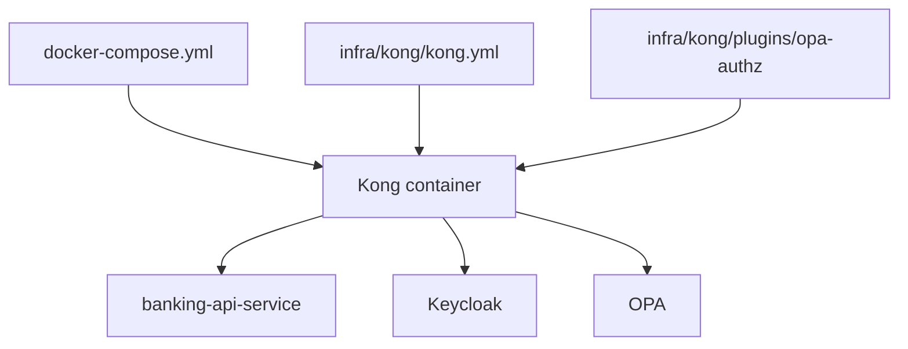
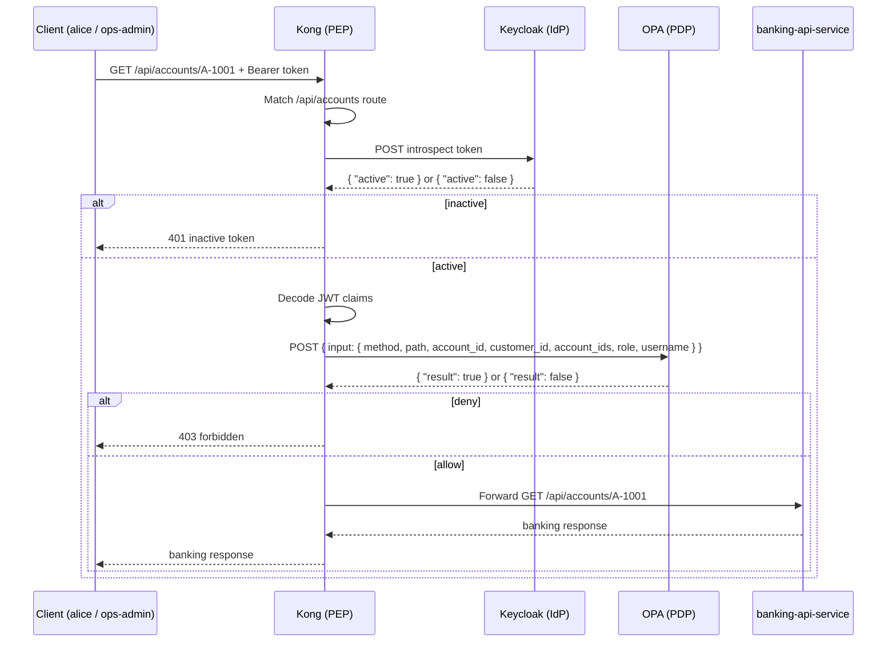

# 07 — Kong (Gateway / PEP)

Kong is the API gateway and [Policy Enforcement Point](01-concepts.md) that intercepts every request, validates tokens with `Keycloak`, asks `OPA` for an authorization decision, and forwards allowed requests to `banking-api-service`.

> **Part II · Component Deep Dives** — Prereqs: [01](01-concepts.md), [05](05-component-tour.md)

## What Kong Is

In the [IdP / PEP / PDP](01-concepts.md) separation used in this PoC:

- `Keycloak` is the **IdP** — it issues tokens.
- `Kong` is the **PEP** — it enforces access at the edge.
- `OPA` is the **PDP** — it decides whether a request is allowed.
- `banking-api-service` is the **resource server** — it owns the protected banking data.

Kong's responsibilities in this project:

1. Receive the incoming API request.
2. Reject requests with a missing or malformed `Authorization` header.
3. Call `Keycloak` introspection to confirm the token is currently active.
4. Decode JWT claims from the token payload.
5. Build an input object from the request path, method, and claims.
6. Call `OPA` for an authorization decision.
7. Return `403` if `OPA` denies, or forward to `banking-api-service` if `OPA` allows.

Kong is not the identity provider, the policy engine, or the banking business service.

## Two Kong-Related Config Files

Two files control Kong in this repo:

| File | Purpose |
|---|---|
| `docker-compose.yml` | Container wiring — image, ports, env vars, volumes, dependencies |
| `infra/kong/kong.yml` | Kong runtime behavior — service, route, plugin, plugin config values |

### How They Relate



- `docker-compose.yml` creates the Kong container and mounts config into it.
- `kong.yml` tells Kong what route to expose and what plugin to run.
- `schema.lua` defines what plugin config fields are valid.
- `handler.lua` contains the enforcement logic that runs on every request.

## Kong In `docker-compose.yml`

The relevant Kong service block:

```yaml
kong:
  image: kong:3.7
  environment:
    KONG_DATABASE: off
    KONG_DECLARATIVE_CONFIG: /etc/kong/kong.yml
    KONG_PLUGINS: bundled,opa-authz
    KONG_PROXY_ACCESS_LOG: /dev/stdout
    KONG_ADMIN_ACCESS_LOG: /dev/stdout
    KONG_PROXY_ERROR_LOG: /dev/stderr
    KONG_ADMIN_ERROR_LOG: /dev/stderr
    KONG_ADMIN_LISTEN: 0.0.0.0:8001
  ports:
    - "8000:8000"
    - "8001:8001"
  depends_on:
    banking-api-service:
      condition: service_started
      restart: true
    opa:
      condition: service_started
  volumes:
    - ./infra/kong/kong.yml:/etc/kong/kong.yml:ro
    - ./infra/kong/plugins/opa-authz:/usr/local/share/lua/5.1/kong/plugins/opa-authz:ro
```

Key environment variables:

- `KONG_DATABASE=off` — Kong runs in DB-less mode. All config comes from files, not a database.
- `KONG_DECLARATIVE_CONFIG=/etc/kong/kong.yml` — the file that holds Kong's declarative routing config.
- `KONG_PLUGINS=bundled,opa-authz` — enables the built-in Kong plugins plus the custom `opa-authz` plugin.
- `KONG_ADMIN_LISTEN=0.0.0.0:8001` — exposes the Kong admin API inside the container.

Key volumes:

- `kong.yml` is mounted read-only at `/etc/kong/kong.yml` inside the container.
- The custom plugin directory is mounted read-only at `/usr/local/share/lua/5.1/kong/plugins/opa-authz` — the standard Lua plugin path Kong scans.

`depends_on` means Kong only starts after `banking-api-service` and `opa` have started. If `banking-api-service` restarts, Kong also restarts (`restart: true`).

## Kong In `infra/kong/kong.yml`

This file uses Kong's declarative format (`_format_version: "3.0"`) and defines one service with one route and one plugin inline:

```yaml
_format_version: "3.0"

services:
  - name: banking-api
    url: http://banking-api-service:8080
    routes:
      - name: banking-api-route
        paths:
          - /api/accounts
        strip_path: false
    plugins:
      - name: opa-authz
        config:
          opa_url: http://opa:8181/v1/data/banking_authz/allow
          introspection_url: http://keycloak:8080/realms/banking-poc/protocol/openid-connect/token/introspect
          introspection_client_id: kong-introspection
          introspection_client_secret: kong-introspection-secret
          timeout_ms: 2000
```

### Service

- `name: banking-api` — Kong's internal name for the upstream.
- `url: http://banking-api-service:8080` — where Kong forwards allowed requests.

### Route

- `paths: [/api/accounts]` — requests starting with `/api/accounts` match this route.
- `strip_path: false` — the path is forwarded as-is.

So a request for `GET /api/accounts/A-1001` (from `alice` or `ops-admin`) is forwarded upstream as `GET /api/accounts/A-1001`.

### Plugin Attachment and Config Values

The `opa-authz` plugin runs on every request matching the route. Its config provides the actual URLs and credentials the plugin uses at runtime:

- `opa_url` — the OPA endpoint Kong POSTs authorization input to.
- `introspection_url` — the `Keycloak` endpoint Kong calls to check token activity.
- `introspection_client_id` — the `kong-introspection` client registered in `Keycloak`.
- `introspection_client_secret` — the paired secret for that client.
- `timeout_ms: 2000` — how long Kong waits on `Keycloak` or `OPA` before aborting.

## The `opa-authz` Plugin

The custom plugin lives at `infra/kong/plugins/opa-authz/` and consists of two files:

### `schema.lua` — Config Definition

`schema.lua` declares the shape of valid plugin config. Kong validates any `opa-authz` plugin block against this schema at startup:

```lua
return {
  name = "opa-authz",
  fields = {
    {
      config = {
        type = "record",
        fields = {
          { opa_url = { type = "string", required = true } },
          { introspection_url = { type = "string", required = true } },
          { introspection_client_id = { type = "string", required = true } },
          { introspection_client_secret = { type = "string", required = true } },
          { timeout_ms = { type = "number", default = 2000 } },
        },
      },
    },
  },
}
```

- All four URL/credential fields are required strings — Kong will refuse to start if any are missing.
- `timeout_ms` is optional and defaults to `2000`.
- `schema.lua` defines what is allowed; `kong.yml` provides the actual values; `handler.lua` uses them at runtime.

### `handler.lua` — Enforcement Logic

`handler.lua` runs on every matching request inside Kong's `access` phase (priority `900`). The logic executes in this order:

**Step 1 — Read bearer token**

```lua
local auth_header = kong.request.get_header("authorization")
if not auth_header then
  return kong.response.exit(401, { message = "missing bearer token" })
end

local token = auth_header:match("[Bb]earer%s+(.+)")
if not token then
  return kong.response.exit(401, { message = "invalid bearer token" })
end
```

Returns `401` if no `Authorization` header is present or if it does not contain a bearer token.

**Step 2 — Introspect token with `Keycloak`**

```lua
local introspection, introspection_err = introspect_token(conf, token)
if not introspection then
  return kong.response.exit(503, { message = "introspection unavailable", detail = introspection_err })
end

if introspection.active ~= true then
  return kong.response.exit(401, { message = "inactive token" })
end
```

Kong POSTs the token to `Keycloak`'s introspection endpoint using HTTP Basic auth with `introspection_client_id` and `introspection_client_secret`. If `Keycloak` is unreachable, Kong returns `503`. If the token is not active, Kong returns `401`.

For why Kong uses introspection rather than JWKS-based local validation, see the [rationale section below](#why-kong-uses-introspection-not-jwks). For how introspection works mechanically, see [11 — JWT Signature, Validation & Introspection](11-jwt-signature-validation.md).

**Step 3 — Decode JWT claims**

```lua
local claims = decode_claims(token)
if not claims then
  return kong.response.exit(401, { message = "unreadable jwt payload" })
end
```

Kong base64-decodes the JWT payload segment and JSON-parses it to read claims. This is a local decode — no further network call.

**Step 4 — Determine effective role**

```lua
local function effective_role(claims)
  local realm_access = claims and claims.realm_access
  local roles = realm_access and realm_access.roles or {}

  for _, role in ipairs(roles) do
    if role == "ops-admin" then return "ops-admin" end
  end

  for _, role in ipairs(roles) do
    if role == "customer" then return "customer" end
  end

  return nil
end
```

`ops-admin` takes precedence over `customer`. If neither role is present, `effective_role` returns `nil`.

**Step 5 — Build OPA input and call `OPA`**

```lua
local account_id = kong.request.get_path():match("/api/accounts/([^/]+)")
local request_body = cjson.encode({
  input = {
    method = kong.request.get_method(),
    path = kong.request.get_path(),
    account_id = account_id,
    customer_id = claim_value(claims.customer_id),
    account_ids = claim_values(claims.account_ids),
    role = effective_role(claims),
    username = claims.preferred_username,
  },
})
```

For a request like `alice` calling `GET /api/accounts/A-1001`, Kong extracts `account_id = "A-1001"` from the path and packages it with the other fields into a JSON input document.

**Step 6 — Enforce `OPA` decision**

```lua
if decision.result ~= true then
  return kong.response.exit(403, { message = "forbidden" })
end
```

`OPA` returns `{"result": true}` or `{"result": false}`. Kong checks `decision.result` — anything other than `true` (including `false` or a missing field) results in `403`. If `OPA` is unreachable or returns a non-200 status, Kong returns `503`.

## Kong Request Flow



## Interoperability With Other Components

### Kong and `banking-api-service`

Kong forwards only requests that passed both `Keycloak` introspection and `OPA` authorization. `banking-api-service` is not directly exposed — all traffic from `alice` or `ops-admin` arrives through Kong.

`banking-api-service` also validates the JWT itself using JWKS. This is defense in depth: the banking service does not trust that Kong has already checked everything.

### Kong and `identity-bootstrap-service`

Kong does not sit in front of `identity-bootstrap-service`. Bootstrap is an internal demo utility that lives on the same Compose network, but Kong does not route any traffic to it.

### Kong and `Keycloak`

Kong uses `Keycloak` for token introspection, not as an identity provider for its own admin access.

#### Why Kong Uses Introspection, Not JWKS

Kong is the edge PEP. Before it builds OPA input from token claims, it needs a live confirmation from `Keycloak` that the token is still active right now.

A token may:

- still decode correctly as a JWT,
- still carry a valid cryptographic signature,
- still be within its `exp` expiry window,

and yet `Keycloak` may already consider it inactive due to logout, session expiry, or revocation.

JWKS-based local validation would confirm signature, issuer, audience, and expiry — but it would not reflect `Keycloak`'s current session state.

Introspection gives Kong the source-of-truth answer directly from `Keycloak` before committing to an OPA call.

The design is therefore:

- **Kong introspection** — live token activity check at the edge, before OPA.
- **`banking-api-service` JWKS validation** — fast local cryptographic validation inside the resource server.

For the full mechanics of how introspection works (the HTTP exchange, Keycloak's response, what `active` means), see [11 — JWT Signature, Validation & Introspection](11-jwt-signature-validation.md).

### Kong and `OPA`

Kong calls `OPA` only after the token is confirmed active. `OPA` receives:

| Field | Source |
|---|---|
| `method` | HTTP method from the request |
| `path` | Request path |
| `account_id` | Extracted from `/api/accounts/{account_id}` |
| `customer_id` | JWT claim |
| `account_ids` | JWT claim (list) |
| `role` | Derived: `ops-admin` \| `customer` \| `nil` |
| `username` | JWT `preferred_username` claim |

`OPA` returns `{"result": true}` or `{"result": false}`. Kong enforces accordingly.

Keeping policy in `OPA` means authorization rules can change without modifying Kong or the banking service.

## Practical Inspection Commands

Use the helper container for requests from inside the Compose network:

```bash
docker compose exec curl sh
```

Check `Keycloak` OIDC discovery:

```bash
docker compose exec curl curl http://keycloak:8080/realms/banking-poc/.well-known/openid-configuration
```

Check the `OPA` policy endpoint:

```bash
docker compose exec curl curl http://opa:8181/v1/data/banking_authz/allow
```

Check `banking-api-service` health:

```bash
docker compose exec curl curl http://banking-api-service:8080/actuator/health
```

Inspect Kong from the host:

```bash
# Admin API — shows loaded routes, services, plugins
curl http://localhost:8001

# Proxy — test the protected route (expect 401 without a token)
curl -i http://localhost:8000/api/accounts/A-1001
```

---

← Prev: [06 — Keycloak / IdP](06-keycloak-idp.md) · Next: [08 — OPA](08-opa.md) →
