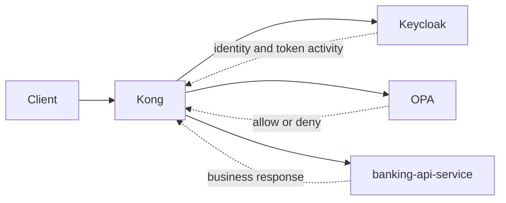
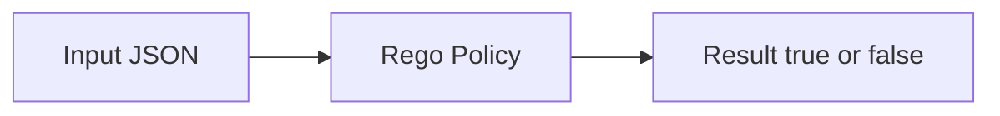
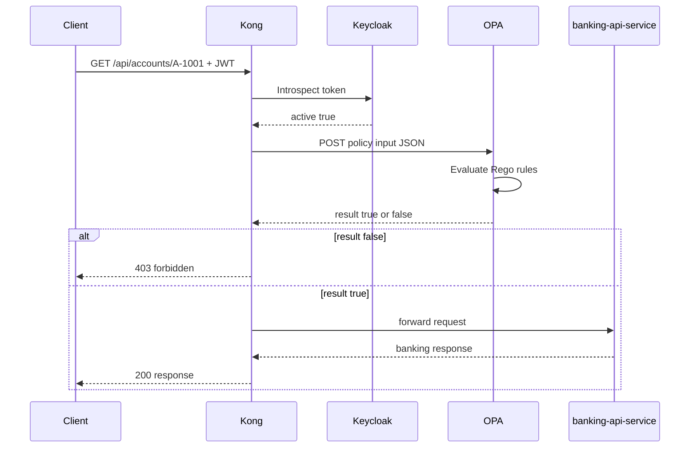

# 09 OPA Integration

This file explains how `OPA` works from underlying principle to practical use in this PoC.

It combines three things:

- the idea behind OPA as a policy engine
- the actual Rego policy in this repo
- the runtime wiring from `docker-compose.yml`

## What OPA Is

`OPA` means `Open Policy Agent`.

OPA is a policy engine.

In this project, OPA is the `PDP`, which means `Policy Decision Point`.

That means OPA does not sit at the edge like Kong, and it does not authenticate users like Keycloak.

Instead, OPA does one job:

- receive policy input
- evaluate policy rules
- return a decision

Typical decisions are:

- allow
- deny

## Why This Project Needs OPA

This project could have placed all authorization logic directly inside:

- Kong plugin code
- Spring Boot service code

But that would mix policy logic with enforcement logic or business logic.

Using OPA gives three important benefits:

1. policy stays separate from application code
2. policy can be tested independently
3. policy can change without rewriting the whole gateway or service logic

In this PoC:

- Keycloak proves who the user is
- Kong enforces at the edge
- OPA decides whether the action is allowed
- Spring Boot adds defense in depth

## Where OPA Sits In The Architecture



Important point:

- OPA never logs the user in
- OPA never issues the JWT
- OPA never serves the banking data

OPA only answers the authorization question.

## The Underlying Principle Behind OPA

OPA is based on a simple model:

1. some system sends `input`
2. OPA evaluates that input against policy rules
3. OPA returns `result`

In this repo:

- Kong sends the `input`
- Rego policy defines the rules
- OPA returns `result: true` or `result: false`

### Input -> Policy -> Result



This pattern is important because it keeps OPA generic.

OPA does not know what a bank account is by itself.
OPA only knows:

- what input it received
- what rules were written in policy

## Rego Basics In Plain English

OPA policies are usually written in `Rego`.

Rego is declarative.

That means you describe:

- what must be true for access to be allowed

instead of writing an imperative step-by-step program.

In practice, this often looks like:

- allow if role is `ops-admin`
- allow if role is `customer` and account is in claimed `account_ids`
- deny everything else

## Deny By Default

One of the most important security ideas in policy design is:

- deny by default

In this repo, the policy starts with:

```rego
default allow := false
```

That means:

- unless a rule explicitly allows the request, the answer is deny

This is safer than trying to list every deny rule manually.

## The Actual Policy In This Repo

File:

- `infra/opa/policies/banking_authz.rego`

Current policy:

```rego
package banking_authz

default allow := false

allow {
    read_only_account_request
    input.role == "ops-admin"
}

allow {
    read_only_account_request
    input.role == "customer"
    input.customer_id != ""
    account_ids := object.get(input, "account_ids", [])
    account_ids[_] == input.account_id
}

read_only_account_request {
    input.method == "GET"
    regex.match("^/api/accounts/[^/]+(?:/transactions)?$", input.path)
}
```

## How To Read The Policy

### `package banking_authz`

This places the rules in the `banking_authz` package.

That matters because Kong calls OPA at:

- `/v1/data/banking_authz/allow`

So:

- `banking_authz` is the package
- `allow` is the decision being queried

### `default allow := false`

Everything is denied unless one of the `allow` rules matches.

### First `allow` Rule

```rego
allow {
    read_only_account_request
    input.role == "ops-admin"
}
```

Meaning:

- if the route is one of the allowed read routes
- and the role is `ops-admin`
- then allow the request

### Second `allow` Rule

```rego
allow {
    read_only_account_request
    input.role == "customer"
    input.customer_id != ""
    account_ids := object.get(input, "account_ids", [])
    account_ids[_] == input.account_id
}
```

Meaning:

- the route must be an allowed read route
- the caller must have role `customer`
- the token must contain a non-empty `customer_id`
- the requested `account_id` must appear in the token’s `account_ids`

This is the main customer-authorization rule.

### Helper Rule: `read_only_account_request`

```rego
read_only_account_request {
    input.method == "GET"
    regex.match("^/api/accounts/[^/]+(?:/transactions)?$", input.path)
}
```

Meaning:

- only `GET` requests are considered valid in this policy
- only two route shapes are allowed:
  - `/api/accounts/{accountId}`
  - `/api/accounts/{accountId}/transactions`

This is important because it prevents future non-read routes from being accidentally allowed by the same rule.

## What Input OPA Receives

OPA does not read HTTP requests directly in this project.

Kong constructs an input object and sends it as JSON.

Typical input looks like this:

```json
{
  "input": {
    "method": "GET",
    "path": "/api/accounts/A-1001",
    "account_id": "A-1001",
    "customer_id": "C-1001",
    "account_ids": ["A-1001"],
    "role": "customer",
    "username": "alice"
  }
}
```

OPA evaluates only what it sees in this input.

That means the quality of the OPA decision depends on:

- trustworthy input
- correct policy rules

## How Kong Sends Input To OPA

Kong calls:

- `http://opa:8181/v1/data/banking_authz/allow`

This value comes from `infra/kong/kong.yml`:

```yaml
plugins:
  - name: opa-authz
    config:
      opa_url: http://opa:8181/v1/data/banking_authz/allow
```

And the runtime call is built in the Kong plugin handler.

The plugin constructs a JSON body like:

```lua
local request_body = cjson.encode({
  input = {
    method = kong.request.get_method(),
    path = kong.request.get_path(),
    account_id = account_id,
    customer_id = claim_value(claims.customer_id),
    account_ids = claim_values(claims.account_ids),
    role = effective_role(claims),
    username = claims.preferred_username,
  },
})
```

So OPA receives a clean authorization input, not the raw full HTTP request.

## What OPA Returns

If the policy allows the request, OPA returns:

```json
{
  "result": true
}
```

If the policy denies the request, OPA returns:

```json
{
  "result": false
}
```

Kong then turns that result into behavior:

- `true` -> forward request upstream
- `false` -> return `403 forbidden`

## How OPA Is Run In Docker Compose

Relevant `docker-compose.yml` section:

```yaml
opa:
  image: openpolicyagent/opa:0.68.0
  command: ["run", "--server", "--addr=0.0.0.0:8181", "/policies"]
  ports:
    - "8181:8181"
  volumes:
    - ./infra/opa/policies:/policies:ro
```

What this means:

- use the official OPA image
- run OPA as an HTTP server
- listen on port `8181`
- load policies from `/policies`
- mount the repo directory `infra/opa/policies` into the container read-only

So OPA is not compiled into the Java services.
It runs as its own separate component.

## Why The OPA Container Is Separate

This separation is useful because:

- policy can be changed without rewriting banking service code
- policy can be tested independently
- Kong can call it directly as the PDP
- the architecture stays aligned with externalized authorization

## How To Read The OPA Tests

File:

- `infra/opa/policies/banking_authz_test.rego`

These tests show the intended behavior of the policy.

Current test categories:

### Admin Allow

```rego
test_ops_admin_is_allowed {
    banking_authz.allow with input as {
        "method": "GET",
        "path": "/api/accounts/A-1001",
        "role": "ops-admin",
        "account_id": "A-1001",
        "customer_id": "C-9999",
    }
}
```

Meaning:

- `ops-admin` may read account endpoints

### Customer Own Account Allow

```rego
test_customer_can_access_owned_account {
    banking_authz.allow with input as {
        "method": "GET",
        "path": "/api/accounts/A-1001",
        "role": "customer",
        "account_id": "A-1001",
        "customer_id": "C-1001",
        "account_ids": ["A-1001"],
    }
}
```

Meaning:

- a customer may read their own claimed account

### Customer Transactions Allow

```rego
test_customer_can_access_owned_account_transactions {
    banking_authz.allow with input as {
        "method": "GET",
        "path": "/api/accounts/A-1001/transactions",
        "role": "customer",
        "account_id": "A-1001",
        "customer_id": "C-1001",
        "account_ids": ["A-1001"],
    }
}
```

Meaning:

- the same customer can also read the transactions subresource

### Deny Cases

The tests also prove denial for:

- wrong customer/account mapping
- missing `customer_id`
- empty `account_ids`
- `POST` requests
- unsupported subresource paths like `/cards`
- unrelated roles like `auditor`

These negative tests are just as important as the allow tests.

Why:

- an authorization policy is only trustworthy if you also prove what it denies

## OPA Request Flow In This PoC



## Practical Examples In This PoC

### Example 1: `alice` Reading Her Own Account

Input to OPA:

```json
{
  "input": {
    "method": "GET",
    "path": "/api/accounts/A-1001",
    "account_id": "A-1001",
    "customer_id": "C-1001",
    "account_ids": ["A-1001"],
    "role": "customer",
    "username": "alice"
  }
}
```

Result:

- allowed

Reason:

- read route
- role is `customer`
- `account_ids` contains `A-1001`

### Example 2: `alice` Reading Another Account

Input to OPA:

```json
{
  "input": {
    "method": "GET",
    "path": "/api/accounts/A-2001",
    "account_id": "A-2001",
    "customer_id": "C-1001",
    "account_ids": ["A-1001"],
    "role": "customer",
    "username": "alice"
  }
}
```

Result:

- denied

Reason:

- the claimed `account_ids` does not contain `A-2001`

### Example 3: `ops-admin`

Input to OPA:

```json
{
  "input": {
    "method": "GET",
    "path": "/api/accounts/A-2001",
    "account_id": "A-2001",
    "customer_id": "C-9999",
    "role": "ops-admin"
  }
}
```

Result:

- allowed

Reason:

- `ops-admin` rule allows read access regardless of customer/account mapping

### Example 4: POST Request

Input:

```json
{
  "input": {
    "method": "POST",
    "path": "/api/accounts/A-1001",
    "role": "ops-admin",
    "account_id": "A-1001",
    "customer_id": "C-9999"
  }
}
```

Result:

- denied

Reason:

- `read_only_account_request` fails because the method is not `GET`

### Example 5: Unsupported Path

Input:

```json
{
  "input": {
    "method": "GET",
    "path": "/api/accounts/A-1001/cards",
    "role": "customer",
    "account_id": "A-1001",
    "customer_id": "C-1001",
    "account_ids": ["A-1001"]
  }
}
```

Result:

- denied

Reason:

- the regex only allows:
  - `/api/accounts/{id}`
  - `/api/accounts/{id}/transactions`

## What OPA Does Not Do

OPA is powerful, but it is important to understand its limits.

OPA does not:

- authenticate the user
- issue JWTs
- introspect tokens by itself in this project
- validate JWT signatures by itself in this request path
- serve the banking response

OPA depends on other components for trustworthy input.

In this PoC:

- Keycloak provides identity
- Kong validates token activity and constructs the policy input
- Spring Boot validates JWT again and serves the business response

## Why OPA Is Useful In Practice

OPA solves an important architectural problem:

- authorization logic becomes a first-class policy layer instead of being scattered through gateway code and service code

That makes the system easier to:

- reason about
- test
- change
- review

## Simple Mental Model

If you want the shortest correct mental model:

1. Keycloak says who the user is
2. Kong verifies the token is active
3. Kong sends request context to OPA
4. OPA decides `allow` or `deny`
5. Kong enforces that decision
6. Spring Boot verifies again before returning data

That is how OPA works in this project from principle to practice.
