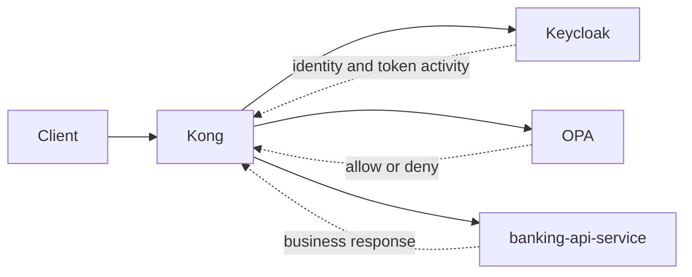
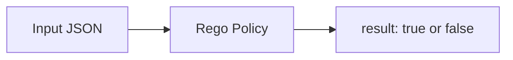

# 08 — OPA (PDP)

`OPA` is the Policy Decision Point: it receives authorization input from `Kong` and returns `allow` or `deny`.

> **Part II · Component Deep Dives** — Prereqs: [01](01-concepts.md), [07](07-kong.md)

## What OPA Is

`OPA` stands for Open Policy Agent.

In this project, `OPA` is the `PDP` (Policy Decision Point) — see [01 — Concepts](01-concepts.md) for the full IdP / PEP / PDP glossary.

`OPA` does one job:

- receive a structured input document
- evaluate it against Rego policy rules
- return a decision: `allow` or `deny`

`OPA` does not authenticate users. That is `Keycloak`'s role.
`OPA` does not enforce the decision at the edge. That is `Kong`'s role.
`OPA` only decides.

## Why This Project Needs OPA

Authorization logic could have been written directly inside:

- `Kong` plugin code
- `banking-api-service` Java code

But that would couple policy to enforcement or business logic.

Using `OPA` as a dedicated `PDP` gives three concrete benefits:

1. Policy stays separate from gateway and service code.
2. Policy can be tested independently with `rego test`.
3. Policy can change without rewriting `Kong` plugins or `banking-api-service`.

In this PoC:

- `Keycloak` proves who the user is.
- `Kong` enforces at the edge (`PEP`).
- `OPA` decides whether the action is allowed (`PDP`).
- `banking-api-service` adds defense in depth (resource server).

## Where OPA Sits In The Architecture



`OPA` sits between `Kong` and the upstream `banking-api-service`. Kong calls `OPA` synchronously on every request, waits for the decision, then either forwards the request or returns `403`.

## The Input → Policy → Result Model

`OPA` is a general-purpose engine. It does not know what a bank account is by itself. It only knows:

1. what input it received
2. what rules were written in Rego



In this repo:

- `Kong` constructs and sends the `input`
- `banking_authz.rego` defines the rules
- `OPA` returns `result: true` or `result: false`

## Rego Basics

`OPA` policies are written in `Rego`, a declarative language.

You describe what must be true for access to be granted, rather than writing step-by-step imperative logic.

In practice the rules in this repo read as:

- allow if the route is a read route and role is `ops-admin`
- allow if the route is a read route, role is `customer`, and the requested account is in the token's `account_ids`
- deny everything else

## Deny By Default

The most important line in the policy is:

```rego
default allow := false
```

Unless one of the `allow` rules matches, the answer is `deny`. This is safer than enumerating deny rules — a missing deny rule can never accidentally open access.

## The Actual Policy In This Repo

File: `infra/opa/policies/banking_authz.rego`

```rego
package banking_authz

default allow := false

allow {
    read_only_account_request
    input.role == "ops-admin"
}

allow {
    read_only_account_request
    input.role == "customer"
    input.customer_id != ""
    account_ids := object.get(input, "account_ids", [])
    account_ids[_] == input.account_id
}

read_only_account_request {
    input.method == "GET"
    regex.match("^/api/accounts/[^/]+(?:/transactions)?$", input.path)
}
```

## Policy Walkthrough

### `package banking_authz`

Places the rules in the `banking_authz` package. `Kong` queries `OPA` at:

```
http://opa:8181/v1/data/banking_authz/allow
```

So `banking_authz` is the package and `allow` is the decision being queried.

### `default allow := false`

Everything is denied unless one of the `allow` rules below matches.

### First `allow` Rule — ops-admin

```rego
allow {
    read_only_account_request
    input.role == "ops-admin"
}
```

Meaning:

- the request must be a valid read route (via helper)
- the caller must have role `ops-admin`
- no account ownership check — `ops-admin` may read any account

### Second `allow` Rule — customer

```rego
allow {
    read_only_account_request
    input.role == "customer"
    input.customer_id != ""
    account_ids := object.get(input, "account_ids", [])
    account_ids[_] == input.account_id
}
```

Meaning:

- the request must be a valid read route
- the caller must have role `customer`
- the token must carry a non-empty `customer_id`
- the requested `account_id` must appear in the token's `account_ids` list

This is the core customer ownership check.

### Helper Rule: `read_only_account_request`

```rego
read_only_account_request {
    input.method == "GET"
    regex.match("^/api/accounts/[^/]+(?:/transactions)?$", input.path)
}
```

Meaning:

- only `GET` requests pass this gate
- only two path shapes are permitted:
  - `/api/accounts/{accountId}`
  - `/api/accounts/{accountId}/transactions`

This prevents future non-read routes from being accidentally allowed by the same `allow` rules.

## What Input OPA Receives

`OPA` does not read HTTP requests directly. `Kong` constructs a structured input document and POSTs it as JSON.

The fields `OPA` actually consumes in the policy are:

| Field | Type | Used by |
|---|---|---|
| `method` | string | `read_only_account_request` |
| `path` | string | `read_only_account_request` |
| `role` | string | both `allow` rules |
| `customer_id` | string | customer `allow` rule |
| `account_ids` | array of strings | customer `allow` rule |
| `account_id` | string | customer `allow` rule |

`username` is included in the input but not consumed by policy rules in this version.

See [14 — Request & Response Details](14-request-response-reference.md) for the full claim catalog.

Example input document for `alice`:

```json
{
  "input": {
    "method": "GET",
    "path": "/api/accounts/A-1001",
    "account_id": "A-1001",
    "customer_id": "C-1001",
    "account_ids": ["A-1001"],
    "role": "customer",
    "username": "alice"
  }
}
```

## How Kong Sends Input To OPA

`Kong` calls the `OPA` REST API via the `opa-authz` plugin. The URL comes from `infra/kong/kong.yml`:

```yaml
plugins:
  - name: opa-authz
    config:
      opa_url: http://opa:8181/v1/data/banking_authz/allow
```

The plugin handler (`infra/kong/plugins/opa-authz/handler.lua`) constructs the input body:

```lua
local request_body = cjson.encode({
  input = {
    method = kong.request.get_method(),
    path = kong.request.get_path(),
    account_id = account_id,
    customer_id = claim_value(claims.customer_id),
    account_ids = claim_values(claims.account_ids),
    role = effective_role(claims),
    username = claims.preferred_username,
  },
})
```

`OPA` receives a clean authorization input extracted from the validated JWT, not the raw HTTP request.

## What OPA Returns

If the policy allows:

```json
{ "result": true }
```

If the policy denies:

```json
{ "result": false }
```

`Kong` maps that to behavior:

- `result: true` → forward request upstream to `banking-api-service`
- `result: false` → return `403 Forbidden` to the client

## OPA Request Flow In This PoC


## How OPA Is Run In Docker Compose

```yaml
opa:
  image: openpolicyagent/opa:0.68.0
  command: ["run", "--server", "--addr=0.0.0.0:8181", "/policies"]
  ports:
    - "8181:8181"
  volumes:
    - ./infra/opa/policies:/policies:ro
```

- `OPA` runs as a standalone HTTP server on port `8181`
- Policies are mounted read-only from `infra/opa/policies`
- `OPA` is not compiled into any Java service — it is a separate container

This separation means policy can be updated, tested, and reloaded independently of `Kong` or `banking-api-service`.

## The Tests

File: `infra/opa/policies/banking_authz_test.rego`

```rego
package banking_authz_test

import data.banking_authz
```

### Allow: ops-admin reads an account

```rego
test_ops_admin_is_allowed {
    banking_authz.allow with input as {
        "method": "GET",
        "path": "/api/accounts/A-1001",
        "role": "ops-admin",
        "account_id": "A-1001",
        "customer_id": "C-9999",
    }
}
```

`ops-admin` may read any account endpoint regardless of customer ownership.

### Allow: customer reads their own account

```rego
test_customer_can_access_owned_account {
    banking_authz.allow with input as {
        "method": "GET",
        "path": "/api/accounts/A-1001",
        "role": "customer",
        "account_id": "A-1001",
        "customer_id": "C-1001",
        "account_ids": ["A-1001"],
    }
}
```

`alice` (customer `C-1001`) may read account `A-1001` when it appears in her `account_ids`.

### Allow: customer reads their own transactions

```rego
test_customer_can_access_owned_account_transactions {
    banking_authz.allow with input as {
        "method": "GET",
        "path": "/api/accounts/A-1001/transactions",
        "role": "customer",
        "account_id": "A-1001",
        "customer_id": "C-1001",
        "account_ids": ["A-1001"],
    }
}
```

The transactions sub-resource is also permitted for an owned account.

### Deny cases

The test file proves denial for all of the following:

| Test | What it proves |
|---|---|
| `test_customer_cannot_access_other_account` | `account_ids` does not contain the requested account |
| `test_customer_without_claimed_account_is_denied` | `account_ids` is empty |
| `test_customer_without_customer_id_is_denied` | `customer_id` field is absent |
| `test_ops_admin_post_account_is_denied` | `POST` fails `read_only_account_request` |
| `test_customer_subresource_path_is_denied` | `/cards` path not matched by regex |
| `test_other_roles_are_denied` | role `auditor` matches neither `allow` rule |

Negative tests matter as much as positive ones: a policy is only trustworthy if you also prove what it denies.

## Practical Examples

### alice Reading Her Own Account

Input:

```json
{
  "input": {
    "method": "GET",
    "path": "/api/accounts/A-1001",
    "account_id": "A-1001",
    "customer_id": "C-1001",
    "account_ids": ["A-1001"],
    "role": "customer",
    "username": "alice"
  }
}
```

Result: `allow`

Reason:

- `GET` + matching path → `read_only_account_request` passes
- `role == "customer"`
- `customer_id` is non-empty
- `A-1001` is in `account_ids`

### alice Attempting Another Customer's Account

Input:

```json
{
  "input": {
    "method": "GET",
    "path": "/api/accounts/A-2001",
    "account_id": "A-2001",
    "customer_id": "C-1001",
    "account_ids": ["A-1001"],
    "role": "customer",
    "username": "alice"
  }
}
```

Result: `deny`

Reason:

- `A-2001` is not in `alice`'s `account_ids` (`["A-1001"]`)

### ops-admin Reading Any Account

Input:

```json
{
  "input": {
    "method": "GET",
    "path": "/api/accounts/A-2001",
    "account_id": "A-2001",
    "customer_id": "C-9999",
    "role": "ops-admin"
  }
}
```

Result: `allow`

Reason:

- `ops-admin` rule does not check account ownership

### POST Request (Denied For Both Roles)

Input:

```json
{
  "input": {
    "method": "POST",
    "path": "/api/accounts/A-1001",
    "role": "ops-admin",
    "account_id": "A-1001",
    "customer_id": "C-9999"
  }
}
```

Result: `deny`

Reason:

- `read_only_account_request` fails because `method != "GET"`

### Unsupported Sub-Resource Path

Input:

```json
{
  "input": {
    "method": "GET",
    "path": "/api/accounts/A-1001/cards",
    "role": "customer",
    "account_id": "A-1001",
    "customer_id": "C-1001",
    "account_ids": ["A-1001"]
  }
}
```

Result: `deny`

Reason:

- regex only matches `/api/accounts/{id}` and `/api/accounts/{id}/transactions`
- `/cards` does not match

## What OPA Does Not Do

`OPA` is powerful, but it has clear limits in this PoC:

- does not authenticate users (that is `Keycloak`)
- does not issue JWTs (that is `Keycloak`)
- does not introspect tokens itself in this request path (that is the `Kong` plugin)
- does not validate JWT signatures itself here (the `Kong` plugin decodes the payload after introspection)
- does not serve banking data (that is `banking-api-service`)

`OPA` depends on `Kong` to provide trustworthy, well-formed input. If the input is wrong, the decision is wrong.

## Mental Model

1. `Keycloak` says who the user is.
2. `Kong` verifies the token is active and extracts claims.
3. `Kong` sends structured input to `OPA`.
4. `OPA` evaluates Rego rules and returns `result: true` or `result: false`.
5. `Kong` enforces that decision at the edge.
6. `banking-api-service` validates the JWT again before returning banking data.

---

← Prev: [07 — Kong](07-kong.md) · Next: [09 — banking-api-service](09-banking-api-service.md) →
