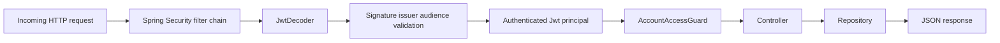
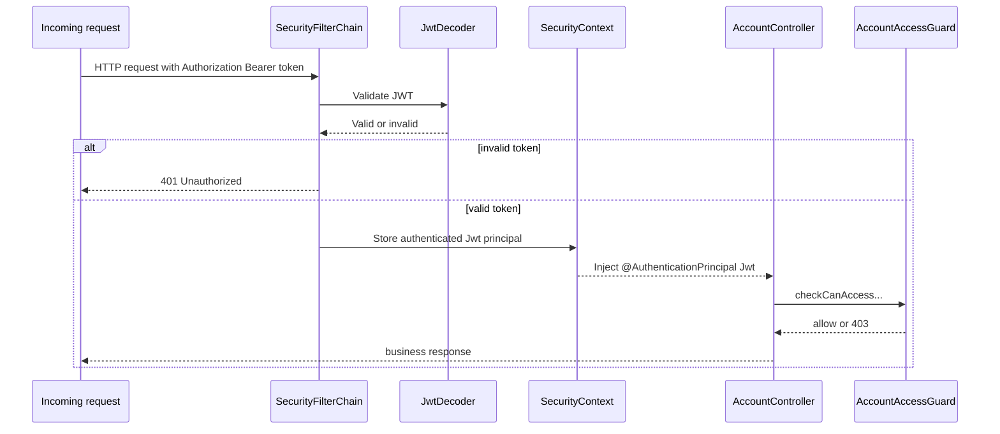
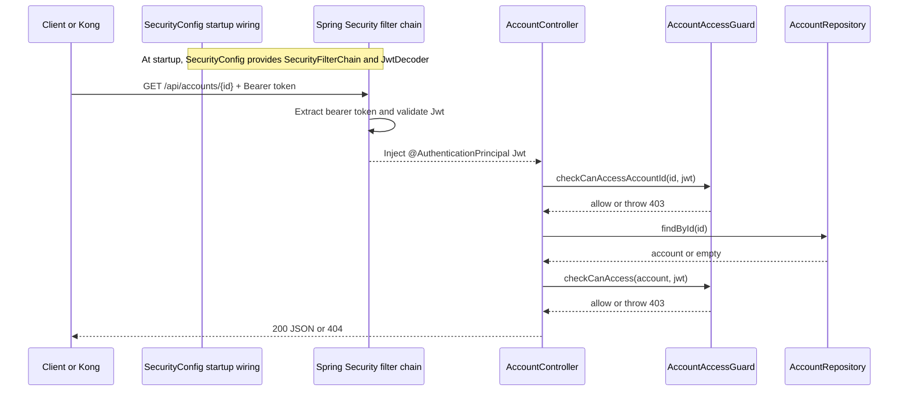
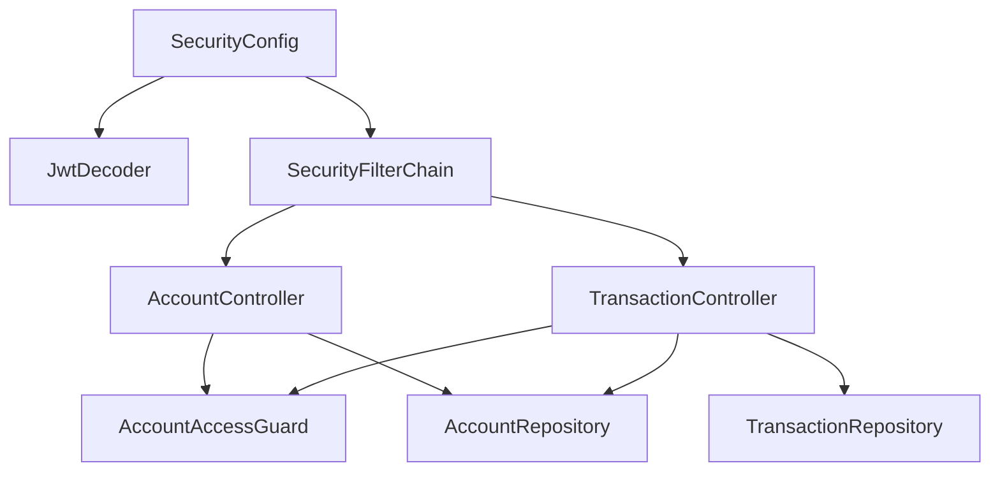

# 10 banking-api-service Authentication And Authorization

This file explains how the `banking-api-service` Spring Boot application works, with emphasis on authentication and authorization.

The main idea is:

- Kong and OPA protect the edge
- `banking-api-service` still performs its own security checks

That gives the PoC defense in depth.

## What `banking-api-service` Does

`banking-api-service` is the business API in this project.

It exposes:

- `GET /api/accounts/{accountId}`
- `GET /api/accounts/{accountId}/transactions`

It returns simple in-memory banking data, but its security behavior is more important than its data storage in this PoC.

Its security responsibilities are:

- authenticate the bearer token
- validate JWT signature
- validate JWT issuer
- validate JWT audience
- authorize access to the requested account

## Why The Service Still Does Security Checks

A common question is:

- if Kong and OPA already protect the request, why does the Spring Boot service still need authentication and authorization logic?

Answer:

- Kong is the edge PEP
- OPA is the PDP
- but the service is still a trust boundary

That means the service should not assume that every request reaching it is automatically safe.

Reasons:

- a service could be called directly inside the network
- a gateway misconfiguration could happen
- future routes might bypass part of the edge logic
- defense in depth is a good security practice

So the service repeats critical checks.

## Big Picture Flow Inside The Service



## Authentication In This Service

Authentication here means:

- turning an incoming bearer token into a trusted authenticated principal

This is mainly configured in:

- `services/banking-api-service/src/main/java/com/banking/poc/bankingapi/security/SecurityConfig.java`

## `SecurityConfig` Overview

Key pieces in `SecurityConfig`:

1. `SecurityFilterChain`
2. `JwtDecoder`
3. custom JWT validator

## How Spring Security Wires `SecurityConfig` Into The Service

This is the missing link between:

- the `SecurityConfig` class you see in the code
- the runtime behavior that happens before the controller executes

Important idea:

- the controller does not call `SecurityConfig` directly
- Spring Boot and Spring Security wire it in automatically at startup

### Step 1: Spring Boot Discovers `SecurityConfig`

`SecurityConfig` is annotated with:

```java
@Configuration
```

That tells Spring Boot:

- this class defines bean configuration

During application startup, Spring scans the application package and finds this class.

### Step 2: Spring Creates The Beans Declared In `SecurityConfig`

The class defines two important beans:

- `JwtDecoder`
- `SecurityFilterChain`

Because they are annotated with `@Bean`, Spring creates them and places them in the application context.

That means these objects become framework-managed components, not objects you manually new-up in controller code.

### Step 3: Spring Security Picks Up `SecurityFilterChain`

Spring Security looks for a `SecurityFilterChain` bean.

When it finds this one:

```java
@Bean
SecurityFilterChain securityFilterChain(HttpSecurity http) throws Exception {
    return http
            .csrf(csrf -> csrf.disable())
            .authorizeHttpRequests(authorize -> authorize
                    .requestMatchers("/actuator/health").permitAll()
                    .anyRequest().authenticated())
            .oauth2ResourceServer(oauth2 -> oauth2.jwt(Customizer.withDefaults()))
            .build();
}
```

it uses that bean to build the runtime security filter chain for incoming HTTP requests.

This is what wires authentication into every request before it reaches the controller.

### Step 4: `oauth2ResourceServer().jwt()` Turns On JWT Authentication

This line is the important switch:

```java
.oauth2ResourceServer(oauth2 -> oauth2.jwt(Customizer.withDefaults()))
```

It tells Spring Security:

- this application is an OAuth2 resource server
- bearer tokens should be treated as JWTs
- JWT authentication filters should be installed in the security chain

Those filters do the heavy lifting at runtime:

- read the `Authorization` header
- extract the bearer token
- ask a `JwtDecoder` to validate it
- create an authenticated principal if validation succeeds

### Step 5: Spring Security Uses The `JwtDecoder` Bean From `SecurityConfig`

`SecurityConfig` also defines:

```java
@Bean
JwtDecoder jwtDecoder(...) {
    NimbusJwtDecoder jwtDecoder = NimbusJwtDecoder.withJwkSetUri(jwkSetUri).build();
    jwtDecoder.setJwtValidator(jwtValidator(issuerUri, audience));
    return jwtDecoder;
}
```

Because a `JwtDecoder` bean exists in the application context, Spring Security uses that exact bean for JWT authentication.

That is the connection.

So the flow is:

1. `SecurityFilterChain` says JWT resource-server authentication is enabled
2. Spring Security needs a `JwtDecoder`
3. Spring finds the `JwtDecoder` bean from `SecurityConfig`
4. that decoder validates signature, issuer, and audience

### Step 6: Successful Authentication Produces A `Jwt` Principal

If the token is valid:

- Spring Security creates an authenticated object
- the JWT becomes the authenticated principal
- Spring stores that authentication result in the security context

If the token is invalid:

- Spring returns `401`
- the controller method is never called

### Step 7: Spring MVC Injects `@AuthenticationPrincipal Jwt jwt`

When the request finally reaches the controller, Spring MVC sees this method signature:

```java
public AccountDto getAccount(@PathVariable String accountId, @AuthenticationPrincipal Jwt jwt)
```

`@AuthenticationPrincipal` means:

- take the authenticated principal from the security context
- inject it into this method parameter

Because the authenticated principal is a validated `Jwt`, the controller receives a trusted `Jwt` object.

That is why controller code can immediately do authorization checks using claims without doing its own token parsing.

### Startup Wiring vs Runtime Request Processing

This distinction is important.

#### Startup wiring

At startup:

- Spring Boot discovers `SecurityConfig`
- Spring creates `SecurityFilterChain`
- Spring creates `JwtDecoder`

#### Runtime request processing

For each request:

- request hits the filter chain
- bearer token is extracted
- `JwtDecoder` validates the token
- authentication is stored in the security context
- controller receives `@AuthenticationPrincipal Jwt jwt`

## Runtime Flow With `SecurityConfig`



### `SecurityFilterChain`

Important configuration:

```java
return http
        .csrf(csrf -> csrf.disable())
        .authorizeHttpRequests(authorize -> authorize
                .requestMatchers("/actuator/health").permitAll()
                .anyRequest().authenticated())
        .oauth2ResourceServer(oauth2 -> oauth2.jwt(Customizer.withDefaults()))
        .build();
```

Meaning:

- disable CSRF because this PoC is an API service, not a browser form app
- allow `/actuator/health` without authentication
- require authentication for everything else
- use Spring Security OAuth2 resource-server mode with JWT

So before the controller runs, Spring Security ensures:

- there is a bearer token
- it can be decoded and validated

If not, Spring returns `401`.

### `JwtDecoder`

Important code:

```java
NimbusJwtDecoder jwtDecoder = NimbusJwtDecoder.withJwkSetUri(jwkSetUri).build();
jwtDecoder.setJwtValidator(jwtValidator(issuerUri, audience));
```

Meaning:

- the service fetches signing keys from Keycloak JWKS
- it validates the JWT using those keys
- it also applies issuer and audience validation

This is how the service knows the JWT is really from Keycloak and meant for this application.

### What The Service Reads From Configuration

From `application.yml`:

- `spring.security.oauth2.resourceserver.jwt.jwk-set-uri`
- `banking-api.security.issuer-uri`
- `banking-api.security.audience`

These values tell Spring Boot:

- where to get the public keys
- which issuer is trusted
- which audience is required

## What JWT Validation Means Here

The service checks at least these things:

### Signature

- proves the token was signed by Keycloak
- rejects a tampered token

### Issuer

- must match the configured Keycloak realm issuer
- rejects tokens from the wrong issuer

### Audience

- must contain `mobile-banking-app`
- rejects tokens not meant for this application

## Authentication Result Inside Spring

If validation succeeds, Spring Security creates a `Jwt` principal.

Controllers receive it here:

```java
public AccountDto getAccount(@PathVariable String accountId, @AuthenticationPrincipal Jwt jwt)
```

and here:

```java
public List<TransactionDto> getTransactions(@PathVariable String accountId, @AuthenticationPrincipal Jwt jwt)
```

That `Jwt` object contains trusted claims, such as:

- `customer_id`
- `account_ids`
- `realm_access.roles`

## Authorization In This Service

Authentication answers:

- is this caller valid?

Authorization answers:

- may this valid caller access this account?

The main authorization class is:

- `AccountAccessGuard`

File:

- `services/banking-api-service/src/main/java/com/banking/poc/bankingapi/account/AccountAccessGuard.java`

## `AccountAccessGuard` Overview

It has two key methods:

1. `checkCanAccessAccountId`
2. `checkCanAccess`

These two checks are intentionally separate.

## Why There Are Two Authorization Checks

### First check: account-id precheck

```java
accountAccessGuard.checkCanAccessAccountId(accountId, jwt);
```

This happens before repository lookup.

Why:

- reject obviously forbidden account IDs early
- reduce information leakage
- avoid looking up data for requests the caller clearly should not access

### Second check: account object check

```java
accountAccessGuard.checkCanAccess(account, jwt);
```

This happens after the account is loaded.

Why:

- confirm the loaded account really matches the claim context
- add another safety layer in case account/customer relationships matter

So the service does:

1. quick precheck against account ID and claims
2. actual object-level check after loading data

## Authorization Rules Inside `AccountAccessGuard`

### Rule 1: no JWT means `401`

If the `Jwt` object is missing:

- throw `401 Unauthorized`

### Rule 2: `ops-admin` can access any account

The guard checks `realm_access.roles`.

If the roles contain:

- `ops-admin`

then access is allowed.

### Rule 3: `customer` must match claim context

A customer is allowed only if:

- role includes `customer`
- `customer_id` exists and is not blank
- requested `accountId` is in `account_ids`

For the object-level check, it also verifies:

- `account.customerId()` equals the JWT `customer_id`
- `account.accountId()` is in JWT `account_ids`

### Rule 4: otherwise `403`

If none of the allowed conditions match:

- throw `403 Forbidden`

## How Roles And Claims Are Read

The guard reads:

- `realm_access.roles`
- `customer_id`
- `account_ids`

`realm_access.roles` is read from the JWT claim map.

`account_ids` is read with:

```java
jwt.getClaimAsStringList("account_ids")
```

`customer_id` is read with:

```java
jwt.getClaimAsString("customer_id")
```

## How `AccountController` Works

File:

- `services/banking-api-service/src/main/java/com/banking/poc/bankingapi/account/AccountController.java`

Flow:

1. receive `accountId`
2. receive authenticated `Jwt`
3. precheck account access with `checkCanAccessAccountId`
4. load account from repository
5. if account missing, return `404`
6. object-level check with `checkCanAccess`
7. return JSON response

### Account Controller Flow



## How `TransactionController` Works

File:

- `services/banking-api-service/src/main/java/com/banking/poc/bankingapi/transaction/TransactionController.java`

Flow is almost the same:

1. authenticate JWT
2. precheck access for account ID
3. load account
4. confirm access against the loaded account
5. load transactions
6. return JSON list

Important detail:

- unknown account -> `404`
- forbidden account -> `403`

## Class Relationship Inside The Service



## How This Service Interoperates With Other Components

### With Keycloak

Keycloak provides:

- the JWT signature source
- the trusted issuer
- the audience-bearing token
- claims such as `customer_id` and `account_ids`

The banking service validates and consumes that data.

### With Kong

Kong is the edge PEP.

Kong forwards requests that pass gateway enforcement.

But the banking service still treats the request as needing local verification.

### With OPA

OPA makes edge authorization decisions through Kong.

The banking service does not call OPA directly in this PoC.

Instead, the banking service re-enforces access based on the same trusted claims.

### With identity-bootstrap-service

The bootstrap service indirectly affects banking authorization by creating Keycloak users with:

- roles
- `customer_id`
- `account_ids`

Those values later appear in the JWT that the banking service reads.

## Practical Security Examples

### Example 1: Valid `alice`

JWT claims:

- role `customer`
- `customer_id = C-1001`
- `account_ids = [A-1001]`

Request:

- `GET /api/accounts/A-1001`

Result:

- authentication passes
- authorization passes
- response `200`

### Example 2: `alice` Requests Another Account

JWT claims still say:

- `account_ids = [A-1001]`

Request:

- `GET /api/accounts/A-2001`

Result:

- authentication passes
- authorization fails at guard
- response `403`

### Example 3: `ops-admin`

JWT claims include:

- role `ops-admin`

Request:

- `GET /api/accounts/A-2001`

Result:

- authentication passes
- role-based authorization passes
- response `200`

### Example 4: Tampered Token

Request contains an altered JWT.

Result:

- JWT validation fails
- Spring Security rejects the request
- response `401`

## What Problems This Service-Side Security Solves

This service-side security solves several problems:

### Problem 1: direct service calls

If a request reaches `banking-api-service` directly, the service still protects itself.

### Problem 2: gateway misconfiguration risk

Even if the gateway layer is changed or misconfigured later, the service still validates the JWT and claims.

### Problem 3: claim misuse risk

The service does not just trust that the route is safe. It verifies the business-specific claim context itself.

## Simple Mental Model

If you want the shortest correct mental model:

1. Spring Security authenticates the bearer token
2. `JwtDecoder` validates signature, issuer, and audience
3. Spring injects a trusted `Jwt` principal
4. `AccountAccessGuard` authorizes account access
5. controllers return data only after those checks pass

That is how `banking-api-service` handles authentication and authorization in this PoC.
