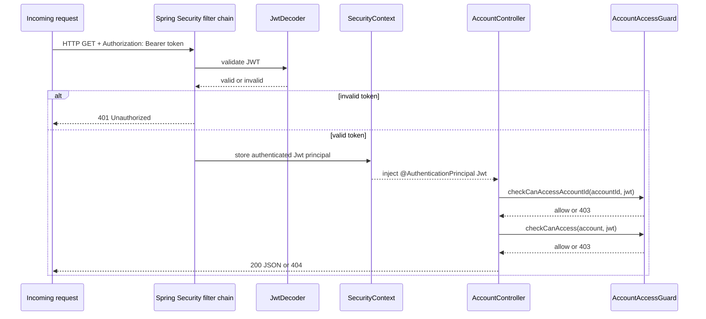
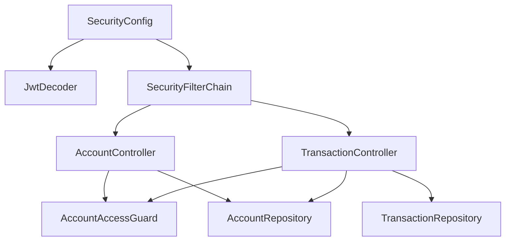

# 09 — banking-api-service (Resource Server)

The Spring Boot service that owns the protected banking data and re-checks security on every request as a defense-in-depth layer.

> **Part II · Component Deep Dives** — Prereqs: [01](01-concepts.md), [05](05-component-tour.md)

---

## What the service does

`banking-api-service` exposes two endpoints:

- `GET /api/accounts/{accountId}`
- `GET /api/accounts/{accountId}/transactions`

It returns simple in-memory banking data. Its security behavior is the focus of this document, not its data storage.

Security responsibilities:

- authenticate the bearer token
- validate JWT signature, issuer, and audience
- authorize access to the requested account based on JWT claims

---

## Why the service still does security checks

`Kong` is the PEP at the edge and `OPA` is the PDP that decides allow/deny. But `banking-api-service` is still a separate trust boundary. See [01 — Concepts](01-concepts.md) for the PEP/PDP/resource-server definitions.

Reasons the service re-checks:

- a service could be called directly inside the network, bypassing `Kong`
- a gateway misconfiguration could let a request through without a valid token
- future routes might bypass part of the edge logic
- defense in depth is good security practice — each layer should protect itself

So the service repeats the critical checks: signature, issuer, audience, and account-level authorization.

---

## Request flow overview

```mermaid
flowchart LR
    R[Incoming HTTP request] --> SF[Spring Security filter chain]
    SF --> JD[JwtDecoder]
    JD --> V[Signature · issuer · audience validation]
    V --> JP[Authenticated Jwt principal]
    JP --> AG[AccountAccessGuard]
    AG --> AC[AccountController or TransactionController]
    AC --> REPO[AccountRepository / TransactionRepository]
    REPO --> RESP[JSON response]
```



---

## `SecurityConfig` wiring

`SecurityConfig` is annotated `@Configuration`. Spring Boot discovers it at startup and creates two beans from it:

- `SecurityFilterChain`
- `JwtDecoder`

### `SecurityFilterChain`

```java
@Bean
SecurityFilterChain securityFilterChain(HttpSecurity http) throws Exception {
    return http
            .csrf(csrf -> csrf.disable())
            .authorizeHttpRequests(authorize -> authorize
                    .requestMatchers("/actuator/health").permitAll()
                    .anyRequest().authenticated())
            .oauth2ResourceServer(oauth2 -> oauth2.jwt(Customizer.withDefaults()))
            .build();
}
```

What each line means:

- CSRF is disabled — this is a stateless API, not a browser form app
- `/actuator/health` is public — needed for container health checks
- everything else requires authentication
- `.oauth2ResourceServer(...jwt(...))` installs JWT authentication filters

Those filters extract the `Authorization: Bearer` token and ask `JwtDecoder` to validate it before the controller is ever called.

### `JwtDecoder`

```java
@Bean
JwtDecoder jwtDecoder(
        @Value("${spring.security.oauth2.resourceserver.jwt.jwk-set-uri}") String jwkSetUri,
        @Value("${banking-api.security.issuer-uri}") String issuerUri,
        @Value("${banking-api.security.audience}") String audience) {
    NimbusJwtDecoder jwtDecoder = NimbusJwtDecoder.withJwkSetUri(jwkSetUri).build();
    jwtDecoder.setJwtValidator(jwtValidator(issuerUri, audience));
    return jwtDecoder;
}
```

`NimbusJwtDecoder.withJwkSetUri(...)` fetches public keys from `Keycloak`'s JWKS endpoint and verifies the token signature with them. A custom `jwtValidator` then checks issuer and audience.

The service uses JWKS (public-key verification) rather than token introspection — stateless, no round-trip to `Keycloak` per request. For the rationale behind that choice, see [11 — JWT signature validation](11-jwt-signature-validation.md). For JWKS mechanics, see [12 — JWKS](12-jwks.md).

---

## Configuration

### `application.yml` keys

| Key | Purpose |
|---|---|
| `spring.security.oauth2.resourceserver.jwt.jwk-set-uri` | URL to fetch `Keycloak` public keys |
| `banking-api.security.issuer-uri` | Trusted issuer; must match the JWT `iss` claim |
| `banking-api.security.audience` | Required audience value; must appear in JWT `aud` claim |

### Environment variables (from `docker-compose.yml`)

| Variable | Docker Compose value |
|---|---|
| `BANKING_API_JWK_SET_URI` | `http://keycloak:8080/realms/banking-poc/protocol/openid-connect/certs` |
| `BANKING_API_ISSUER_URI` | `http://keycloak:8080/realms/banking-poc` |
| `BANKING_API_AUDIENCE` | `mobile-banking-app` |

---

## JWT validation

The `jwtValidator` method in `SecurityConfig` composes two validators:

### Signature

`NimbusJwtDecoder` verifies the token signature using keys fetched from `Keycloak`'s JWKS endpoint. A tampered token fails immediately.

### Issuer

`JwtValidators.createDefaultWithIssuer(issuerUri)` checks that the `iss` claim matches the configured `Keycloak` realm. A token from a different issuer is rejected.

### Audience

A `JwtClaimValidator` checks that the `aud` claim contains `mobile-banking-app`. A token not scoped to this application is rejected.

If any check fails, Spring Security returns `401 Unauthorized` and the controller is never called.

---

## What claims the service reads

`AccountAccessGuard` reads three claims from the validated `Jwt`:

| Claim | How it is read |
|---|---|
| `realm_access.roles` | `jwt.getClaim("realm_access")` cast to `Map`, then `get("roles")` |
| `customer_id` | `jwt.getClaimAsString("customer_id")` |
| `account_ids` | `jwt.getClaimAsStringList("account_ids")` |

For the full claim catalog across the system, see [14 — Request/Response Reference](14-request-response-reference.md).

---

## How Spring Security wires `SecurityConfig` at runtime

At startup:

1. Spring discovers `SecurityConfig` (`@Configuration`)
2. Creates `SecurityFilterChain` bean — installs JWT filter chain
3. Creates `JwtDecoder` bean — Spring Security uses it automatically

Per request:

1. JWT filter extracts the bearer token
2. `JwtDecoder` validates signature, issuer, audience
3. Spring stores the authenticated `Jwt` in the security context
4. Controllers receive it via `@AuthenticationPrincipal Jwt jwt`
5. Controller calls `AccountAccessGuard` for authorization



---

## `AccountAccessGuard`

File: `services/banking-api-service/src/main/java/com/banking/poc/bankingapi/account/AccountAccessGuard.java`

The guard has two public methods:

- `checkCanAccessAccountId(String accountId, Jwt jwt)` — called before repository lookup
- `checkCanAccess(AccountDto account, Jwt jwt)` — called after the account is loaded

### Why two checks

**First check — account-id precheck (`checkCanAccessAccountId`):**

- rejects obviously forbidden account IDs early
- reduces information leakage — the service does not touch the repository for a request it will reject
- avoids loading data for requests the caller clearly cannot access

**Second check — object-level check (`checkCanAccess`):**

- confirms the loaded account's `customerId` actually matches the JWT `customer_id`
- adds a safety layer for cases where account/customer relationships diverge from what the ID alone implies

### Authorization rules

**Rule 1 — no JWT → `401`**

If the `Jwt` object is `null`, the guard throws `401 Unauthorized`.

**Rule 2 — `ops-admin` may access any account**

If `realm_access.roles` contains `ops-admin`, both checks pass unconditionally.

**Rule 3 — `customer` must match claim context**

For `checkCanAccessAccountId`, all of the following must be true:

- `realm_access.roles` contains `customer`
- `customer_id` claim is non-null and non-blank
- `account_ids` claim contains the requested `accountId`

For `checkCanAccess`, additionally:

- `account.customerId()` equals the JWT `customer_id`
- `account.accountId()` is in the JWT `account_ids` list

**Rule 4 — otherwise `403`**

---

## `AccountController`

File: `services/banking-api-service/src/main/java/com/banking/poc/bankingapi/account/AccountController.java`

Endpoint: `GET /api/accounts/{accountId}`

```java
@GetMapping("/{accountId}")
public AccountDto getAccount(@PathVariable String accountId, @AuthenticationPrincipal Jwt jwt) {
    accountAccessGuard.checkCanAccessAccountId(accountId, jwt);
    AccountDto account = accountRepository.findById(accountId)
            .orElseThrow(() -> new ResponseStatusException(HttpStatus.NOT_FOUND));
    accountAccessGuard.checkCanAccess(account, jwt);
    return account;
}
```

Flow:

1. receive `accountId` from path, receive validated `Jwt` from security context
2. `checkCanAccessAccountId` — reject early if the caller cannot access this account ID
3. load account from `AccountRepository` — return `404` if not found
4. `checkCanAccess` — confirm the loaded account matches the caller's claim context
5. return `AccountDto` as JSON

---

## `TransactionController`

File: `services/banking-api-service/src/main/java/com/banking/poc/bankingapi/transaction/TransactionController.java`

Endpoint: `GET /api/accounts/{accountId}/transactions`

```java
@GetMapping("/{accountId}/transactions")
public List<TransactionDto> getTransactions(@PathVariable String accountId, @AuthenticationPrincipal Jwt jwt) {
    accountAccessGuard.checkCanAccessAccountId(accountId, jwt);
    AccountDto account = accountRepository.findById(accountId)
            .orElseThrow(() -> new ResponseStatusException(HttpStatus.NOT_FOUND));
    accountAccessGuard.checkCanAccess(account, jwt);
    return transactionRepository.findByAccountId(accountId);
}
```

The flow is the same as `AccountController`. After both guard checks pass, the controller loads the transaction list from `TransactionRepository` and returns it.

---

## Class relationships



---

## Interoperability

### With `Keycloak`

`Keycloak` signs the JWT, sets the issuer, and embeds `customer_id`, `account_ids`, and role claims. The service validates the signature against `Keycloak`'s JWKS endpoint and trusts no claims from an unsigned or mis-issued token.

### With `Kong`

`Kong` is the PEP that forwards requests reaching `banking-api-service`. However, the service does not trust `Kong` unconditionally — it validates the JWT independently. This means a direct call to the service (bypassing `Kong`) still gets the same security enforcement.

### With `OPA`

`OPA` is the PDP consulted by `Kong` at the edge. `banking-api-service` does not call `OPA` directly. Instead, it re-enforces the same business access rules (account ownership, role) from the trusted JWT claims. The edge and the service converge on the same answer because they both read the same claims.

### With `identity-bootstrap-service`

`identity-bootstrap-service` creates `Keycloak` users with roles, `customer_id`, and `account_ids`. Those values are embedded in every JWT that `banking-api-service` later receives and validates.

---

## Practical examples

### Example 1 — `alice` accesses her own account

`alice`'s JWT:

- `realm_access.roles`: `["customer"]`
- `customer_id`: `C-1001`
- `account_ids`: `["A-1001"]`

Request: `GET /api/accounts/A-1001`

Result:

- JWT validation passes (signature, issuer, audience)
- `checkCanAccessAccountId` passes (`A-1001` is in `account_ids`)
- account loaded
- `checkCanAccess` passes (`customerId` matches)
- `200 OK` with account JSON

### Example 2 — `alice` requests an account she does not own

Same JWT as above.

Request: `GET /api/accounts/A-2001`

Result:

- JWT validation passes
- `checkCanAccessAccountId` fails (`A-2001` not in `account_ids = ["A-1001"]`)
- `403 Forbidden` — controller never executes

### Example 3 — `ops-admin` accesses any account

`ops-admin`'s JWT:

- `realm_access.roles`: `["ops-admin"]`

Request: `GET /api/accounts/A-2001`

Result:

- JWT validation passes
- `checkCanAccessAccountId` passes (role `ops-admin` short-circuits)
- account loaded
- `checkCanAccess` passes (role `ops-admin` short-circuits)
- `200 OK` with account JSON

### Example 4 — tampered token

Request carries a JWT with an invalid signature.

Result:

- `JwtDecoder` rejects the token during signature verification
- Spring Security returns `401 Unauthorized`
- controller never executes

---

## Mental model

1. `SecurityConfig` wires two beans at startup: `SecurityFilterChain` and `JwtDecoder`
2. Per request, the filter chain extracts and validates the bearer token (signature → issuer → audience)
3. A valid token becomes a trusted `Jwt` principal injected via `@AuthenticationPrincipal`
4. `AccountAccessGuard` enforces account-level authorization using `realm_access.roles`, `customer_id`, and `account_ids`
5. Controllers return data only after both the authentication and authorization checks pass

---

← Prev: [08 — OPA](08-opa.md) · Next: [10 — identity-bootstrap-service](10-identity-bootstrap-service.md) →
