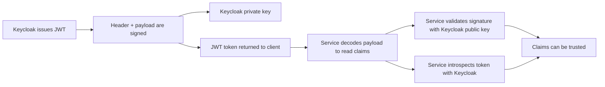

# 09 JWT Signature, Validation, And Introspection

This page explains how JWT signatures, validation, introspection, and claims work with Keycloak in this PoC.

For a deeper key-distribution explanation, see `10-jwks-deep-dive.md`.

The short version is:

- Keycloak issues the token
- Keycloak signs the token with its private key
- services verify the signature with Keycloak's public key
- services may also introspect the token against Keycloak before trusting it
- the claims live in the JWT payload

## The Four Pieces

### 1. Signature

The signature is the cryptographic proof that Keycloak created the token.

It is produced when Keycloak issues the access token by signing the token header and payload with Keycloak's private key.

Why it matters:

- it proves the token came from Keycloak
- it proves the payload was not changed after issuance
- it prevents a caller from forging a fake token that looks valid just by Base64URL-encoding data

### 2. Validation

Validation means checking that the token is genuine and acceptable for the request.

Typical validation checks are:

- the signature is valid
- the token is not expired
- the issuer is the expected Keycloak realm
- the audience matches the client or API

In this PoC:

- Spring Boot validates JWTs locally
- Kong also relies on Keycloak introspection before it trusts a token for policy decisions

### 3. Introspection

Introspection is a live call from a service to Keycloak's introspection endpoint.

Keycloak responds with whether the token is active or inactive, and it can also return token metadata.

Why it matters:

- it confirms the token is still valid from the source of truth
- it catches revoked or otherwise inactive tokens
- it gives a stronger trust check than decoding the JWT alone

In this PoC, Kong introspects the token before it uses decoded claims to build policy input for OPA.

### 4. Claims

Claims are the data inside the JWT payload.

Examples in this PoC are:

- `iss`
- `aud`
- `preferred_username`
- `realm_access.roles`
- `customer_id`
- `account_ids`

Decoding the token lets you read those claims.
Validation or introspection tells you whether those claims are trustworthy.

## How The Trust Chain Works



The important idea is that decoding and trusting are not the same thing.

- decoding answers: what does the token say?
- validation answers: was it really issued by Keycloak, and is it acceptable now?
- introspection answers: does Keycloak still consider this token active?

## How Signature Verification Works

JWTs have three parts:

```text
header.payload.signature
```

Keycloak signs the `header.payload` part with its private key.
The signature is attached as the third segment.

When a service validates the token, it does the reverse:

1. split the JWT into header, payload, and signature
2. fetch or load Keycloak's public key or certificate
3. recompute the expected signature from the header and payload
4. compare the computed signature with the one in the token

If they match, the token was signed by the matching private key and the payload was not altered.

If they do not match, the token is rejected.

### Private Key And Public Key

Keycloak keeps the private key secret.

Services never need the private key.
They only need the public key, which is safe to share.

That public key is what lets Spring Boot and other services verify that a token came from the expected Keycloak realm.

### Crypto Mechanism In This PoC

The access token in this PoC uses `RS256`.

That means:

- `R` = RSA public-key cryptography
- `S` = signature
- `256` = SHA-256 hashing

The process is:

1. Keycloak builds the JWT header and payload.
2. It Base64URL-encodes each part.
3. It concatenates them as `header.payload`.
4. It hashes that string with SHA-256.
5. It signs the hash with the Keycloak private RSA key.
6. It attaches the resulting signature as the third JWT segment.

When a service validates the token, it repeats the verification side:

1. split the JWT into header, payload, and signature
2. Base64URL-decode the header and payload
3. rebuild the `header.payload` signing input
4. use Keycloak's public RSA key to verify the signature

If the signature was created by the matching private key, verification succeeds.
If the token was modified, verification fails because the hash no longer matches the signed content.

In plain language:

- Keycloak signs with its private key
- services verify with Keycloak's public key
- the SHA-256 hash makes the payload tamper-evident

details could refer to https://medium.com/@bn121rajesh/rsa-sign-and-verify-using-openssl-behind-the-scene-bf3cac0aade2

### Public Certificate

In many setups, the public key is exposed as a certificate or through a JWKS endpoint.

The important part is the trust boundary:

- private key signs tokens inside Keycloak
- public key verifies tokens outside Keycloak

## What Validation Usually Checks

Validation is broader than signature checking.

A service usually checks:

- signature is valid
- `exp` has not passed
- `iss` matches the expected realm
- `aud` matches the expected client or API
- the token type is what the service expects

If any of these checks fail, the token should not be trusted for authorization decisions.

In this PoC, Spring Boot performs JWT validation on incoming requests, so it can reject tokens that are expired, malformed, or issued for the wrong audience.

## What Introspection Adds

Introspection is useful when a service wants a live answer from Keycloak.

Typical flow:

1. a request arrives with a bearer token
2. Kong sends the token to Keycloak's introspection endpoint
3. Keycloak returns `active: true` or `active: false`
4. Kong only proceeds with policy evaluation if the token is active

This adds an extra trust check beyond local JWT decoding.

Why this is stronger than decoding alone:

- a decoded JWT can still be forged
- a valid-looking JWT can still be inactive or revoked
- Keycloak is the source of truth for whether the token should still be accepted

## What Claims Are Used For

Claims carry identity and authorization context.

Examples:

- `iss` tells services who issued the token
- `aud` tells services which client or API the token is meant for
- `preferred_username` gives a readable username
- `realm_access.roles` gives role information
- `customer_id` and `account_ids` carry business context

Claims are easy to read once decoded, but they are only safe to use after validation or introspection.

## End-To-End Example

For the `alice` token in this PoC:

1. Keycloak issues an access token for `alice`
2. Keycloak signs the header and payload with its private key
3. the JWT payload contains claims like `iss`, `aud`, `preferred_username`, `customer_id`, and `account_ids`
4. Kong or Spring decodes the payload to read those claims
5. Spring validates the token signature with Keycloak's public key
6. Kong may also introspect the token before it sends policy input to OPA

That gives two layers of trust:

- local cryptographic verification
- live Keycloak status verification

## Short Version

- decode = read what the token says
- validate = prove the token is genuine and acceptable
- introspect = ask Keycloak whether the token is still active

The signature is what makes the token tamper-evident.
Validation is what makes it acceptable.
Introspection is what makes it a live answer from Keycloak.


