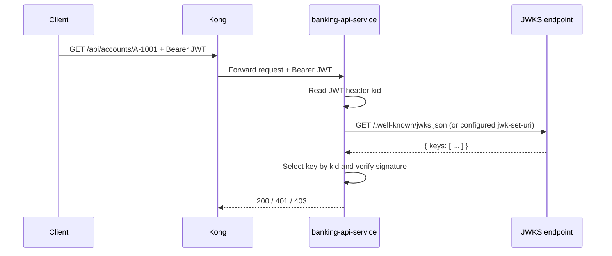

# 10 JWK And JWKS Deep Dive

This page explains JWK and JWKS in depth, and how they are used by Spring Security in this PoC.

If JWT signatures answer "was this token signed by the issuer?", JWKS answers "which public key should I use to verify this token right now?"

## Quick Definitions

- JWK: a JSON object that describes one cryptographic key.
- JWKS: a JSON document with a `keys` array containing one or more JWKs.
- `kid`: key ID used to select the correct key for verification.
- `jwk-set-uri`: endpoint that serves the JWKS document.

## Why JWKS Exists

With asymmetric signing such as RS256:

- Keycloak signs JWTs with a private key.
- services verify JWTs with the matching public key.

The public key can rotate. If services hardcode one key, verification breaks on rotation.
JWKS solves this by publishing current public keys at a stable URL.

## How It Fits This PoC

The banking service is configured in `services/banking-api-service/src/main/resources/application.yml`:

- `spring.security.oauth2.resourceserver.jwt.jwk-set-uri`

That tells Spring where to fetch public keys used to validate JWT signatures.

In this PoC, the value is injected by `docker-compose.yml` as:

```yaml
BANKING_API_JWK_SET_URI: http://keycloak:8080/realms/banking-poc/protocol/openid-connect/certs
```

Why it uses `http://keycloak:8080` instead of `http://localhost:9081`:

- `banking-api-service` runs inside the Docker Compose network
- inside that network, `keycloak` is the service hostname
- inside the container, `localhost` would mean the banking service container itself, not Keycloak

So:

- host machine view: `http://localhost:9081/...`
- internal container-to-container view: `http://keycloak:8080/...`

Flow:

1. Request arrives with bearer token.
2. Spring decodes JWT header and reads `kid`.
3. Spring fetches JWKS (or uses cached keys).
4. Spring picks the JWK whose `kid` matches token header `kid`.
5. Spring verifies JWT signature.
6. If signature and other validators pass, request is authenticated.



## The Actual JWKS Response In This PoC

The Keycloak JWKS endpoint in this project returns JSON in this shape:

```json
{
  "keys": [
    {
      "kid": "gMTvER9Ofps6D0UuEk2av7caU5GlZd4sS-c7fWkyxoA",
      "kty": "RSA",
      "alg": "RSA-OAEP",
      "use": "enc",
      "n": "...",
      "e": "AQAB",
      "x5c": ["..."],
      "x5t": "...",
      "x5t#S256": "..."
    },
    {
      "kid": "0BYek66uebuec84BqxfwJ9_qxIDr1Wka-1siBT2z0Lk",
      "kty": "RSA",
      "alg": "RS256",
      "use": "sig",
      "n": "...",
      "e": "AQAB",
      "x5c": ["..."],
      "x5t": "...",
      "x5t#S256": "..."
    }
  ]
}
```

The important thing to notice is:

- the endpoint returns more than one key
- not every key is for the same purpose

## Why Two Keys Appear

In your example, Keycloak exposes two RSA keys with different uses.

### Key 1: Encryption Key

```json
{
  "alg": "RSA-OAEP",
  "use": "enc"
}
```

Meaning:

- `use: "enc"` means the key is intended for encryption use cases
- this is not the key the banking service uses to verify JWT signatures

### Key 2: Signature Key

```json
{
  "kid": "0BYek66uebuec84BqxfwJ9_qxIDr1Wka-1siBT2z0Lk",
  "kty": "RSA",
  "alg": "RS256",
  "use": "sig"
}
```

Meaning:

- `use: "sig"` means this key is intended for signature verification
- `alg: "RS256"` matches the JWT header in this PoC
- this is the key Spring Security uses to verify the JWT signature

So the banking service cares about the second key, not the first one.

## Anatomy Of A JWK (RSA)

Typical RSA public JWK fields:

```json
{
  "kty": "RSA",
  "kid": "0BYek66uebuec84BqxfwJ9_qxIDr1Wka-1siBT2z0Lk",
  "use": "sig",
  "alg": "RS256",
  "n": "...",
  "e": "AQAB"
}
```

What each field means:

- `kty`: key type. `RSA` here.
- `kid`: key ID. Must match JWT header `kid`.
- `use`: intended use. `sig` means signature verification.
- `alg`: expected algorithm, often `RS256` in this project.
- `n`: RSA modulus (public part).
- `e`: RSA public exponent.

Some providers also include certificate fields such as `x5c`, `x5t`, and `x5t#S256`.

### What `x5c`, `x5t`, and `x5t#S256` Mean

- `x5c`
  - X.509 certificate chain
  - another representation of the public key material

- `x5t`
  - certificate thumbprint

- `x5t#S256`
  - SHA-256 certificate thumbprint

In this PoC, these fields are present because Keycloak exposes certificate-related metadata along with the RSA key.

Spring Security mainly needs the public key material for verification, but these extra fields are normal in a JWKS response.

## JWT Header To JWK Match

A JWT header in this PoC looks like:

```json
{
  "alg": "RS256",
  "typ": "JWT",
  "kid": "0BYek66uebuec84BqxfwJ9_qxIDr1Wka-1siBT2z0Lk"
}
```

Verification uses this mapping:

- take `kid` from JWT header
- find JWK with same `kid` in JWKS `keys`
- verify signature using that JWK's public key

If no matching `kid` exists, verification fails and Spring returns `401 Unauthorized`.

### Concrete Match In This PoC

The JWT header seen in this PoC looks like:

```json
{
  "alg": "RS256",
  "typ": "JWT",
  "kid": "0BYek66uebuec84BqxfwJ9_qxIDr1Wka-1siBT2z0Lk"
}
```

Spring looks in the JWKS `keys` array for:

- `kid = "0BYek66uebuec84BqxfwJ9_qxIDr1Wka-1siBT2z0Lk"`

Then it also sees:

- `use = "sig"`
- `alg = "RS256"`

That is the exact public key entry used to verify the token.

## Key Rotation And Multiple Keys

JWKS commonly contains multiple keys during rotation.

Example shape:

```json
{
  "keys": [
    { "kid": "old-key", "kty": "RSA", "use": "sig", "n": "...", "e": "AQAB" },
    { "kid": "new-key", "kty": "RSA", "use": "sig", "n": "...", "e": "AQAB" }
  ]
}
```

Why this is important:

- old tokens still verify with old key until they expire
- new tokens verify with new key immediately
- services do not need redeploys just because signing key rotated

## Spring Security Behavior In Practice

In this PoC, `NimbusJwtDecoder` is built from `jwk-set-uri` and then combined with issuer and audience validators.

So request acceptance effectively requires all of these:

1. signature valid against selected JWK
2. token not expired (default validator)
3. issuer matches configured issuer
4. audience contains configured audience

If any check fails, Spring rejects at the filter chain before controller logic.

### What Spring Actually Does With The JWKS

At a high level:

1. read the JWT header
2. extract `kid`
3. fetch the JWKS from Keycloak if needed
4. locate the JWK whose `kid` matches
5. reconstruct the RSA public key from fields like `n` and `e`
6. verify the JWT signature
7. only then continue to issuer and audience validation

So the JWKS endpoint is effectively a live public-key directory for the service.

## How To Inspect JWKS During Troubleshooting

You can inspect JWKS with curl:

```bash
curl -sS 'http://localhost:9081/realms/banking-poc/protocol/openid-connect/certs' | jq
```

Then compare against a token header:

```bash
TOKEN='<access-token>'
printf '%s' "$TOKEN" | cut -d '.' -f 1 | base64 --decode 2>/dev/null | jq
```

Check:

- `kid` in header exists in JWKS
- algorithm expectation aligns with key and verifier
- issuer and audience claims match service config

## Common Failure Modes

- wrong `jwk-set-uri`: service cannot fetch keys, token validation fails.
- stale/missing `kid`: token signed by key not present in fetched JWKS.
- issuer mismatch: token from different realm.
- audience mismatch: token not intended for `mobile-banking-app`.
- network/path issues: service cannot reach JWKS endpoint.

All of these surface as authentication failures, usually `401 Unauthorized`.

## Security Notes

- JWKS contains public keys only, never private keys.
- exposing JWKS is expected and normal.
- trust comes from HTTPS, issuer checks, and correct endpoint configuration.
- do not disable issuer/audience checks just because signature passes.

## In One Line

JWKS is the live key directory that lets the banking service pick the right public key by `kid` and verify JWT signatures safely, even when Keycloak rotates signing keys.
