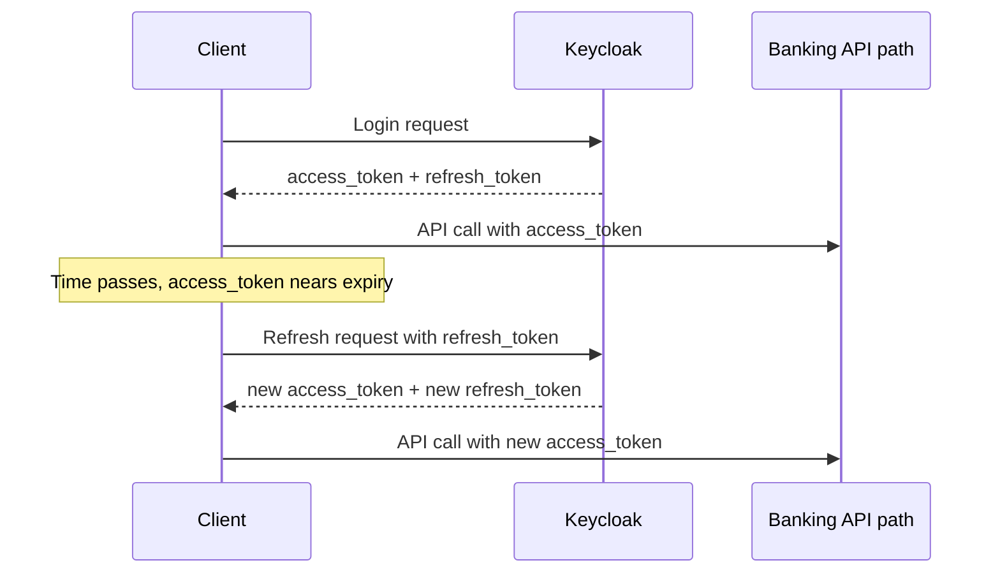

# 11 Access Token And Refresh Token Lifecycle

This page explains why Keycloak returns fields like:

- `access_token`
- `expires_in`
- `refresh_token`
- `refresh_expires_in`

It also explains how a client can renew a session automatically.

## Why Keycloak Returns More Than Just `access_token`

When a client logs in to Keycloak, Keycloak does not return only a JWT string.

It returns a full OAuth 2.0 / OpenID Connect token response.

That response gives the client everything it needs to:

- call APIs now
- know how long the token is valid
- renew the session later without asking the user to log in again immediately

That is why the response contains more than just `access_token`.

## Example Token Response

A typical response looks like this:

```json
{
  "access_token": "<jwt>",
  "expires_in": 300,
  "refresh_expires_in": 1800,
  "refresh_token": "<refresh-token>",
  "token_type": "Bearer",
  "scope": "email profile"
}
```

## What Each Field Means

### `access_token`

This is the token used to call protected APIs right now.

In this PoC:

- the client sends it to Kong
- Kong introspects it with Keycloak
- Spring Boot validates it again before returning banking data

Think of it as:

- the short-lived API ticket

### `expires_in`

This tells the client how many seconds the `access_token` remains valid.

Example:

- `300` means 5 minutes

Purpose:

- keep access tokens short-lived
- limit risk if an access token is leaked

### `refresh_token`

This is a different token used to get a new `access_token` without asking the user to log in again immediately.

Think of it as:

- the token used to continue the session

The refresh token is not normally sent to the banking API.
It is sent back to Keycloak when the client wants a new access token.

### `refresh_expires_in`

This tells the client how many seconds the `refresh_token` remains usable.

Example:

- `1800` means 30 minutes

Purpose:

- limit how long the session can be silently extended
- avoid refresh tokens living forever

### `token_type`

Usually this is:

- `Bearer`

That means the client should send the access token like this:

```http
Authorization: Bearer <access_token>
```

### `scope`

This tells the client which scopes were granted.

In this PoC you often see:

- `email profile`

Scopes are another way of expressing granted capabilities or identity information.

### `session_state`

You may also see `session_state` in Keycloak responses.

This helps Keycloak track the login session on its side.

For most client logic, the more important fields are still:

- `access_token`
- `expires_in`
- `refresh_token`
- `refresh_expires_in`

## Why These Fields Exist

These fields exist because there is a security-usability tradeoff.

### If Access Tokens Lived Too Long

That would be convenient, but unsafe.

If someone stole the token, they could use it for a long time.

### If Access Tokens Lived Too Short Without Refresh

That would be safe, but annoying.

Users would have to log in again very frequently.

### The Combined Design

So the common design is:

- short-lived `access_token`
- longer-lived `refresh_token`

This gives:

- better security for API calls
- better user experience for session continuity

## What Problem Refresh Tokens Solve

Refresh tokens solve a very practical problem:

- how can a client keep a user signed in without keeping a long-lived access token?

Without refresh tokens, the client would need to:

- ask the user to log in again every time the access token expires

That would be painful, especially for:

- mobile apps
- SPAs
- dashboards
- long-lived user sessions

Refresh tokens allow the client to:

- quietly ask Keycloak for a new access token
- continue the session until the refresh token itself expires

## Access Token vs Refresh Token

| Token | Main purpose | Sent to banking API? | Lifetime |
|---|---|---|---|
| `access_token` | Call protected APIs | Yes | Short |
| `refresh_token` | Get a new access token | No, sent to Keycloak only | Longer |

## Session Renewal Flow



## How Automatic Renewal Works At The Client Side

The basic client logic is usually:

1. log in once
2. store:
   - `access_token`
   - `refresh_token`
   - access-token expiry time
   - refresh-token expiry time
3. before the access token expires, call Keycloak with the refresh token
4. replace the stored tokens with the new response
5. if refresh fails, send the user back to login

## Generic Client-Side Pseudocode

```text
login() {
  tokenResponse = requestToken(username, password)

  store.accessToken = tokenResponse.access_token
  store.refreshToken = tokenResponse.refresh_token
  store.accessTokenExpiresAt = now() + tokenResponse.expires_in
  store.refreshTokenExpiresAt = now() + tokenResponse.refresh_expires_in
}

getValidAccessToken() {
  if now() < store.accessTokenExpiresAt - 30 seconds {
    return store.accessToken
  }

  if now() >= store.refreshTokenExpiresAt {
    redirectToLogin()
    return
  }

  refreshed = refreshSession(store.refreshToken)

  store.accessToken = refreshed.access_token
  store.refreshToken = refreshed.refresh_token
  store.accessTokenExpiresAt = now() + refreshed.expires_in
  store.refreshTokenExpiresAt = now() + refreshed.refresh_expires_in

  return store.accessToken
}

callApi() {
  token = getValidAccessToken()
  send Authorization: Bearer <token>
}
```

### Why Refresh Slightly Before Expiry

Notice the line:

- `now() < accessTokenExpiresAt - 30 seconds`

Clients often renew a little early instead of waiting for exact expiry.

That avoids problems such as:

- network latency
- clock skew
- token expiring while a request is in flight

## Refresh Request Example

When a client refreshes the session, it typically calls the Keycloak token endpoint again, but with a different grant type.

Example shape:

```http
POST /realms/banking-poc/protocol/openid-connect/token
Content-Type: application/x-www-form-urlencoded

grant_type=refresh_token
client_id=mobile-banking-app
refresh_token=<refresh_token>
```

Keycloak responds with a fresh token response, usually including:

- new `access_token`
- new `refresh_token`
- new `expires_in`
- new `refresh_expires_in`

## What Happens When Renewal Fails

There are two common failure cases:

### Case 1: Access token expired, refresh token still valid

- client refreshes successfully
- user stays logged in

### Case 2: Refresh token expired or invalid

- Keycloak rejects the refresh request
- client can no longer renew the session
- user must log in again

So the refresh token is what determines whether silent session continuation is still possible.

## How This Relates To This PoC

In this repo:

- `scripts/demo.sh` logs in and extracts only `access_token`
- it ignores the `refresh_token`

Why?

- the script is short-lived
- it only needs to demonstrate a small set of calls
- it does not try to behave like a real mobile or web client session manager

But a real mobile banking app would likely:

- store the refresh token safely
- monitor token expiry
- refresh tokens automatically in the background

## Security Considerations

Refresh tokens are sensitive.

In many ways they are more sensitive than short-lived access tokens because they can be exchanged for new access tokens.

So a client should treat them carefully.

Important rules:

- do not expose refresh tokens unnecessarily
- do not send refresh tokens to resource APIs like the banking API
- send refresh tokens only to Keycloak token endpoint
- store them carefully based on client type

For example:

- mobile apps often store them in secure platform storage
- browser apps need more careful design because browser storage has different risks

## Simple Mental Model

If you want the shortest correct mental model:

1. `access_token` is for calling APIs now
2. `expires_in` tells you how long that token lasts
3. `refresh_token` is for getting a new access token later
4. `refresh_expires_in` tells you how long session renewal remains possible
5. when refresh expires, the user must log in again

That is why Keycloak returns these fields and what problem they solve.
