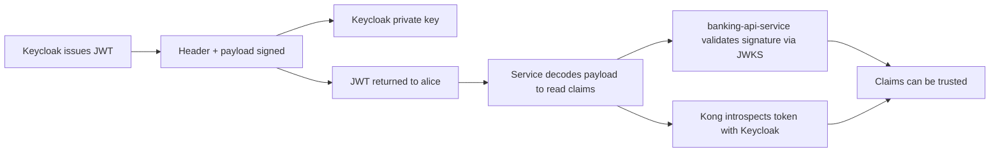
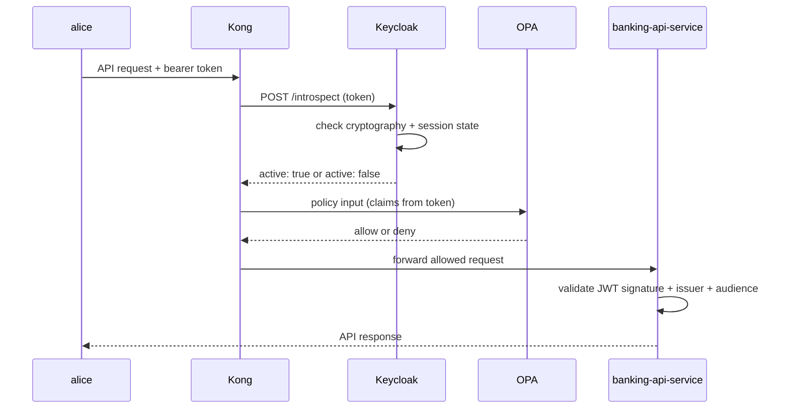
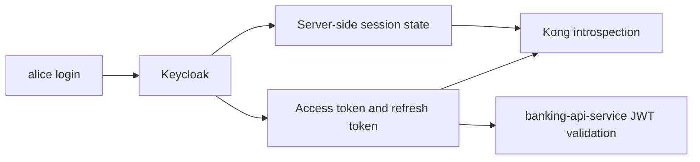

# 11 — JWT Signature, Validation & Introspection

How tokens are signed, validated, and introspected in this PoC — and why `Keycloak` can return `active: false` even for a structurally valid, unexpired JWT.

> **Part III · Token Mechanics** — Prereqs: [06](06-keycloak-idp.md), [07](07-kong.md)

See [01 — Concepts](01-concepts.md) for the locked terminology used throughout: `Keycloak` (IdP), `Kong` (PEP), `OPA` (PDP), `banking-api-service` (resource server).

---

## The Four Pieces

### 1. Signature

The signature is the cryptographic proof that `Keycloak` created the token.

It is produced when `Keycloak` issues the access token by signing the token header and payload with `Keycloak`'s private key.

Why it matters:

- it proves the token came from `Keycloak`
- it proves the payload was not changed after issuance
- it prevents a caller from forging a fake token that looks valid just by Base64URL-encoding data

### 2. Validation

Validation means checking that the token is genuine and acceptable for the request.

Typical validation checks are:

- the signature is valid
- the token is not expired (`exp`)
- the issuer (`iss`) matches the expected `Keycloak` realm
- the audience (`aud`) matches the client or API

In this PoC:

- `banking-api-service` validates JWTs locally using JWKS
- `Kong` uses `Keycloak` introspection before it trusts a token for policy decisions

### 3. Introspection

Introspection is a live call from a service to `Keycloak`'s introspection endpoint.

`Keycloak` responds with whether the token is `active` or not, and may also return token metadata.

Why it matters:

- it confirms the token is still valid from the source of truth
- it catches revoked or otherwise inactive tokens
- it gives a stronger trust check than decoding the JWT alone

In this PoC, `Kong` introspects the token before it uses decoded claims to build policy input for `OPA`.

The full mechanics of why `Keycloak` can return `active: false` even for a structurally valid, unexpired JWT are covered in depth in the [introspection section](#what-introspection-actually-checks) below.

### 4. Claims

Claims are the data inside the JWT payload.

Examples in this PoC:

- `iss`
- `aud`
- `preferred_username`
- `realm_access.roles`
- `customer_id`
- `account_ids`

Decoding the token lets you read those claims.
Validation or introspection tells you whether those claims are trustworthy.

---

## How The Trust Chain Works



The important idea is that decoding and trusting are not the same thing.

- decoding answers: what does the token say?
- validation answers: was it really issued by `Keycloak`, and is it acceptable now?
- introspection answers: does `Keycloak` still consider this token active?

---

## How Signature Verification Works

JWTs have three parts:

```text
header.payload.signature
```

`Keycloak` signs the `header.payload` part with its private key.
The signature is attached as the third segment.

When a service validates the token, it does the reverse:

1. split the JWT into header, payload, and signature
2. fetch or load `Keycloak`'s public key (via JWKS — see [12 — JWKS Deep Dive](12-jwks.md))
3. recompute the expected signature from the header and payload
4. compare the computed signature with the one in the token

If they match, the token was signed by the matching private key and the payload was not altered.
If they do not match, the token is rejected.

### Private Key And Public Key

`Keycloak` keeps the private key secret.

Services never need the private key.
They only need the public key, which is safe to share.

That public key is what lets `banking-api-service` and other services verify that a token came from the expected `Keycloak` realm.

### Crypto Mechanism In This PoC

The access token in this PoC uses `RS256`:

- `R` = RSA public-key cryptography
- `S` = signature
- `256` = SHA-256 hashing

The signing process:

1. `Keycloak` builds the JWT header and payload.
2. It Base64URL-encodes each part.
3. It concatenates them as `header.payload`.
4. It hashes that string with SHA-256.
5. It signs the hash with the `Keycloak` private RSA key.
6. It attaches the resulting signature as the third JWT segment.

When a service validates the token, it reverses:

1. split the JWT into header, payload, and signature
2. Base64URL-decode the header and payload
3. rebuild the `header.payload` signing input
4. use `Keycloak`'s public RSA key to verify the signature

If the signature was created by the matching private key, verification succeeds.
If the token was modified, verification fails because the hash no longer matches the signed content.

In plain language:

- `Keycloak` signs with its private key
- services verify with `Keycloak`'s public key
- the SHA-256 hash makes the payload tamper-evident

> How services discover and cache `Keycloak`'s public keys at the JWKS endpoint is covered in [12 — JWKS Deep Dive](12-jwks.md).

---

## What Validation Usually Checks

Validation is broader than signature checking.

A service usually checks:

- signature is valid
- `exp` has not passed
- `iss` matches the expected realm
- `aud` matches the expected client or API
- the token type is what the service expects

If any of these checks fail, the token should not be trusted for authorization decisions.

In this PoC, `banking-api-service` performs JWT validation on incoming requests, so it can reject tokens that are expired, malformed, or issued for the wrong audience.

---

## What Introspection Actually Checks

This section is the single full treatment of introspection mechanics in this documentation series.

### What Keycloak Does During Introspection

When `Kong` calls `Keycloak`'s introspection endpoint, `Keycloak` does more than decode the JWT.

At a high level, `Keycloak` checks:

1. can the token be parsed?
2. is the token cryptographically acceptable?
3. is the token expired?
4. is the user session still active?
5. is the client session still active?
6. has logout, revocation, or invalidation made this token unusable?

If those checks pass, `Keycloak` returns:

```json
{
  "active": true
}
```

If they do not pass, `Keycloak` returns:

```json
{
  "active": false
}
```

So introspection is answering: does `Keycloak` still consider this token usable right now?

### Why Keycloak Can Return `active: false` Even For A Structurally Valid, Unexpired JWT

This is one of the most important ideas in the whole stack.

Because `Keycloak` keeps server-side session state, it can say a token is inactive even if:

- the token still looks like a valid JWT
- the claims can still be decoded
- the token has not yet reached its `exp` timestamp

The reason is that `Keycloak` is not only the issuer of the JWT — it is also the owner of the live session state behind that JWT.

Examples of why `Keycloak` may return `active: false`:

- `alice` logged out
- the user session expired
- the client session expired
- the `alice` account was disabled
- the client (e.g. `mobile-banking-app`) was disabled
- a realm or client invalidation event occurred

So when `Keycloak` receives an introspection request, it is not only asking "does this JWT look well-formed?" — it is also asking "does this token still belong to a live, acceptable session according to `Keycloak` right now?"

**The JWT carries token data. `Keycloak` keeps the session truth.**

That is the most important mental model for introspection.

### How Keycloak Keeps Session State

Access tokens and sessions are related but not the same thing.

- the JWT carries identity and claim data
- `Keycloak` keeps live session information on the server side

`Keycloak` typically maintains these session layers:

| Layer | What It Represents |
|---|---|
| Authentication session | Temporary state during the login flow; removed after login completes or expires |
| User session | The authenticated user session in a realm — tracks start time, idle/expiry, logout status |
| Client session | Per-client participation in that user session (e.g. for `mobile-banking-app`) |

At runtime, `Keycloak` stores online session state primarily in Infinispan caches. Offline sessions are persisted in the database. In clustered deployments, caches are replicated across nodes.

The practical point: token claims are carried in the JWT, but live session activity is maintained server-side. That is why a token can decode correctly but introspection can still return `active: false` if the backing session state is gone.

### Introspection Flow In This PoC



### Session And Token Relationship



---

## JWKS vs Introspection — Which To Use

This PoC uses both mechanisms, but in different places.

### Why `banking-api-service` Uses JWKS Rather Than Introspection

`banking-api-service` acts as a resource server. It uses JWKS for JWT validation for these reasons:

**1. Local and fast.** After `banking-api-service` downloads `Keycloak`'s public keys from the JWKS endpoint, it can validate JWTs locally with no network round-trip per request.

**2. JWTs are designed for this pattern.** A self-contained JWT already carries claims, expiry, issuer, audience, and signature. That makes local JWKS validation the natural and standard pattern for a Spring Security JWT resource server.

**3. Better resilience.** If `Keycloak` is briefly slow or unavailable, local JWT validation can still work for already-issued tokens as long as the service already has the needed public keys. Introspection on every request creates a hard dependency on live `Keycloak` availability.

**4. Cleaner resource-server boundary.** Spring Security resource-server support is built exactly for bearer JWT + public key discovery through JWKS + issuer and audience validation. Using JWKS is the standard, efficient model — not a workaround.

> Key rotation mechanics and JWKS caching are covered in [12 — JWKS Deep Dive](12-jwks.md).

### What Each Mechanism Answers

| Mechanism | Question answered |
|---|---|
| JWKS validation | Was this token signed by the trusted issuer? Does it have the right `iss`, `aud`, and `exp`? |
| Introspection | Does `Keycloak` still consider this token active right now? |

JWKS validation answers whether the token is cryptographically trustworthy.
Introspection adds a live answer about whether the session behind the token is still alive.

### Why This PoC Uses Both

| Component | Mechanism | Purpose |
|---|---|---|
| `Kong` | Introspection | Live token activity check at the edge — asks `Keycloak` whether the token is active before building `OPA` policy input |
| `banking-api-service` | JWKS validation | Local cryptographic verification — the service does not blindly trust that the gateway already checked everything |

Defense in depth: `banking-api-service` still validates the JWT as its own trust boundary, even after `Kong` has already introspected it.

**Short version:**

- introspection = live session status check
- JWKS validation = local cryptographic trust check

---

## What Claims Are Used For

Claims carry identity and authorization context.

Examples:

- `iss` tells services who issued the token
- `aud` tells services which client or API the token is meant for
- `preferred_username` gives a readable username (`alice`, `ops-admin`)
- `realm_access.roles` gives role information
- `customer_id` and `account_ids` carry business context

Claims are easy to read once decoded, but they are only safe to act on after validation or introspection.

---

## End-To-End Example (alice)

1. `alice` authenticates with `Keycloak`.
2. `Keycloak` creates a user session and a client session server-side.
3. `Keycloak` issues a signed JWT access token containing `iss`, `aud`, `preferred_username`, `customer_id`, and `account_ids`.
4. `alice` sends the bearer token to `Kong`.
5. `Kong` calls `Keycloak`'s introspection endpoint — `Keycloak` checks the JWT and the live session state, returns `active: true`.
6. `Kong` sends policy input (decoded claims) to `OPA`; `OPA` returns allow.
7. `Kong` forwards the request to `banking-api-service`.
8. `banking-api-service` validates the JWT signature using `Keycloak`'s public key (fetched via JWKS), checks `iss`, `aud`, and `exp`.
9. `banking-api-service` returns the API response to `alice`.

Two layers of trust:

- live `Keycloak` session verification (via `Kong` introspection)
- local cryptographic verification (via `banking-api-service` JWKS validation)

> For how access tokens are renewed via refresh tokens, see [13 — Token Lifecycle](13-token-lifecycle.md).

---

## Summary

- **decode** = read what the token says
- **validate** = prove the token is genuine, meant for this service, and not expired
- **introspect** = ask `Keycloak` whether the token's session is still alive

The signature makes the token tamper-evident.
Validation makes it locally acceptable.
Introspection gives the live answer from `Keycloak` — and `Keycloak` can return `active: false` even for a structurally valid, unexpired JWT because it owns the session truth, not just the token string.

---

← Prev: [10 — identity-bootstrap-service](10-identity-bootstrap-service.md) · Next: [12 — JWKS Deep Dive](12-jwks.md) →
