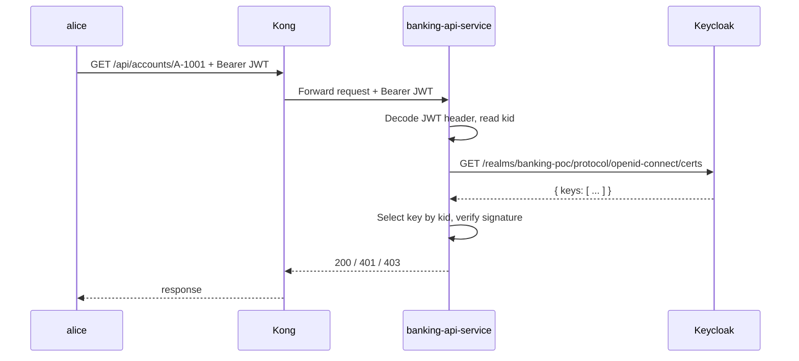

# 12 — JWKS Deep Dive

JWKS is the live public-key directory that lets `banking-api-service` select the right key by `kid` and verify JWT signatures safely, even when `Keycloak` rotates signing keys.

> **Part III · Token Mechanics** — Prereqs: [11](11-jwt-signature-validation.md)

See [01 — Concepts](01-concepts.md) for the locked terminology used throughout: `Keycloak` (IdP), `Kong` (PEP), `OPA` (PDP), `banking-api-service` (resource server).

---

## Quick Definitions

- **JWK** — a JSON object that describes one cryptographic key.
- **JWKS** — a JSON document with a `keys` array containing one or more JWKs.
- **`kid`** — key ID used to select the correct key for verification.
- **`jwk-set-uri`** — the endpoint that serves the JWKS document.

---

## Why JWKS Exists

With asymmetric signing such as `RS256`:

- `Keycloak` signs JWTs with a private key.
- services verify JWTs with the matching public key.

The public key can rotate. If services hardcode one key, verification breaks on rotation. JWKS solves this by publishing current public keys at a stable URL. Services fetch from that URL on demand and cache the result.

---

## How It Fits This PoC

`banking-api-service` is configured in `services/banking-api-service/src/main/resources/application.yml` with:

```yaml
spring.security.oauth2.resourceserver.jwt.jwk-set-uri
```

That tells Spring Security where to fetch the public keys used to validate JWT signatures.

In this PoC, the value is injected by `docker-compose.yml` as:

```yaml
BANKING_API_JWK_SET_URI: http://keycloak:8080/realms/banking-poc/protocol/openid-connect/certs
```

Why `http://keycloak:8080` rather than `http://localhost:9081`:

- `banking-api-service` runs inside the Docker Compose network.
- Inside that network, `keycloak` is the service hostname.
- `localhost` inside the container refers to the `banking-api-service` container itself, not `Keycloak`.

| Viewer | URL |
|---|---|
| Host machine | `http://localhost:9081/realms/banking-poc/protocol/openid-connect/certs` |
| Container-to-container | `http://keycloak:8080/realms/banking-poc/protocol/openid-connect/certs` |

---

## JWKS Lookup Flow

When a request arrives with a bearer token, Spring Security follows these steps:

1. Receive request with bearer token.
2. Decode the JWT header and read `kid`.
3. Fetch the JWKS from `Keycloak` (or use the cached key set).
4. Pick the JWK whose `kid` matches the token header `kid`.
5. Verify the JWT signature using that key.
6. If signature and all other validators pass, authenticate the request.



---

## The Actual JWKS Response In This PoC

Fetching the `Keycloak` JWKS endpoint returns JSON in this shape:

```json
{
  "keys": [
    {
      "kid": "gMTvER9Ofps6D0UuEk2av7caU5GlZd4sS-c7fWkyxoA",
      "kty": "RSA",
      "alg": "RSA-OAEP",
      "use": "enc",
      "n": "...",
      "e": "AQAB",
      "x5c": ["..."],
      "x5t": "...",
      "x5t#S256": "..."
    },
    {
      "kid": "0BYek66uebuec84BqxfwJ9_qxIDr1Wka-1siBT2z0Lk",
      "kty": "RSA",
      "alg": "RS256",
      "use": "sig",
      "n": "...",
      "e": "AQAB",
      "x5c": ["..."],
      "x5t": "...",
      "x5t#S256": "..."
    }
  ]
}
```

Notice that:

- the endpoint returns more than one key.
- not every key has the same purpose — `use` distinguishes them.

---

## Why Two Keys Appear

`Keycloak` exposes two RSA keys with different intended uses.

### Key 1 — Encryption Key

```json
{
  "alg": "RSA-OAEP",
  "use": "enc"
}
```

- `use: "enc"` means this key is for encryption use cases, not signature verification.
- `banking-api-service` does not use this key to verify JWT signatures.

### Key 2 — Signature Key

```json
{
  "kid": "0BYek66uebuec84BqxfwJ9_qxIDr1Wka-1siBT2z0Lk",
  "kty": "RSA",
  "alg": "RS256",
  "use": "sig"
}
```

- `use: "sig"` means this key is for signature verification.
- `alg: "RS256"` matches the JWT header algorithm in this PoC.
- This is the key Spring Security uses to verify JWT signatures.

`banking-api-service` cares about the second key, not the first.

---

## Anatomy Of A JWK (RSA)

A typical RSA public JWK looks like this:

```json
{
  "kty": "RSA",
  "kid": "0BYek66uebuec84BqxfwJ9_qxIDr1Wka-1siBT2z0Lk",
  "use": "sig",
  "alg": "RS256",
  "n": "...",
  "e": "AQAB"
}
```

| Field | Meaning |
|---|---|
| `kty` | Key type. `RSA` here. |
| `kid` | Key ID. Must match the `kid` in the JWT header. |
| `use` | Intended use. `sig` means signature verification. |
| `alg` | Expected algorithm. `RS256` in this PoC. |
| `n` | RSA modulus (public part). |
| `e` | RSA public exponent. |

### What `x5c`, `x5t`, and `x5t#S256` Mean

`Keycloak` includes certificate fields alongside the RSA key material.

| Field | Meaning |
|---|---|
| `x5c` | X.509 certificate chain — another representation of the public key material. |
| `x5t` | SHA-1 thumbprint of the certificate. |
| `x5t#S256` | SHA-256 thumbprint of the certificate. |

Spring Security mainly needs `n` and `e` to reconstruct the RSA public key for verification. The certificate fields are normal in a JWKS response and do not affect the verification process for this PoC.

---

## JWT Header To JWK Match By `kid`

A JWT header in this PoC looks like:

```json
{
  "alg": "RS256",
  "typ": "JWT",
  "kid": "0BYek66uebuec84BqxfwJ9_qxIDr1Wka-1siBT2z0Lk"
}
```

The key selection process:

1. Take `kid` from the JWT header.
2. Find the JWK in the JWKS `keys` array with the same `kid`.
3. Verify the signature using that JWK's public key.

If no JWK matches the `kid`, verification fails and Spring Security returns `401 Unauthorized`.

### Concrete Match In This PoC

Spring looks for the JWK where:

- `kid = "0BYek66uebuec84BqxfwJ9_qxIDr1Wka-1siBT2z0Lk"`

It also confirms:

- `use = "sig"`
- `alg = "RS256"`

That is the exact public key entry used to verify the token.

---

## Key Rotation And Multiple Keys

JWKS commonly holds multiple keys during a rotation period.

Example shape during rotation:

```json
{
  "keys": [
    { "kid": "old-key", "kty": "RSA", "use": "sig", "n": "...", "e": "AQAB" },
    { "kid": "new-key", "kty": "RSA", "use": "sig", "n": "...", "e": "AQAB" }
  ]
}
```

Why this matters:

- old tokens still verify with the old key until they expire.
- new tokens verify with the new key immediately.
- services do not need redeploys just because the signing key rotated.

The `kid` in each token's header always points to exactly the right key, regardless of how many keys are in the JWKS at that moment.

---

## Spring Security Behavior In Practice

`banking-api-service` uses `NimbusJwtDecoder`, built from `jwk-set-uri` and combined with issuer and audience validators.

At runtime, Spring Security follows this sequence:

1. Read the JWT header and extract `kid`.
2. Fetch the JWKS from `Keycloak` if not already cached.
3. Locate the JWK whose `kid` matches.
4. Reconstruct the RSA public key from `n` and `e`.
5. Verify the JWT signature.
6. Check that the token is not expired (`exp`).
7. Check that `iss` matches the configured issuer.
8. Check that `aud` contains the configured audience.

If any check fails, Spring Security rejects the request before controller logic runs.

Request acceptance requires all of the following:

| Check | Description |
|---|---|
| Signature | Valid against the selected JWK |
| Expiry | `exp` has not passed |
| Issuer | `iss` matches the configured `Keycloak` realm |
| Audience | `aud` contains the expected value |

So the JWKS endpoint is effectively a live public-key directory for `banking-api-service`.

---

## How To Inspect JWKS During Troubleshooting

Fetch the JWKS directly from the host machine:

```bash
curl -sS 'http://localhost:9081/realms/banking-poc/protocol/openid-connect/certs' | jq
```

Decode a token header to see which `kid` it carries:

```bash
TOKEN='<access-token>'
printf '%s' "$TOKEN" | cut -d '.' -f 1 | base64 --decode 2>/dev/null | jq
```

Check:

- the `kid` in the token header exists in the JWKS `keys` array.
- the algorithm in the token header matches the `alg` of the selected JWK.
- `iss` and `aud` in the token payload match the `banking-api-service` configuration.

---

## Common Failure Modes

| Failure | Symptom |
|---|---|
| Wrong `jwk-set-uri` | `banking-api-service` cannot fetch keys; all token validation fails. |
| Stale or missing `kid` | Token signed by a key not present in the fetched JWKS; `401 Unauthorized`. |
| Issuer mismatch | Token issued by a different `Keycloak` realm. |
| Audience mismatch | Token not intended for `banking-api-service`. |
| Network or path issue | `banking-api-service` cannot reach the `Keycloak` certs endpoint at startup or refresh time. |

All of these surface as `401 Unauthorized`.

---

## Security Notes

- The JWKS endpoint contains public keys only — never private keys.
- Exposing JWKS is expected and normal; it is not a secret.
- Trust comes from HTTPS, issuer verification, and correct endpoint configuration — not from the keys being hidden.
- Do not disable issuer or audience checks just because the signature passes. All four validators together provide the correct trust boundary.

---

← Prev: [11 — JWT Signature, Validation & Introspection](11-jwt-signature-validation.md) · Next: [13 — Access & Refresh Token Lifecycle](13-token-lifecycle.md) →
