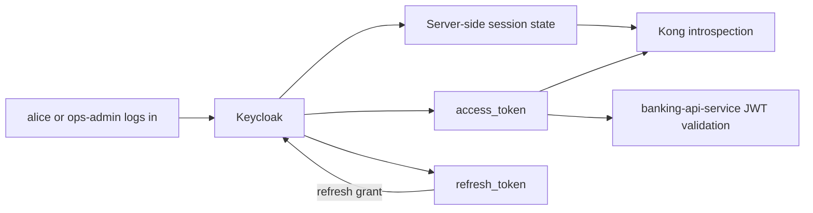
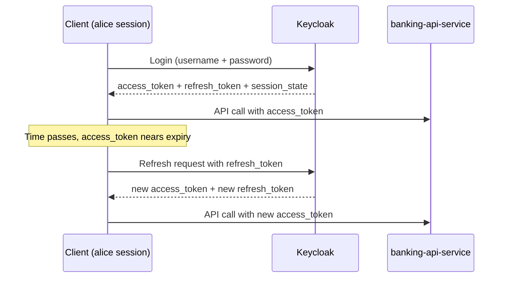

# 13 — Access & Refresh Token Lifecycle

How `Keycloak` token responses work, why each field exists, and how clients manage access and refresh tokens through the full session lifecycle.

> **Part III · Token Mechanics** — Prereqs: [11](11-jwt-signature-validation.md)

---

## What Keycloak Returns After Login

When a client logs in to `Keycloak`, it does not receive only a JWT string.

It receives a full OAuth 2.0 / OpenID Connect token response that gives the client everything it needs to:

- call APIs now
- know how long the token is valid
- renew the session later without asking the user to log in again immediately

## Example Token Response

A typical response for `alice` logging in via `mobile-banking-app` looks like this:

```json
{
  "access_token": "<jwt>",
  "expires_in": 300,
  "refresh_expires_in": 1800,
  "refresh_token": "<refresh-token>",
  "token_type": "Bearer",
  "scope": "email profile",
  "session_state": "<uuid>"
}
```

## What Each Field Means

### `access_token`

This is the token used to call protected APIs right now.

In this PoC:

- `alice` or `ops-admin` sends it to `Kong`
- `Kong` introspects it with `Keycloak`
- `banking-api-service` validates it again before returning banking data

Think of it as the short-lived API ticket.

### `expires_in`

This tells the client how many seconds the `access_token` remains valid.

Example:

- `300` means 5 minutes

Purpose:

- keep access tokens short-lived
- limit risk if an access token is leaked

### `refresh_token`

This is a separate token used to get a new `access_token` without asking the user to log in again immediately.

Think of it as the session continuation token.

The refresh token is not sent to `banking-api-service`.
It is sent back to `Keycloak` when the client wants a new access token.

### `refresh_expires_in`

This tells the client how many seconds the `refresh_token` remains usable.

Example:

- `1800` means 30 minutes

Purpose:

- limit how long the session can be silently extended
- avoid refresh tokens living forever

### `token_type`

Usually `Bearer`. That means the client should send the access token like this:

```http
Authorization: Bearer <access_token>
```

### `scope`

This tells the client which scopes were granted.

In this PoC you often see:

- `email profile`

Scopes express granted capabilities or identity information available in the token.

### `session_state`

`Keycloak` also returns a `session_state` field, which is an opaque identifier for the server-side session `Keycloak` keeps on behalf of the authenticated user.

This is not primarily a client-side concern, but it matters for understanding the full picture (see [Access Token, Refresh Token, and Session State](#access-token-refresh-token-and-session-state) below).

## Why These Fields Exist: The Security-Usability Tradeoff

### If Access Tokens Lived Too Long

Convenient, but unsafe. A stolen token could be used for a long time.

### If Access Tokens Lived Too Short Without Refresh

Safe, but painful. Users would have to log in again very frequently.

### The Combined Design

The standard design is:

- short-lived `access_token`
- longer-lived `refresh_token`

This gives:

- better security for API calls
- better user experience for session continuity

## Access Token vs Refresh Token vs Session State

These three concepts are related but distinct.

### Access token

The `access_token` is:

- a short-lived bearer token
- usually self-contained as a JWT
- used to call APIs directly

It carries claims such as `sub`, `preferred_username`, `realm_access.roles`, `customer_id`, `account_ids`, and `aud`. Services like `banking-api-service` can often validate it locally using JWKS without contacting `Keycloak`.

Think of it as answering: "can this token present claims to an API right now?"

### Refresh token

The `refresh_token` is:

- used to obtain a new `access_token`
- more directly tied to the ongoing `Keycloak` session
- not sent to `banking-api-service` or any resource API

If the underlying session is gone, expired, or invalidated, the refresh token stops working even if an old access token still exists.

Think of it as answering: "can this client continue the login session and get a new access token?"

### Session state

`Keycloak` maintains server-side session state that is separate from but related to both tokens.

`Keycloak` tracks three layers of session:

1. **Authentication session** (short-lived) — temporary state during the login flow; removed after login completes or expires
2. **User session** — represents the authenticated user in a realm; tracks start time, idle/expiry state, and logout status
3. **Client session** (per client app) — attached to a user session for each client such as `mobile-banking-app`; tracks client-specific participation in that login session

At runtime, `Keycloak` stores online session state primarily in Infinispan caches. In clustered deployments these caches are distributed across nodes. Offline sessions are persisted in the database.

The critical insight:

- JWT claims travel inside the token
- Live session activity lives server-side in `Keycloak`

That is why a token can still decode as a valid JWT while introspection returns `active: false`. For full introspection mechanics see [11 — JWT Signature, Validation & Introspection](11-jwt-signature-validation.md).

### Summary table

| Token / concept | Main purpose | Sent to `banking-api-service`? | Lifetime |
|---|---|---|---|
| `access_token` | Call protected APIs | Yes | Short (e.g. 5 min) |
| `refresh_token` | Get a new access token | No, sent to `Keycloak` only | Longer (e.g. 30 min) |
| Session state | Server-side session tracking | Not directly | Tied to user/client session TTL |

### Relationship diagram



## What Problem Refresh Tokens Solve

Refresh tokens solve a practical problem:

- how can a client keep a user signed in without holding a long-lived access token?

Without refresh tokens, the client would need to ask `alice` to log in again every time the access token expired. That would be painful for:

- mobile apps
- SPAs
- dashboards
- long-lived user sessions

Refresh tokens allow the client to quietly ask `Keycloak` for a new access token and continue the session until the refresh token itself expires.

## Session Renewal Flow



## How Automatic Renewal Works At The Client Side

The basic client logic is:

1. Log in once
2. Store:
   - `access_token`
   - `refresh_token`
   - access-token expiry time
   - refresh-token expiry time
3. Before the access token expires, call `Keycloak` with the refresh token
4. Replace stored tokens with the new response
5. If refresh fails, redirect the user back to login

## Client-Side Pseudocode

```text
login() {
  tokenResponse = requestToken(username, password)

  store.accessToken = tokenResponse.access_token
  store.refreshToken = tokenResponse.refresh_token
  store.accessTokenExpiresAt = now() + tokenResponse.expires_in
  store.refreshTokenExpiresAt = now() + tokenResponse.refresh_expires_in
}

getValidAccessToken() {
  if now() < store.accessTokenExpiresAt - 30 seconds {
    return store.accessToken
  }

  if now() >= store.refreshTokenExpiresAt {
    redirectToLogin()
    return
  }

  refreshed = refreshSession(store.refreshToken)

  store.accessToken = refreshed.access_token
  store.refreshToken = refreshed.refresh_token
  store.accessTokenExpiresAt = now() + refreshed.expires_in
  store.refreshTokenExpiresAt = now() + refreshed.refresh_expires_in

  return store.accessToken
}

callApi() {
  token = getValidAccessToken()
  send Authorization: Bearer <token>
}
```

### Why Refresh Slightly Before Expiry

Notice the line:

- `now() < accessTokenExpiresAt - 30 seconds`

Clients often renew a little early instead of waiting for exact expiry. That avoids problems such as:

- network latency
- clock skew
- token expiring while a request is in flight

## Refresh Request Example

When a client refreshes, it calls the `Keycloak` token endpoint with a different grant type:

```http
POST /realms/banking-poc/protocol/openid-connect/token
Content-Type: application/x-www-form-urlencoded

grant_type=refresh_token
client_id=mobile-banking-app
refresh_token=<refresh_token>
```

`Keycloak` responds with a fresh token response including:

- new `access_token`
- new `refresh_token`
- new `expires_in`
- new `refresh_expires_in`

## Failure Cases

### Case 1: Access token expired, refresh token still valid

- client calls the refresh endpoint
- `Keycloak` issues new tokens
- `alice` stays logged in transparently

### Case 2: Refresh token expired or invalid

- `Keycloak` rejects the refresh request
- the client can no longer renew the session
- `alice` must log in again

### Case 3: Session invalidated server-side

Because `Keycloak` maintains server-side session state, the refresh token can be rejected even before its `refresh_expires_in` timestamp is reached, for example if:

- `alice` logged out from another device
- the user was disabled in `Keycloak`
- the client was disabled
- a realm or client invalidation event occurred

In this case `Keycloak` will return an error on the refresh attempt, and the client must treat it the same as an expired refresh token.

## How This Relates To This PoC

In this repo:

- `scripts/demo.sh` logs in as `alice` or `ops-admin` and extracts only `access_token`
- it ignores the `refresh_token`

Why?

- the script is short-lived
- it only needs to demonstrate a small number of API calls
- it does not behave like a real mobile or web client session manager

A real mobile banking app would:

- store the refresh token safely (e.g. in secure platform storage)
- monitor token expiry proactively
- refresh tokens automatically in the background

## Security Considerations

Refresh tokens are sensitive. In many ways they are more sensitive than short-lived access tokens because they can be exchanged for new access tokens repeatedly.

Important rules:

- do not expose refresh tokens unnecessarily
- do not send refresh tokens to `banking-api-service` or any resource API
- send refresh tokens only to the `Keycloak` token endpoint
- store them carefully based on client type

For example:

- mobile apps often store them in secure platform storage
- browser apps need more careful design because browser storage has different risk profiles

## Mental Model

1. `access_token` is for calling APIs now
2. `expires_in` tells you how long that token lasts
3. `refresh_token` is for getting a new access token without re-login
4. `refresh_expires_in` tells you how long session renewal remains possible
5. `session_state` is the server-side anchor — `Keycloak` can invalidate a session independently of the token timestamps
6. When refresh expires or the session is invalidated, the user must log in again

That is why `Keycloak` returns these fields and what problem they solve.

---

← Prev: [12 — JWKS Deep Dive](12-jwks.md) · Next: [14 — Request & Response Details](14-request-response-reference.md) →
