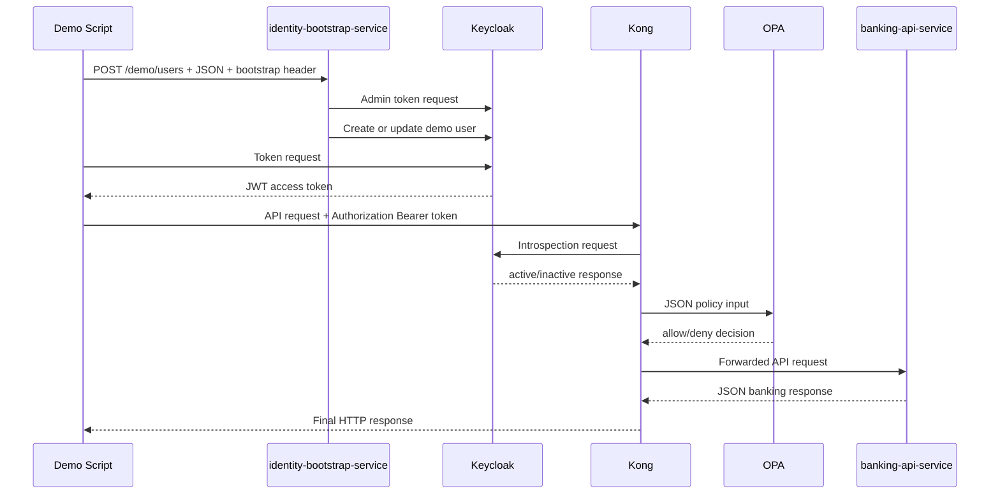
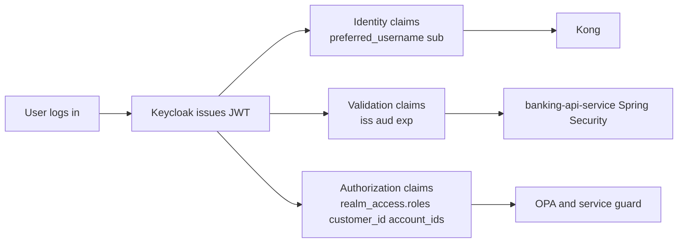
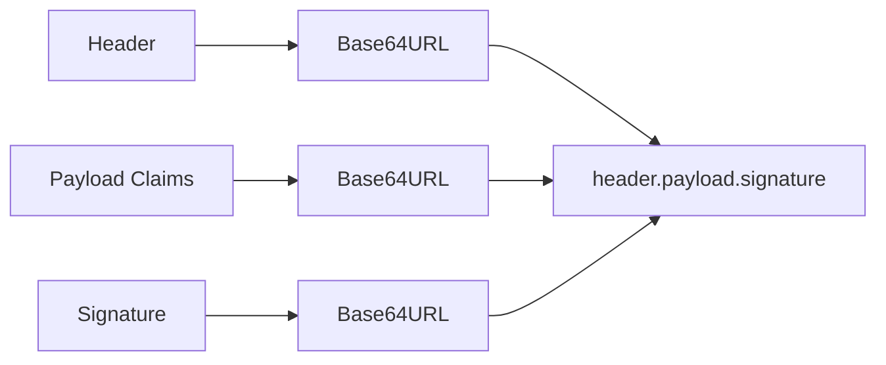
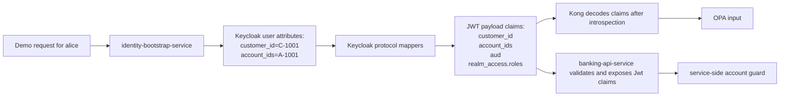
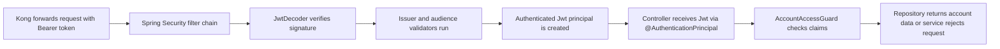

# 14 — Request & Response Details (Wire-Level Reference)

Every header, body, and claim that crosses a component boundary in this PoC, in one place.

> **Part IV · Reference** — Use as a lookup; read Parts I–III first.

## How to use this doc

This is a **lookup reference**, not a read-through. Jump to the flow you need:

| You want to know… | Go to |
|---|---|
| What the demo script sends to create a user | [Flow 1](#flow-1-demo-script---identity-bootstrap-service) |
| How the bootstrap service authenticates to Keycloak | [Flow 2](#flow-2-identity-bootstrap-service---keycloak-token-endpoint) |
| Which Keycloak admin APIs are called | [Flow 3](#flow-3-identity-bootstrap-service---keycloak-admin-user-apis) |
| How a user JWT is obtained | [Flow 4](#flow-4-demo-script---keycloak-login-endpoint) |
| What JWT claims exist and why | [Flow 5 — Claim Catalog](#flow-5-jwt-claims-produced-by-keycloak) |
| What the client sends to Kong | [Flow 6](#flow-6-client---kong) |
| How Kong introspects the token | [Flow 7](#flow-7-kong---keycloak-introspection) |
| What Kong sends to OPA | [Flow 8](#flow-8-kong---opa) |
| How Kong forwards to the banking service | [Flow 9](#flow-9-kong---banking-api-service) |
| What responses the banking service returns | [Flow 10](#flow-10-banking-api-service-responses) |
| Quick header reference per hop | [Flow 11](#flow-11-which-component-sends-which-important-header) |

This doc owns the **canonical JWT claim catalog** (Flows 5A–5K). Docs [06](06-keycloak-idp.md) and [08](08-opa.md)–[09](09-banking-api-service.md) link here rather than duplicating that material.

---

## End-To-End Data Flow Map



---

## Flow 1: Demo Script -> identity-bootstrap-service

The demo script creates demo users by calling `POST http://identity-bootstrap-service:8080/demo/users`.

### Headers

```http
X-Demo-Bootstrap-Secret: demo-bootstrap-secret
Content-Type: application/json
```

### Request Body — `alice`

```json
{
  "username": "alice",
  "password": "Password123!",
  "role": "customer",
  "customerId": "C-1001",
  "accountIds": ["A-1001"]
}
```

### Request Body — `ops-admin`

```json
{
  "username": "ops-admin",
  "password": "Password123!",
  "role": "ops-admin",
  "customerId": "C-9999",
  "accountIds": ["A-1001", "A-2001"]
}
```

### Response

On success, `identity-bootstrap-service` returns HTTP `201`:

```json
{
  "username": "alice",
  "role": "customer",
  "status": "created"
}
```

| Condition | Status |
|---|---|
| Missing bootstrap header | `401` |
| Role not in allowed set | `400` |
| Username exists but not demo-managed | `409` |

---

## Flow 2: identity-bootstrap-service -> Keycloak Token Endpoint

Before creating or updating users, the bootstrap service authenticates to [Keycloak](01-concepts.md) as an admin client.

### Request

```http
POST http://keycloak:8080/realms/master/protocol/openid-connect/token
Content-Type: application/x-www-form-urlencoded
```

Form body:

```text
grant_type=password
client_id=admin-cli
username=admin
password=admin
```

Curl example:

```bash
curl -sS -X POST "http://keycloak:8080/realms/master/protocol/openid-connect/token" \
  -H "Content-Type: application/x-www-form-urlencoded" \
  --data-urlencode "grant_type=password" \
  --data-urlencode "client_id=admin-cli" \
  --data-urlencode "username=admin" \
  --data-urlencode "password=admin"
```

### Response

Keycloak returns JSON containing at least:

```json
{
  "access_token": "<admin-jwt>",
  "expires_in": 60,
  "refresh_expires_in": 1800,
  "refresh_token": "<refresh-token>",
  "token_type": "Bearer",
  "not-before-policy": 0,
  "session_state": "2f914f0e-7690-435a-bf95-d887213fca8e",
  "scope": "profile email"
}
```

The bootstrap service extracts `access_token` and uses it in all subsequent admin API calls.

---

## Flow 3: identity-bootstrap-service -> Keycloak Admin User APIs

After obtaining an admin token the bootstrap service calls several Keycloak admin endpoints.

### Find User By Username

```http
GET /admin/realms/banking-poc/users?username=alice&exact=true
Authorization: Bearer <admin-token>
```

Response when not found:

```json
[]
```

Response when found:

```json
[
  {
    "id": "134d2448-334d-4be5-8868-4d13085bf2cd",
    "username": "alice",
    "firstName": "alice",
    "lastName": "Demo",
    "email": "alice@example.local",
    "emailVerified": false,
    "attributes": {
      "customer_id": ["C-1001"],
      "account_ids": ["A-1001"]
    },
    "createdTimestamp": 1780652643152,
    "enabled": true,
    "totp": false,
    "disableableCredentialTypes": [],
    "requiredActions": [],
    "notBefore": 0,
    "access": {
      "manageGroupMembership": true,
      "view": true,
      "mapRoles": true,
      "impersonate": true,
      "manage": true
    }
  }
]
```

### Create User

```http
POST /admin/realms/banking-poc/users
Authorization: Bearer <admin-token>
Content-Type: application/json
```

Body:

```json
{
  "username": "alice",
  "enabled": true,
  "email": "alice@example.local",
  "firstName": "alice",
  "lastName": "Demo",
  "attributes": {
    "demo_managed": ["true"],
    "customer_id": ["C-1001"],
    "account_ids": ["A-1001"]
  },
  "credentials": [
    {
      "type": "password",
      "value": "Password123!",
      "temporary": false
    }
  ]
}
```

Response: HTTP `201 Created` with a `Location` header pointing to the new user resource.

### Update Existing Demo-Managed User

```http
PUT /admin/realms/banking-poc/users/<userId>
Authorization: Bearer <admin-token>
Content-Type: application/json
```

Body:

```json
{
  "username": "alice",
  "enabled": true,
  "email": "alice@example.local",
  "firstName": "alice",
  "lastName": "Demo",
  "attributes": {
    "demo_managed": ["true"],
    "customer_id": ["C-1001"],
    "account_ids": ["A-1001"]
  }
}
```

### Reset Password

```http
PUT /admin/realms/banking-poc/users/<userId>/reset-password
Authorization: Bearer <admin-token>
Content-Type: application/json
```

Body:

```json
{
  "type": "password",
  "value": "Password123!",
  "temporary": false
}
```

### Read And Sync Realm Roles

Current role lookup:

```http
GET /admin/realms/banking-poc/users/<userId>/role-mappings/realm
Authorization: Bearer <admin-token>
```

Requested role lookup:

```http
GET /admin/realms/banking-poc/roles/customer
Authorization: Bearer <admin-token>
```

Remove stale demo-managed role:

```http
DELETE /admin/realms/banking-poc/users/<userId>/role-mappings/realm
Authorization: Bearer <admin-token>
Content-Type: application/json
```

Add desired role:

```http
POST /admin/realms/banking-poc/users/<userId>/role-mappings/realm
Authorization: Bearer <admin-token>
Content-Type: application/json
```

Body:

```json
[
  {
    "id": "role-customer",
    "name": "customer",
    "composite": false,
    "clientRole": false,
    "containerId": "banking-poc"
  }
]
```

---

## Flow 4: Demo Script -> Keycloak Login Endpoint

The script gets user tokens directly from Keycloak using the Resource Owner Password Credentials grant.

### Request

```http
POST http://localhost:9081/realms/banking-poc/protocol/openid-connect/token
Content-Type: application/x-www-form-urlencoded
```

Form body:

```text
grant_type=password
client_id=mobile-banking-app
username=alice
password=Password123!
```

Curl example:

```bash
curl -sS -X POST 'http://localhost:9081/realms/banking-poc/protocol/openid-connect/token' \
  -H 'Content-Type: application/x-www-form-urlencoded' \
  --data-urlencode 'grant_type=password' \
  --data-urlencode 'client_id=mobile-banking-app' \
  --data-urlencode 'username=alice' \
  --data-urlencode 'password=Password123!'
```

### Response

```json
{
  "access_token": "<signed-jwt>",
  "expires_in": 300,
  "refresh_expires_in": 1800,
  "refresh_token": "<refresh-token>",
  "token_type": "Bearer",
  "not-before-policy": 0,
  "session_state": "31fd1c66-4930-4538-8f6e-091e9ab9fb0c",
  "scope": "email profile"
}
```

The `access_token` is the signed JWT. Its payload contains the identity and authorization claims that later components read after validation. The script extracts `.access_token`.

### JWT Decode Example

A JWT has this structure:

```text
header.payload.signature
```

Decoded header for an `alice` token:

```json
{
  "alg": "RS256",
  "typ": "JWT",
  "kid": "0BYek66uebuec84BqxfwJ9_qxIDr1Wka-1siBT2z0Lk"
}
```

The `kid` tells downstream systems which Keycloak public key to use for verification.

Decoded payload:

```json
{
  "exp": 1781580804,
  "iat": 1781580504,
  "jti": "c2c1b237-1501-4602-a42f-f3b7a5a69590",
  "iss": "http://keycloak:8080/realms/banking-poc",
  "aud": "mobile-banking-app",
  "sub": "134d2448-334d-4be5-8868-4d13085bf2cd",
  "typ": "Bearer",
  "azp": "mobile-banking-app",
  "sid": "31fd1c66-4930-4538-8f6e-091e9ab9fb0c",
  "acr": "1",
  "realm_access": {
    "roles": ["customer"]
  },
  "scope": "email profile",
  "account_ids": ["A-1001"],
  "email_verified": false,
  "name": "alice Demo",
  "preferred_username": "alice",
  "given_name": "alice",
  "customer_id": "C-1001",
  "family_name": "Demo",
  "email": "alice@example.local"
}
```

For the full claim-by-claim breakdown, see [Flow 5E](#flow-5e-which-claims-this-poc-uses-and-why).

### Signature

The third JWT segment is the cryptographic signature. Keycloak generates it by signing the header and payload with its private key. Downstream systems verify it with Keycloak's public key (fetched via JWKS).

- If the header or payload changes after issuance, the signature no longer matches.
- If the token was not issued by Keycloak, the signature cannot be verified.
- Decoding lets you inspect claims. Signature verification or introspection is what lets you trust them.

---

## Flow 5: JWT Claims Produced By Keycloak

This section is the **canonical claim catalog** for this PoC. Docs [06](06-keycloak-idp.md), [08](08-opa.md), and [09](09-banking-api-service.md) link here rather than repeating this material.

### Flow 5A: What JWT Claims Are

[JWT](01-concepts.md) claims are named key-value facts stored inside the token payload. Each field in the JSON object below is a claim:

```json
{
  "iss": "http://keycloak:8080/realms/banking-poc",
  "aud": "mobile-banking-app",
  "preferred_username": "alice",
  "customer_id": "C-1001",
  "account_ids": ["A-1001"]
}
```

**Standard claims** are defined by JWT/OIDC conventions (`iss`, `aud`, `exp`, `sub`, `iat`). They solve common token-validation problems.

**Custom claims** are application-specific additions. In this PoC: `customer_id` and `account_ids`. They solve banking-domain authorization problems.

### Flow 5B: Why We Need JWT Claims

After a user logs in, [Kong](01-concepts.md) (PEP), [OPA](01-concepts.md) (PDP), and `banking-api-service` each need to know:

- who is calling
- whether the token came from the right issuer
- what role the user has
- which customer/account scope belongs to the user

Claims carry that context with the request so each component does not have to query another system for every call.

### Flow 5C: What Problem JWT Claims Solve

| Problem | Claims used |
|---|---|
| Identity propagation | `preferred_username`, `sub` |
| Token validation context | `iss`, `aud`, `exp` |
| Authorization context | `realm_access.roles`, `customer_id`, `account_ids` |
| Reducing repeated lookups | all of the above carried in-token |

### Flow 5D: What JWT Claims Do Not Solve

Claims are not sufficient on their own.

- A decoded claim is not automatically trustworthy — anyone can craft a fake JWT string.
- A valid token can still be unauthorized for a specific action.
- If the source of truth changes, old tokens still contain the claim values they had at issuance until they expire.

That is why this PoC still uses Keycloak introspection in Kong, JWT validation in `banking-api-service`, OPA policy evaluation, and service-side authorization checks.

### Flow 5E: Which Claims This PoC Uses And Why

#### `iss`

- Meaning: which Keycloak realm issued the token (`http://keycloak:8080/realms/banking-poc`)
- Used by: `banking-api-service`
- Purpose: reject tokens not issued by this realm

#### `aud`

- Meaning: which client/application the token is meant for (`mobile-banking-app`)
- Used by: `banking-api-service`
- Purpose: reject tokens not intended for this application

#### `preferred_username`

- Meaning: human-readable username (`alice` or `ops-admin`)
- Used by: Kong (logging, OPA input), diagnostics
- Purpose: identity context; also forwarded as `input.username` to OPA

#### `realm_access.roles`

- Meaning: realm roles assigned to the user (`["customer"]` or `["ops-admin"]`)
- Used by: Kong, OPA, `banking-api-service`
- Purpose: distinguish `customer` from `ops-admin`; Kong extracts the first role and sends it as `input.role` to OPA

#### `customer_id`

- Meaning: business identifier for the banking customer (`C-1001` for `alice`, `C-9999` for `ops-admin`)
- Used by: OPA (`input.customer_id`), `banking-api-service`
- Purpose: connect authenticated identity to banking ownership; OPA checks `customer_id != ""` for the `customer` role

#### `account_ids`

- Meaning: accounts the token carries (`["A-1001"]` for `alice`, `["A-1001","A-2001"]` for `ops-admin`)
- Used by: OPA (`input.account_ids`), `banking-api-service`
- Purpose: account-level authorization; OPA checks that the requested `account_id` is in `account_ids`

#### `sub`

- Meaning: Keycloak internal user UUID
- Used by: `banking-api-service` (Spring Security principal)
- Purpose: stable unique identifier for the subject

#### `exp` / `iat` / `jti`

- Meaning: expiry time, issued-at time, JWT ID
- Used by: token validation in Kong (via introspection) and Spring Security
- Purpose: prevent token reuse after expiry; provide audit trail

### Flow 5F: JWT Claims In This PoC At A Glance



Claims originate in Keycloak. Kong and `banking-api-service` read them — they do not invent them.

### Flow 5G: Where The Claims Come From

#### Step 1: User Attributes Written Into Keycloak

When `identity-bootstrap-service` creates or updates a user it sends:

```json
{
  "attributes": {
    "demo_managed": ["true"],
    "customer_id": ["C-1001"],
    "account_ids": ["A-1001"]
  }
}
```

That comes from `KeycloakAdminProvisioner`:

```java
private Map<String, List<String>> attributes(DemoUserRequest request) {
    return Map.of(
            DEMO_MANAGED_ATTRIBUTE, List.of(DEMO_MANAGED_VALUE),
            "customer_id", List.of(request.customerId()),
            "account_ids", request.accountIds());
}
```

For `alice`: `customer_id = C-1001`, `account_ids = [A-1001]`.  
For `ops-admin`: `customer_id = C-9999`, `account_ids = [A-1001, A-2001]`.

#### Step 2: Realm Roles Stored In Keycloak

The bootstrap service assigns a realm role (`customer` or `ops-admin`). Keycloak automatically places realm roles into the token under `realm_access.roles`. Both roles are declared in `infra/keycloak/realm-export.json`.

#### Step 3: Protocol Mappers Copy Attributes Into The Token

The `mobile-banking-app` client in `infra/keycloak/realm-export.json` has three protocol mappers. These mappers are the bridge between stored user attributes and JWT claims.

**`customer_id` mapper** — reads the `customer_id` user attribute and places it into the access token claim `customer_id` as a `String`:

```json
{
  "name": "customer_id",
  "protocolMapper": "oidc-usermodel-attribute-mapper",
  "config": {
    "access.token.claim": "true",
    "claim.name": "customer_id",
    "user.attribute": "customer_id",
    "jsonType.label": "String"
  }
}
```

**`account_ids` mapper** — reads the `account_ids` user attribute and places it into the access token claim `account_ids` as a multivalued `String` array:

```json
{
  "name": "account_ids",
  "protocolMapper": "oidc-usermodel-attribute-mapper",
  "config": {
    "access.token.claim": "true",
    "claim.name": "account_ids",
    "user.attribute": "account_ids",
    "jsonType.label": "String",
    "multivalued": "true"
  }
}
```

**`mobile-banking-app-audience` mapper** — adds `mobile-banking-app` to the token audience:

```json
{
  "name": "mobile-banking-app-audience",
  "protocolMapper": "oidc-audience-mapper",
  "config": {
    "access.token.claim": "true",
    "included.client.audience": "mobile-banking-app"
  }
}
```

That is why `banking-api-service` can check `aud = mobile-banking-app`.

### Flow 5H: How The JWT Is Structured

```text
header.payload.signature
```

Each part is Base64URL-encoded.



**Header** — signing algorithm, key ID, token type:

```json
{
  "alg": "RS256",
  "typ": "JWT",
  "kid": "..."
}
```

**Payload** — the claims. This is what Kong decodes after introspection and what Spring Security exposes via the `Jwt` principal:

```json
{
  "iss": "http://keycloak:8080/realms/banking-poc",
  "aud": "mobile-banking-app",
  "preferred_username": "alice",
  "realm_access": {
    "roles": ["customer"]
  },
  "customer_id": "C-1001",
  "account_ids": ["A-1001"]
}
```

**Signature** — cryptographic proof created by Keycloak with its private key. Decoding the payload is easy. Trusting it requires validation.

### Flow 5I: Why Kong Can Decode Claims But Still Must Validate

The Kong plugin decodes the JWT payload segment locally to read claims:

```lua
local function decode_claims(token)
  local payload_segment = token:match("^[^.]+%.([^.]+)%.([^.]+)$")
  ...
  return cjson.decode(decoded)
end
```

But payload decoding alone is unsafe — anyone can craft a string that looks like a JWT. So Kong first calls Keycloak introspection:

1. Kong receives the bearer token.
2. Kong calls the Keycloak introspection endpoint.
3. Keycloak responds with `active: true` or `active: false`.
4. Only then does Kong use the decoded payload to build OPA input.

That is the difference between reading claims and trusting claims.

### Flow 5J: How banking-api-service Retrieves The Same Claims

`banking-api-service` does not do manual Base64 decoding. Instead:

1. Spring Security validates the JWT signature and checks `iss` and `aud`.
2. It creates a validated `Jwt` principal object.
3. Controller and guard code read claims from that object:
   - `jwt.getClaimAsString("customer_id")`
   - `jwt.getClaimAsStringList("account_ids")`
   - `realm_access.roles` (via a custom converter)

The same claim values therefore flow through two separate enforcement paths:
- Kong → OPA path
- `banking-api-service` service-side defense-in-depth path

### Flow 5K: End-To-End Claim Pipeline For `alice`



**Concrete example — `alice`**

User attributes stored in Keycloak:

```json
{
  "customer_id": ["C-1001"],
  "account_ids": ["A-1001"]
}
```

Role assigned in Keycloak:

```json
{
  "realm_access": {
    "roles": ["customer"]
  }
}
```

Audience added by mapper:

```json
{
  "aud": "mobile-banking-app"
}
```

Final representative payload seen by the rest of the system:

```json
{
  "iss": "http://keycloak:8080/realms/banking-poc",
  "aud": "mobile-banking-app",
  "preferred_username": "alice",
  "realm_access": {
    "roles": ["customer"]
  },
  "customer_id": "C-1001",
  "account_ids": ["A-1001"]
}
```

Why each claim matters:

| Claim | Consumer | Purpose |
|---|---|---|
| `iss` | `banking-api-service` | Checks the token came from this Keycloak realm |
| `aud` | `banking-api-service` | Checks the token is intended for `mobile-banking-app` |
| `realm_access.roles` | Kong, OPA, `banking-api-service` | Distinguishes `customer` from `ops-admin` |
| `customer_id` | OPA, `banking-api-service` | Links identity to banking ownership |
| `account_ids` | OPA, `banking-api-service` | Account-level authorization |

---

## Flow 6: Client -> Kong

The client calls Kong at `http://localhost:8000/api/accounts/...`. Kong routes all `/api/accounts` traffic via the `banking-api-route` route defined in `infra/kong/kong.yml`.

### Example Request

```http
GET /api/accounts/A-1001 HTTP/1.1
Host: localhost:8000
Authorization: Bearer <jwt>
```

| Condition | Response |
|---|---|
| Missing token | `401 {"message":"missing bearer token"}` |
| Malformed token | `401 {"message":"invalid bearer token"}` |

---

## Flow 7: Kong -> Keycloak Introspection

Before using token claims for [OPA](01-concepts.md) input, Kong introspects the token. The `opa-authz` plugin in `infra/kong/kong.yml` is configured with `introspection_url`, `introspection_client_id` (`kong-introspection`), and `introspection_client_secret` (`kong-introspection-secret`).

### Request

```http
POST http://keycloak:8080/realms/banking-poc/protocol/openid-connect/token/introspect
Authorization: Basic base64(kong-introspection:kong-introspection-secret)
Content-Type: application/x-www-form-urlencoded

token=<jwt>
```

### Response — Valid Token

```json
{
  "active": true,
  "client_id": "mobile-banking-app",
  "username": "alice",
  "token_type": "Bearer",
  "exp": 1781236914,
  "iat": 1781236614,
  "sub": "134d2448-334d-4be5-8868-4d13085bf2cd",
  "aud": "mobile-banking-app",
  "iss": "http://keycloak:8080/realms/banking-poc"
}
```

### Response — Tampered Or Inactive Token

```json
{
  "active": false
}
```

Kong then returns:

```http
HTTP/1.1 401 Unauthorized
Content-Type: application/json; charset=utf-8

{"message":"inactive token"}
```

---

## Flow 8: Kong -> OPA

If introspection returns `active: true`, Kong decodes the JWT claims locally and sends them to [OPA](01-concepts.md).

The OPA endpoint is `http://opa:8181/v1/data/banking_authz/allow` (from `infra/kong/kong.yml`). The policy lives in `infra/opa/policies/banking_authz.rego`.

### Request

```http
POST http://opa:8181/v1/data/banking_authz/allow
Content-Type: application/json
```

Body for `alice` accessing `A-1001`:

```json
{
  "input": {
    "method": "GET",
    "path": "/api/accounts/A-1001",
    "account_id": "A-1001",
    "customer_id": "C-1001",
    "account_ids": ["A-1001"],
    "role": "customer",
    "username": "alice"
  }
}
```

**Input field mapping** — all fields come from the JWT claims Kong decoded after introspection:

| OPA input field | Source claim | Notes |
|---|---|---|
| `method` | HTTP method | From the incoming request |
| `path` | HTTP path | From the incoming request |
| `account_id` | path segment | Extracted from `/api/accounts/{id}` |
| `customer_id` | `customer_id` | JWT custom claim |
| `account_ids` | `account_ids` | JWT custom claim array |
| `role` | `realm_access.roles[0]` | First realm role |
| `username` | `preferred_username` | JWT standard claim |

### OPA Policy Logic (from `banking_authz.rego`)

```rego
allow {
    read_only_account_request
    input.role == "ops-admin"
}

allow {
    read_only_account_request
    input.role == "customer"
    input.customer_id != ""
    account_ids := object.get(input, "account_ids", [])
    account_ids[_] == input.account_id
}

read_only_account_request {
    input.method == "GET"
    regex.match("^/api/accounts/[^/]+(?:/transactions)?$", input.path)
}
```

`ops-admin` gets read access to any account. `customer` must have a non-empty `customer_id` and the requested `account_id` must appear in their `account_ids`.

### Response — Allowed

```json
{
  "result": true
}
```

### Response — Denied

```json
{
  "result": false
}
```

Kong returns:

```http
HTTP/1.1 403 Forbidden
Content-Type: application/json; charset=utf-8

{"message":"forbidden"}
```

---

## Flow 9: Kong -> banking-api-service

If OPA returns `result: true`, Kong forwards the request to `http://banking-api-service:8080` (configured as the `banking-api` service in `infra/kong/kong.yml`).

### Forwarded Request

```http
GET /api/accounts/A-1001 HTTP/1.1
Authorization: Bearer <jwt>
```

Kong passes the original bearer token unchanged. `banking-api-service` is the [resource server](01-concepts.md) and treats this as its own authentication boundary.

### Spring Security Validation Flow



Spring Security is configured via `application.yml`:

- `spring.security.oauth2.resourceserver.jwt.jwk-set-uri` — where to fetch Keycloak's public keys
- `banking-api.security.issuer-uri` — which Keycloak realm must have issued the token
- `banking-api.security.audience` — which client the token must be intended for (`mobile-banking-app`)

Validation steps:

1. Extract the bearer token from the `Authorization` header.
2. `NimbusJwtDecoder` loads JWKs from the JWKS endpoint.
3. Verify the JWT signature against Keycloak's public key.
4. Check that `iss` matches the configured realm URI.
5. Check that `aud` contains `mobile-banking-app`.
6. If any check fails, Spring Security returns `401 Unauthorized` before the controller is called.

### Service-Side Authorization Guard

Once the token is accepted, `AccountAccessGuard` applies its own rules before returning data:

| Role | Rule |
|---|---|
| `ops-admin` | Access any account |
| `customer` | Must have non-empty `customer_id`; requested `accountId` must appear in `account_ids` |

The service reads these claims from the validated `Jwt` principal:

- `realm_access.roles`
- `customer_id`
- `account_ids`

If the token is missing or claims do not match, the guard throws `401` or `403` accordingly.

**Why validate again after Kong already checked?**

- Kong is a gateway control point, not the banking service's trust boundary.
- The service must defend itself if called directly, bypassing Kong, or if the gateway is misconfigured.
- Kong answers "should this request enter the platform?" — the service answers "should I trust and act on this token?"
- The service needs the validated `Jwt` object so guard code can make account-specific decisions.

This is defense in depth: Kong filters bad traffic early; the service still enforces its own rules before returning banking data.

For the signature and trust model, see [11 — JWT Signature Validation](11-jwt-signature-validation.md) and [12 — JWKS](12-jwks.md).

---

## Flow 10: banking-api-service Responses

### Account Details Success

```http
GET /api/accounts/A-1001
```

```json
{
  "accountId": "A-1001",
  "customerId": "C-1001",
  "currency": "GBP"
}
```

### Transactions Success

```http
GET /api/accounts/A-1001/transactions
```

```json
[
  {
    "accountId": "A-1001",
    "amount": -12.35
  }
]
```

### Error Responses

| Condition | Status |
|---|---|
| Account not found (after auth passes) | `404 Not Found` |
| Valid token but claims forbid access (direct/internal call) | `403 Forbidden` |
| Token fails JWT validation | `401 Unauthorized` |

---

## Flow 11: Which Component Sends Which Important Header

| Hop | Key headers |
|---|---|
| Demo Script → `identity-bootstrap-service` | `X-Demo-Bootstrap-Secret`, `Content-Type: application/json` |
| `identity-bootstrap-service` → Keycloak token endpoint | `Content-Type: application/x-www-form-urlencoded` |
| `identity-bootstrap-service` → Keycloak admin APIs | `Authorization: Bearer <admin-token>`, `Content-Type: application/json` (writes) |
| Client → Kong | `Authorization: Bearer <jwt>` |
| Kong → Keycloak introspection | `Authorization: Basic <base64(clientId:clientSecret)>`, `Content-Type: application/x-www-form-urlencoded` |
| Kong → OPA | `Content-Type: application/json` |
| Kong → `banking-api-service` | forwarded `Authorization: Bearer <jwt>` |

---

## Quick Comparison Table

| Sender | Receiver | Main purpose | Body style |
|---|---|---|---|
| Demo script | `identity-bootstrap-service` | Create demo user | JSON |
| `identity-bootstrap-service` | Keycloak token endpoint | Get admin token | Form URL-encoded |
| `identity-bootstrap-service` | Keycloak admin API | Create/update users and roles | JSON |
| Demo script | Keycloak token endpoint | Get user JWT | Form URL-encoded |
| Client | Kong | Call protected banking API | Usually no body for GET |
| Kong | Keycloak introspection | Validate token activity | Form URL-encoded |
| Kong | OPA | Ask policy decision | JSON |
| Kong | `banking-api-service` | Forward allowed request | Forwarded original request |

---

← Prev: [13 — Access & Refresh Token Lifecycle](13-token-lifecycle.md)
