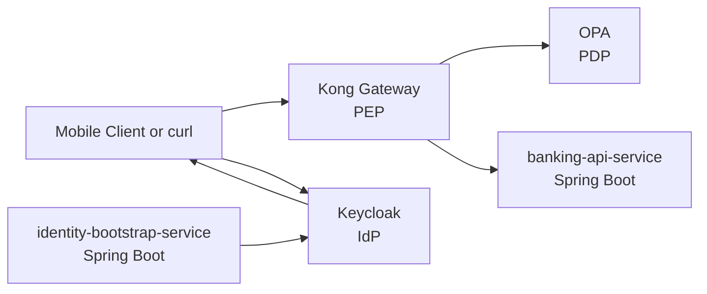

# Mobile Banking Auth PoC Design

## Goal

Build a quick proof of concept for a mobile banking authentication and authorization platform using Spring Boot microservices, Keycloak as the identity provider, Kong as the policy enforcement point, and OPA as the policy decision point. The PoC must prove user setup, login, JWT validation, and policy-based access control for retail banking APIs.

## Scope

In scope:

- User setup for demo retail users
- User login through Keycloak
- JWT issuance by Keycloak
- JWT signature and claim verification in Spring Boot
- Kong-protected banking APIs
- OPA authorization decisions for account access
- Local microservice deployment with Docker Compose
- End-to-end allow and deny demo scenarios

Out of scope:

- Mobile UI or web frontend
- Production-grade user onboarding flows
- MFA and step-up authentication
- Persistent customer database
- Transaction posting or money movement
- Production hardening, HA, audit retention, and secrets management

## Architecture

The PoC uses a gateway-enforced architecture. Kong acts as the edge policy enforcement point and forwards authorization decisions to OPA. Keycloak handles identity and token issuance. Spring Boot services remain responsible for business logic and perform defense-in-depth JWT validation before serving banking data.

Two Spring Boot services are used:

- `identity-bootstrap-service`: demo-only helper for user setup and test data alignment with Keycloak
- `banking-api-service`: protected banking APIs for account details and transactions

This keeps user setup concerns separate from banking API delivery while staying small enough for a quick feasibility PoC.



## Components

### Keycloak

Responsibilities:

- Host realm `banking-poc`
- Manage users, roles, and client configuration
- Issue signed JWT access tokens for the mobile banking client
- Expose JWKS for downstream signature verification

Proposed initial setup:

- Realm: `banking-poc`
- Client: `mobile-banking-app`
- Roles:
  - `customer`
  - `ops-admin`

Relevant token claims:

- `sub`
- `preferred_username`
- `iss`
- `aud`
- `exp`
- `realm_access.roles`
- custom claim or mapped attribute for `customer_id`

### Kong

Responsibilities:

- Expose public and protected routes
- Act as PEP for banking APIs
- Require bearer tokens on protected routes
- Forward authorization input to OPA
- Block unauthorized requests before they reach the banking service

Protected route examples:

- `/api/accounts/{accountId}`
- `/api/accounts/{accountId}/transactions`

### OPA

Responsibilities:

- Act as PDP for banking authorization
- Evaluate whether the caller may access the requested banking resource
- Separate policy logic from the gateway and business service

Initial policy rules:

- Allow all access for role `ops-admin`
- Allow access for role `customer` only when the requested `accountId` belongs to that customer
- Deny all other requests

### identity-bootstrap-service

Responsibilities:

- Create and seed demo users in Keycloak
- Map a user to banking identifiers used by policy evaluation
- Reduce manual setup friction during the demo

Initial endpoint:

- `POST /demo/users`

Example request shape:

```json
{
  "username": "alice",
  "password": "Password123!",
  "role": "customer",
  "customerId": "C-1001",
  "accountIds": ["A-1001"]
}
```

This service is demo-only and not intended as a production registration service.

### banking-api-service

Responsibilities:

- Serve retail banking API responses
- Verify JWT signature and core claims using Keycloak JWKS
- Extract user identity and roles from the token
- Return in-memory banking data for demo scenarios

Initial endpoints:

- `GET /api/accounts/{accountId}`
- `GET /api/accounts/{accountId}/transactions`

The service will use static or in-memory data to avoid introducing a database into the PoC.

## Data Model

The PoC uses a small in-memory banking model.

Accounts:

- `A-1001` owned by `alice` / customer `C-1001`
- `A-2001` owned by `bob` / customer `C-2001`

Users:

- `alice` with role `customer`, limited to `A-1001`
- `bob` with role `customer`, limited to `A-2001`
- `ops-admin` with role `ops-admin`, allowed for both accounts

OPA input should include enough information to decide access, such as:

- username
- roles
- customer ID
- requested path
- requested account ID
- HTTP method

## Request Flows

### User Setup

1. A demo user is created through `identity-bootstrap-service`
2. The service provisions the user in Keycloak
3. The service aligns user metadata such as `customer_id` and account access mapping

### Login

1. The client authenticates against Keycloak
2. Keycloak validates credentials
3. Keycloak returns a signed JWT access token

### Protected Banking API Access

1. The client calls Kong with a bearer token
2. Kong validates that a token is present and extracts authorization context
3. Kong calls OPA with request and identity data
4. OPA returns `allow` or `deny`
5. If allowed, Kong forwards the request to `banking-api-service`
6. `banking-api-service` validates JWT signature, issuer, audience, and expiry
7. The banking service returns the requested account data

## Authorization Model

The PoC authorization model is intentionally small but representative of banking controls.

Customer policy:

- A customer may access only their own account resources
- Access is determined by matching requested `accountId` to the set assigned to the authenticated user

Admin policy:

- An `ops-admin` user may access all account resources for support and operations use cases

Default policy:

- Any request not explicitly allowed is denied

This is sufficient to prove separated authorization with OPA while avoiding unnecessary entitlement complexity.

## JWT Verification

JWT verification is required in two places conceptually, though the exact mechanics differ.

At the edge:

- Kong enforces presence of a bearer token on protected routes
- Kong passes authenticated request context into OPA before proxying

In the service:

- `banking-api-service` verifies JWT signature using Keycloak JWKS
- It validates `iss`, `aud`, and `exp`
- It rejects malformed, expired, or wrongly signed tokens with `401`

This service-side validation provides defense in depth and directly satisfies the requirement for JWT signature verification.

## Deployment Topology

Local deployment will use `docker-compose` with one container per component:

- `keycloak`
- `kong`
- `opa`
- `identity-bootstrap-service`
- `banking-api-service`

Deployment characteristics:

- Kong uses declarative config or bootstrap setup for routes and plugins
- OPA loads mounted Rego policies
- Spring Boot services expose health endpoints
- All services share a Docker network for local integration

The PoC target is a single command startup suitable for local validation and demo.

## Error Handling

Expected responses:

- Missing token: `401`
- Invalid signature, issuer, audience, or expired token: `401`
- Valid token but unauthorized account access: `403`
- OPA unavailable: `503` preferred for explicit policy backend failure
- Banking service unavailable: `502` or `503`

Logging should capture enough information for demo diagnostics:

- username if available
- role set
- requested endpoint
- requested account ID
- allow or deny decision
- denial reason when easy to surface

## Testing And Demo Proof

The PoC succeeds if the following can be demonstrated end to end:

1. A demo user can be created in Keycloak
2. `alice` can log in and receive a JWT
3. `alice` can access `/api/accounts/A-1001`
4. `alice` is denied for `/api/accounts/A-2001`
5. `ops-admin` can access both accounts
6. A request with an invalid or wrongly signed JWT is rejected
7. A request without a token is blocked before reaching the banking service

Testing layers:

- Spring Boot unit tests for token-to-auth-context mapping and request handling
- Spring Boot integration tests for protected endpoints with valid and invalid tokens
- End-to-end scripts that obtain tokens and call Kong-routed APIs

## Success Criteria

The PoC is considered feasible when:

- All services start locally with one Docker Compose command
- A user can authenticate through Keycloak and receive a JWT
- Kong and OPA jointly enforce policy decisions for banking API access
- The banking service independently validates JWT signatures and claims
- The demo shows both allowed and denied access outcomes clearly

## Risks And Simplifications

Simplifications made deliberately for speed:

- In-memory banking data instead of a database
- Demo helper service for setup instead of a full onboarding journey
- Minimal role model with only `customer` and `ops-admin`

Known risks not addressed in this PoC:

- Production identity lifecycle management
- Fine-grained consent and delegated access
- Fraud controls, MFA, and device binding
- Secret rotation and production deployment security

## Recommended Next Step After This PoC

If the PoC works, the next increment should replace in-memory data with a small persistence layer and formalize the mapping between Keycloak identities, customer records, and account entitlements.
